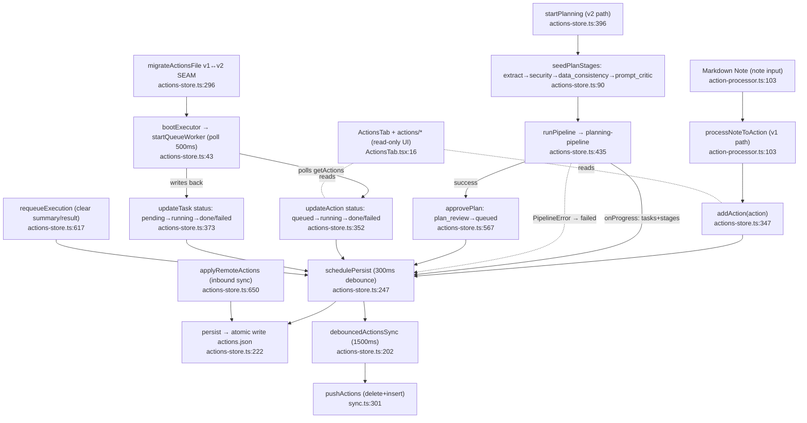

# Feature: actions-foundation

## Sources

- `src/types/actions.ts` — full file (data model, v1+v2 union)
- `src/stores/actions-store.ts` — full file (Zustand store, persistence, sync, planning + queue boot)
- `src/lib/action-processor.ts` — full file (v1 note → Action processor)
- `src/components/ActionsTab.tsx` — top 100 lines (UI host, queue button)
- `src/lib/sync.ts` — `pushActions` / `fetchActions` excerpt only (lines 287–316)
- `src/components/actions/*` — directory listing only (ActionCard / ActionDetail / ActionList / TaskItem; UI, no logic traced)

## Happy path

1. **Boot** — App startup calls `useActionsStore.load()` (`actions-store.ts:286`). It reads `actions.json` from `appLocalDataDir()`, runs `migrateActionsFile()` (v1 → v2 if needed), resets stale `running` actions/tasks back to `draft`/`pending`, then calls `bootExecutor(get)` which fires `startQueueWorker(...)` once (`actions-store.ts:43`, the outbound edge to the executor feature).
2. **Action creation (v1 path)** — User triggers note processing → `processNoteToAction(input)` (`action-processor.ts:103`) calls `generateText` (AI provider), parses JSON, builds an `Action` with `status: 'waiting'` and a list of `ActionTask{ status: 'waiting' }`. The caller invokes `addAction(action)` (`actions-store.ts:347`) which appends to the in-memory list and `schedulePersist(...)`.
3. **Persist + sync** — `schedulePersist` (`actions-store.ts:247`) debounces 300 ms, writes atomically (`actions.json.tmp` → rename) via `persist()` (`actions-store.ts:222`), then calls `debouncedActionsSync(actions)` (`actions-store.ts:202`) which after another 1.5 s calls `pushActions(userId, actions)` (`sync.ts:301`). `pushActions` deletes-then-inserts the user's rows in Supabase `actions` table.
4. **Action creation (v2 / pipeline path)** — `startPlanning(actionId, project)` (`actions-store.ts:396`) flips `status: 'planning'`, seeds `planStages` (extract → security → data_consistency → prompt_critic, `actions-store.ts:90`), and runs `runPipeline(...)` from `@/lib/planning`. Each `StageRunResult` commits via `applyStageCommit` and writes back `tasks`. On success `status` → `plan_review`; on `PipelineError` → `status: 'failed'` with `applyStageFailure`.
5. **Plan approval** — `approvePlan(actionId)` (`actions-store.ts:567`) requires `status === 'plan_review'`, flips to `queued`, resets every task to `status: 'pending'`. `rejectPlan` (`actions-store.ts:583`) flips to `rejected` and stamps the reason on the last `PlanStage`.
6. **Executor consumes** — Queue Worker (booted at step 1) polls `getActions()` every 500 ms (`actions-store.ts:46`), picks up `queued` actions, and writes back via the injected `updateAction` / `updateTask` callbacks. Status flow inside the worker: action `queued → running → done|failed`; tasks `pending → running → done|failed` (or `blocked_hitl`/`skipped`). `notter.report_progress` writes `task.summary`. Internals NOT traced here — see `executor.md`.
7. **Inbound remote sync** — `applyRemoteActions(actions)` (`actions-store.ts:650`) is called by `auth-sync` after a Supabase fetch; it replaces the in-memory list and writes through to disk (no debounce, no echo back to Supabase).
8. **Re-queue** — `requeueExecution(actionId)` (`actions-store.ts:617`) accepts `failed | done | queued | running` actions, flips them back to `queued`, and clears every task's `summary | result | startedAt | completedAt` so the worker re-runs them.

## Mermaid

## Side effects

- **Disk** — Atomic write of `appLocalDataDir/actions.json` via `.tmp` + `rename` (with non-atomic fallback for Windows rename failures). Also writes a `.v1-backup.json` once on first v1→v2 migration; on parse failure renames the corrupt file to `actions.json.corrupted-<ts>`.
- **Network** — Debounced (1.5 s) `pushActions` to Supabase `actions` table: delete-all-by-user-id + bulk insert. Only fires when `useAuthStore.user?.id` is present.
- **Globals** — Module-level singletons: `queueWorkerStarted` (one-shot guard), `actionsSyncTimer`, `writeTimer`, `pendingPersistArgs`. `flushActionsStore()` exported for window-close handlers.
- **Time mutation** — Every mutator stamps `updatedAt: new Date().toISOString()`. `createdAt`/`updatedAt` are ISO strings (v1); `createdAtMs`/`updatedAtMs` are optional v2 numeric mirrors.

## Error branches

- **Parse failure on load** (`actions-store.ts:332`) — corrupted `actions.json` is renamed to `actions.json.corrupted-<ts>`; store loads empty.
- **Atomic-rename failure** (`actions-store.ts:239`) — falls back to direct `writeTextFile` (loses atomicity).
- **Pipeline failure** (`actions-store.ts:447`) — non-`PipelineError` exceptions are wrapped as `PipelineError{stage:'extract', reason:'llm_error'}`; action flips to `status: 'failed'` and the offending stage records `errorMessage` + `output`.
- **Stale in-flight on cold start** (`actions-store.ts:318`) — actions still marked `running` are demoted to `draft`; tasks marked `running` are demoted to `pending`. This is the recovery rule for unclean process exit.
- **Migration warnings** (`actions-store.ts:308`) — non-fatal: surfaced via `console.warn` only.
- **Queue worker boot failure** (`actions-store.ts:51`) — caught and logged; `queueWorkerStarted` stays `true` so we don't retry. App continues but executor is dead.
- **`pushActions` failure** (`sync.ts:316`) — swallowed with `console.error`; no retry, no UI surface. Local store stays correct; remote drifts.

## External deps

- **executor** — `startQueueWorker(...)` (outbound at `actions-store.ts:43`). Store injects `getActions / updateAction / updateTask` callbacks; the worker is the sole writer of execution-phase status (`queued → running → done|failed`) and `task.summary`. Internals out of scope (see `executor.md`).
- **planning-pipeline** — `runPipeline` + `PipelineError` + `StageRunResult` from `@/lib/planning` (called at `actions-store.ts:435` and `:519`). Drives `Action.planStages`, `Action.tasks`, and the planning-phase status transitions (`planning → plan_review | failed`). Store provides `onProgress` callback for stage-by-stage commits. (See `planning-pipeline.md`.)
- **auth-sync** — Outbound `pushActions(userId, actions)` (`sync.ts:301`) from `debouncedActionsSync`. Inbound `applyRemoteActions(actions)` (`actions-store.ts:650`) is called by the sync layer after `fetchActions`. (See `auth-sync.md`.)
- **ai-client / ai-providers** — Used only by the v1 path (`processNoteToAction`) via `generateText` (`action-processor.ts:107`). v2 path goes through planning-pipeline instead.
- **actions-migration** — `migrateActionsFile(parsed)` (`actions-store.ts:12`, called at `:296`) is the v1↔v2 SEAM. Adds `.v1-backup.json` on first migration.
- **auth-store** — `useAuthStore.getState().user?.id` gates outbound sync (`actions-store.ts:205`).
- **Tauri fs / path** — `@tauri-apps/plugin-fs` (`readTextFile`, `writeTextFile`, `exists`, `rename`), `@tauri-apps/api/path` (`appLocalDataDir`, `join`).
- **UI consumers** — `ActionsTab.tsx`, `actions/ActionCard.tsx`, `actions/ActionDetail.tsx`, `actions/ActionList.tsx`, `actions/TaskItem.tsx`. All read-only via `useActionsStore` selectors; no business logic. `ActionsTab` also calls `runActionQueue` from `@/lib/action-runner` for the v1 manual queue button — note this is a SECOND, parallel execution path beside the v2 Queue Worker.

## v1 ↔ v2 seam (data-model)

| Concern | v1 | v2 |
|---|---|---|
| Action status | `waiting`/`processing`/`skipped`/`done` | `draft`/`planning`/`plan_review`/`rejected`/`queued`/`running`/`awaiting_hitl`/`report_review`/`failed`/`cancelled` |
| Task status | `waiting`/`running`/`done`/`failed` | `pending`/`blocked_hitl`/`skipped` (additive) |
| Timestamps | `createdAt`/`updatedAt` ISO strings | `createdAtMs`/`updatedAtMs` numeric (optional mirror) |
| Plan | (none) | `planStages: PlanStage[]` (4-stage pipeline), `tokenUsage`, `report` |
| Task fields | `objective`/`prompt`/`agentId`/`modelTag`/`terminalId`/`returnText` | + `rawPrompt`/`refinedPrompt`/`trustLevel`/`securityFlags`/`dataFlags`/`dependsOn`/`result`/`startedAt`/`completedAt`/`summary` |
| Execution driver | `runActionQueue(actions, terminalId)` (manual button in `ActionsTab.tsx:48`) | `startQueueWorker(...)` polling every 500 ms |
| Status cycler | `nextTaskStatus` (`actions.ts:155`) cycles ONLY through v1 statuses; v2 statuses fall back to `'waiting'` |

The seam is intentionally additive: v2 fields are all `optional?` on `Action`/`ActionTask`, so v1 UI keeps reading the original fields while the v2 pipeline populates the new ones.

## Confidence

**High** — Action data model, CRUD ops, persistence/sync mechanics, planning-stage state machine, and v1↔v2 seam are read directly from full files.

**Medium** —
- The exact set of status transitions written by the executor was inferred from the type union and `requeueExecution`'s gate (`failed | done | queued | running`), not verified against `executor` internals (out of scope per task).
- The `runActionQueue` v1 manual path noted in External Deps was identified from the import in `ActionsTab.tsx:12` but its internals were not read.

**Low** —
- `actions/*` UI files were enumerated by glob only; "UI, not logic" is asserted by directory naming convention but not file-content verified.
- Whether `auth-sync` is the only caller of `applyRemoteActions` (it might also be called by a manual "pull remote" UI affordance) — not exhaustively grepped.
