# Feature: agent-chat

## Purpose

Configures named "agent profiles" (provider + model + API key + system prompt + autonomous flag) and lets the user run a non-streaming test chat against the selected profile. Messages are dispatched through a Rust-side HTTP proxy command (`llm_request`) so the webview avoids CORS / API-key exposure issues, then provider-specific responses are normalized and rendered. Profiles are persisted to local FS and debounce-synced to Supabase via `pushAgentProfiles`.

## Entry Points

- `src/App.tsx:57` — mounts `<AgentsTab />` inside the `Layout` tab map.
- `src/components/AgentsTab.tsx:11` — main component, drives profile selection, config form, and embedded `TestChatPanel`.
- `src/components/AgentsTab.tsx:172` — `TestChatPanel` (input → `onSend` → store action).

## Happy Path Flow

```mermaid
flowchart TD
    A[User types message in TestChatPanel<br/>src/components/AgentsTab.tsx:232] --> B[handleSend trim+guard<br/>src/components/AgentsTab.tsx:189]
    B --> C[onSend = sendTestMessage<br/>src/components/AgentsTab.tsx:157]
    C --> D[useAgentsStore.sendTestMessage<br/>src/stores/agents-store.ts:149]
    D --> E[Resolve selected AgentProfile<br/>src/stores/agents-store.ts:153]
    E --> F[Compose ChatMessage list<br/>system + history + user<br/>src/stores/agents-store.ts:158]
    F --> G[Optimistic state: append user msg + chatLoading=true<br/>src/stores/agents-store.ts:164]
    G --> H[sendChat dispatcher<br/>src/lib/chat.ts:116]
    H --> I[REQUEST_BUILDERS by provider<br/>ollama/openai/anthropic/gemini<br/>src/lib/chat.ts:102]
    I --> J[proxyFetch invoke llm_request<br/>src/lib/chat.ts:14]
    J --> K[Tauri cmd llm_request<br/>reqwest POST/GET<br/>src-tauri/src/lib.rs:202]
    K --> L[Provider HTTP API<br/>localhost:11434 or cloud endpoint<br/>src/lib/chat.ts:21]
    L --> M[Raw JSON returned to JS<br/>src-tauri/src/lib.rs:233]
    M --> N[RESPONSE_PARSERS extract content<br/>src/lib/chat.ts:109]
    N --> O[Append assistant msg + chatLoading=false<br/>src/stores/agents-store.ts:174]
    O --> P[TestChatPanel re-renders bubbles + auto-scroll<br/>src/components/AgentsTab.tsx:185]
```

## Key Functions

- `AgentsTab` (`src/components/AgentsTab.tsx:11`) — wires profile sidebar, config form (name/provider/model/apiKey/systemPrompt/autonomous), and chat panel; calls `loadProfiles` + `loadOllamaModels` on mount.
- `TestChatPanel` (`src/components/AgentsTab.tsx:172`) — local input state, Enter-to-send, auto-scroll on new messages, error styling for `Error:` prefixed assistant messages.
- `useAgentsStore` (`src/stores/agents-store.ts:52`) — Zustand store holding `profiles`, `selectedProfileId`, `chatMessages` (per-profile), `chatLoading`, plus profile CRUD.
- `sendTestMessage` (`src/stores/agents-store.ts:149`) — orchestrates message append, calls `sendChat`, appends assistant reply (or `Error: ...` content).
- `loadProfiles` / `saveProfiles` (`src/stores/agents-store.ts:64`, `:92`) — read/write `AgentProfiles/profiles.json` under `BaseDirectory.AppLocalData`; `saveProfiles` triggers `debouncedProfileSync`.
- `debouncedProfileSync` (`src/stores/agents-store.ts:19`) — 1s debounce → `pushAgentProfiles(userId, profiles)` to Supabase.
- `loadOllamaModels` (`src/stores/agents-store.ts:134`) — populates dynamic ollama model dropdown via `fetchOllamaModels`.
- `sendChat` (`src/lib/chat.ts:116`) — provider dispatch, API-key guard for non-ollama, calls builder + parser, wraps errors into `ChatResponse.error`.
- `proxyFetch` (`src/lib/chat.ts:14`) — `invoke('llm_request', { payload })` bridge to Rust.
- `buildOllamaRequest` / `buildOpenAIRequest` / `buildAnthropicRequest` / `buildGeminiRequest` (`src/lib/chat.ts:20`, `:33`, `:45`, `:64`) — provider-specific URL/headers/body shaping (Anthropic splits system prompt; Gemini maps roles to `user`/`model` and uses query-string API key).
- `parse*Response` (`src/lib/chat.ts:82`–`:99`) — normalize each provider's JSON to a single `content` string.
- `fetchOllamaModels` (`src/lib/chat.ts:142`) — GET `localhost:11434/api/tags` via the same proxy, returns model names.
- `llm_request` (`src-tauri/src/lib.rs:202`) — Rust `tauri::command`: builds `reqwest` POST/GET, attaches headers + body, returns raw text or `HTTP {status}: {body}` error string.

## State Modified

- `useAgentsStore` (`src/stores/agents-store.ts`):
  - `profiles`, `selectedProfileId` — CRUD + load.
  - `chatMessages: Record<profileId, ChatMessage[]>` — per-profile transcript; cleared by `clearChat`.
  - `chatLoading` — gates UI input + spinner.
  - `ollamaModels`, `ollamaModelsLoading`, `ollamaModelsError` — dropdown state.
- Local FS (Tauri): `AgentProfiles/profiles.json` under `BaseDirectory.AppLocalData` via `@tauri-apps/plugin-fs`.
- Remote: Supabase profiles row, written through `pushAgentProfiles` (debounced 1s).

## External Dependencies

- **ai-providers (cross-feature edge, not traced)** — `AIProvider` union type from `@/types`; provider/model dropdowns and `PROVIDER_MODELS` constant in this store mirror canonical values from the ai-providers feature.
- **auth-sync** — `useAuthStore.user.id` gates remote sync; `pushAgentProfiles` from `@/lib/sync` writes profiles to Supabase only when authenticated. Inbound `applyRemoteProfiles` (`src/stores/agents-store.ts:194`) lets the realtime sync feature push remote profile updates back into the store.
- **Tauri runtime**:
  - `@tauri-apps/plugin-fs` — JSON profile persistence.
  - `@tauri-apps/api/core` `invoke('llm_request', ...)` — HTTP proxy bypassing webview CORS.
- **External LLM HTTP APIs** — `localhost:11434` (Ollama), `api.openai.com`, `api.anthropic.com`, `generativelanguage.googleapis.com` — reached from Rust via `reqwest`.

## Notes / Edge Cases

- Streaming is **not** used — Ollama request hard-codes `stream: false` (`src/lib/chat.ts:27`); cloud providers issue single non-streamed completions. UI fakes "streaming feel" only via the `chatLoading` spinner.
- Errors surface in two ways: `sendChat` returns `{ content: '', error }` and the store renders the assistant bubble with `content = 'Error: ' + error` (`src/stores/agents-store.ts:176`), styled as destructive in `TestChatPanel` (`src/components/AgentsTab.tsx:214`).
- API-key guard short-circuits before any HTTP call for non-ollama providers (`src/lib/chat.ts:118`).
- `profileSyncTimer` is module-scoped — switching users without reload could in theory race a pending push; mitigated by reading `userId` lazily inside the timer (`src/stores/agents-store.ts:22`).
- `loadProfiles` seeds a default Ollama profile on first run (`src/stores/agents-store.ts:75`).
- `getModelsForProvider` returns `ollamaModels` for ollama (dynamic) and a static `PROVIDER_MODELS` map otherwise (`src/stores/agents-store.ts:144`).
- Rust `llm_request` returns the body as-is on success and `HTTP {status}: {body}` on non-2xx, so HTTP failures are caught in JS as thrown errors and bubble through `sendChat`'s try/catch (`src-tauri/src/lib.rs:229`, `src/lib/chat.ts:137`).
