# auth-sync — flowchart

## Sources consulted
- `src/stores/auth-store.ts:1-187`
- `src/lib/sync.ts:1-319`
- `src/lib/supabase.ts:1-19`
- `src/lib/realtime.ts:1-143`
- `src/components/AuthDialog.tsx:1-200`
- `src/lib/deep-link.ts:1-53` (OAuth deep-link callback that drives `SIGNED_IN`)
- `supabase/schema.sql:1-89` (no `supabase/migrations/` directory exists; schema is single-file)

## Happy path
The user opens `AuthDialog`, picks email/password or OAuth (Google/GitHub). For email, `signInWithPassword` returns a session immediately. For OAuth, the dialog calls `signInWithOAuth({ redirectTo: 'notterai://auth/callback', skipBrowserRedirect: true })`, opens the provider URL via `@tauri-apps/plugin-opener`, and the deep-link handler later picks up the callback URL, parses the `code`, and runs `supabase.auth.exchangeCodeForSession(code)`. Either way the supabase-js client persists the session (PKCE, `persistSession: true`, `autoRefreshToken: true`) in `localStorage` and fires `onAuthStateChange('SIGNED_IN')`. The auth-store listener then runs `syncOnLogin(userId)` and `startRealtimeSync(userId)`. `syncOnLogin` fans out six sequential Supabase reads (preferences → agent profiles → projects → subjects → board tasks → actions); for each table, if remote rows exist they are pushed into the matching store via `applyRemote*`; otherwise the local state is uploaded via `push*` (first-login bootstrap). After hydration, `startRealtimeSync` opens one `db-sync` channel with six `postgres_changes` listeners filtered by `user_id=eq.<uid>` that re-fetch and re-apply on every change. `App.initialize()` also runs the same path on cold-start when a stored session exists. `signOut` calls `stopRealtimeSync()` then `supabase.auth.signOut()`.

## Mermaid

```mermaid
flowchart TD
  AuthDialog["AuthDialog<br/>src/components/AuthDialog.tsx:14"] -->|email submit| SignInEmail["signInWithEmail<br/>src/stores/auth-store.ts:136"]
  AuthDialog -->|signup submit| SignUpEmail["signUpWithEmail<br/>src/stores/auth-store.ts:149"]
  AuthDialog -->|Google/GitHub click| SignInOAuth["signInWithOAuth<br/>src/stores/auth-store.ts:162"]
  SignInOAuth -->|openUrl provider URL| Browser["External browser (PKCE)<br/>src/stores/auth-store.ts:174"]
  Browser -->|notterai://auth/callback?code=...| DeepLink["initDeepLinkHandler / onOpenUrl<br/>src/lib/deep-link.ts:38"]
  DeepLink -->|exchangeCodeForSession| ExchangeCode["supabase.auth.exchangeCodeForSession<br/>src/lib/deep-link.ts:30"]

  SignInEmail --> SbAuth[("supabase.auth (PKCE,<br/>persistSession=true)<br/>src/lib/supabase.ts:8")]
  SignUpEmail --> SbAuth
  ExchangeCode --> SbAuth
  SbAuth -->|stores tokens| LocalStorage[("localStorage:<br/>sb-*-auth-token")]

  AppInit["App boot → useAuthStore.initialize<br/>src/stores/auth-store.ts:99"] -->|getSession| SbAuth
  SbAuth -->|onAuthStateChange SIGNED_IN| AuthListener["onAuthStateChange handler<br/>src/stores/auth-store.ts:117"]
  AuthListener -->|set user/session| AuthState["useAuthStore state<br/>src/stores/auth-store.ts:93"]
  AuthListener --> SyncOnLogin["syncOnLogin userId<br/>src/stores/auth-store.ts:32"]
  AuthListener --> StartRT["startRealtimeSync userId<br/>src/lib/realtime.ts:14"]

  SyncOnLogin -->|fetchPreferences| Prefs["user_preferences<br/>src/lib/sync.ts:14"]
  Prefs -->|remote hit| ApplyPrefs["app-store.applyRemotePreferences<br/>src/stores/app-store.ts:90"]
  Prefs -->|miss → upload local| PushPrefs["pushPreferences upsert<br/>src/lib/sync.ts:36"]

  SyncOnLogin -->|fetchAgentProfiles| Profiles["agent_profiles<br/>src/lib/sync.ts:54"]
  Profiles -->|remote hit| ApplyProfiles["agents-store.applyRemoteProfiles<br/>src/stores/agents-store.ts:194"]
  Profiles -->|miss → upload local| PushProfiles["pushAgentProfiles delete+insert<br/>src/lib/sync.ts:76"]

  SyncOnLogin -->|fetchProjects| Projects["projects<br/>src/lib/sync.ts:102"]
  Projects -->|remote hit| ApplyProjects["planner-store.applyRemoteProjects<br/>src/stores/planner-store.ts:276"]
  Projects -->|miss → upload local| PushProjects["pushProjects delete+insert<br/>src/lib/sync.ts:116"]

  SyncOnLogin -->|fetchSubjects| Subjects["subjects (markdown)<br/>src/lib/sync.ts:143"]
  Subjects -->|remote hit| ApplySubjects["planner-store.applyRemoteSubjects<br/>src/stores/planner-store.ts:285"]
  Subjects -->|miss → upload local| PushSubjects["planner-store.pushAllSubjects<br/>src/stores/planner-store.ts:299"]

  SyncOnLogin -->|fetchBoardTasks| Board["board_tasks<br/>src/lib/sync.ts:234"]
  Board -->|remote hit| ApplyBoard["board-store.applyRemoteTasks<br/>src/stores/board-store.ts:234"]
  Board -->|miss → upload local| PushBoard["pushBoardTasks delete+insert<br/>src/lib/sync.ts:259"]

  SyncOnLogin -->|fetchActions| Actions["actions (JSONB)<br/>src/lib/sync.ts:287"]
  Actions -->|remote hit| ApplyActions["actions-store.applyRemoteActions<br/>src/stores/actions-store.ts:650"]
  Actions -->|miss → upload local| PushActions["pushActions delete+insert<br/>src/lib/sync.ts:301"]

  StartRT --> RTChan["channel('db-sync')<br/>src/lib/realtime.ts:18"]
  RTChan -->|user_preferences| RTPrefs["postgres_changes → applyRemotePreferences<br/>src/lib/realtime.ts:20-36"]
  RTChan -->|agent_profiles| RTProfiles["postgres_changes → re-fetch + applyRemoteProfiles<br/>src/lib/realtime.ts:37-59"]
  RTChan -->|projects| RTProjects["postgres_changes → applyRemoteProjects<br/>src/lib/realtime.ts:60-76"]
  RTChan -->|subjects| RTSubjects["postgres_changes → applyRemoteSubjects<br/>src/lib/realtime.ts:77-94"]
  RTChan -->|board_tasks| RTBoard["postgres_changes → applyRemoteTasks<br/>src/lib/realtime.ts:95-119"]
  RTChan -->|actions| RTActions["postgres_changes → applyRemoteActions<br/>src/lib/realtime.ts:120-133"]

  RTPrefs --> ApplyPrefs
  RTProfiles --> ApplyProfiles
  RTProjects --> ApplyProjects
  RTSubjects --> ApplySubjects
  RTBoard --> ApplyBoard
  RTActions --> ApplyActions

  AuthListener -->|SIGNED_OUT| StopRT["stopRealtimeSync removeChannel<br/>src/lib/realtime.ts:137"]
  SignOut["signOut<br/>src/stores/auth-store.ts:180"] --> StopRT
  SignOut --> SbAuth

  RLS{{"RLS: auth.uid() = user_id on all 6 tables<br/>supabase/schema.sql:28-88"}} -.->|enforced on every read/write| Prefs
  RLS -.-> Profiles
  RLS -.-> Projects
  RLS -.-> Subjects
  RLS -.-> Board
  RLS -.-> Actions

  ApplyPrefs -.->|cross-feature| FApp[["app-shell / preferences"]]
  ApplyProfiles -.->|cross-feature| FAgents[["agents-config"]]
  ApplyProjects -.->|cross-feature| FPlanner1[["planner (projects)"]]
  ApplySubjects -.->|cross-feature| FPlanner2[["planner (subjects/notes)"]]
  ApplyBoard -.->|cross-feature| FBoard[["board"]]
  ApplyActions -.->|cross-feature| FActions[["actions-queue"]]
```

## Side effects
- `src/lib/supabase.ts:8-19` — single supabase-js client with PKCE, `persistSession`, `autoRefreshToken`; tokens land in `localStorage` (`detectSessionInUrl: false` because OAuth comes through Tauri deep-link, not the renderer URL).
- `src/stores/auth-store.ts:106` — `getSession()` on cold start; if a session is restored from localStorage, the same `syncOnLogin` + `startRealtimeSync` fan-out fires without user interaction.
- `src/stores/auth-store.ts:117-129` — global `onAuthStateChange` subscription; `SIGNED_IN` runs sync+realtime, `SIGNED_OUT` only stops realtime (it does NOT clear the hydrated stores → stale data lingers across user switches on the same device).
- `src/lib/sync.ts:79,119,262,304` — `pushAgentProfiles`, `pushProjects`, `pushBoardTasks`, `pushActions` are destructive `DELETE` + `INSERT` for the user. Concurrent writers on the same account can wipe rows during the gap.
- `src/lib/sync.ts:32-89` (auth-store) — `syncOnLogin` is sequential and uses "no remote rows ⇒ upload local" logic per table; on a brand-new account this bootstraps from local state, but on an existing account that happens to have an empty table it will silently overwrite the cloud with the local copy.
- `src/lib/realtime.ts:18-134` — one channel `db-sync` shared by six listeners; `agent_profiles`, `projects`, `subjects`, `board_tasks`, `actions` listeners re-`SELECT * WHERE user_id=eq.<uid>` on every event (chatty fan-out for high-frequency tables like `actions`).
- `src/lib/realtime.ts:137-142` — single module-level `channel` variable (singleton). Calling `startRealtimeSync` again removes the previous channel first.
- `src/stores/auth-store.ts:113-114` — `syncOnLogin` is fired without `await`, so realtime subscribes in parallel; the first realtime payload can race the still-running fetch and call `applyRemote*` twice.
- `src/components/AuthDialog.tsx:34-41` — dialog auto-closes by watching `user` becoming truthy, which is the only UI feedback for the OAuth deep-link round-trip.
- `supabase/schema.sql:28-88` — RLS `FOR ALL USING (auth.uid() = user_id)` on every table; no service-role usage in the renderer (anon key only, see `src/lib/supabase.ts:3-4`).

## External deps (cross-feature)
- `app-shell / preferences` — hydrated via `useAppStore.applyRemotePreferences` (`src/stores/app-store.ts:90`).
- `agents-config` — hydrated via `useAgentsStore.applyRemoteProfiles` (`src/stores/agents-store.ts:194`).
- `planner` — hydrated via `usePlannerStore.applyRemoteProjects` and `applyRemoteSubjects` / `pushAllSubjects` (`src/stores/planner-store.ts:276,285,299`); also re-entered via the planner's "Force Sync" button calling `syncOnLogin`.
- `board` — hydrated via `useBoardStore.applyRemoteTasks` (`src/stores/board-store.ts:234`).
- `actions-queue` — hydrated via `useActionsStore.applyRemoteActions` (`src/stores/actions-store.ts:650`).
- `deep-link / OAuth callback` — `src/lib/deep-link.ts` is the only path that turns an OAuth redirect into a session; without it, `signInWithOAuth` would never produce `SIGNED_IN`.
- `i18n / sonner toast` — `AuthDialog` consumes `react-i18next` and `sonner` for user-visible auth errors and success toasts.
