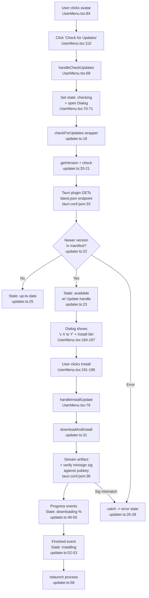

# Feature: auto-updater

## Summary

Manual, user-triggered self-update flow built on the Tauri Updater plugin v2. The user opens the **UserMenu** dropdown and clicks "Check for Updates". The frontend calls a thin wrapper in `src/lib/updater.ts` that invokes the Tauri `check()` command, which fetches `https://github.com/Ganim/Notter-AI/releases/latest/download/latest.json`, compares the manifest version against the bundled app version, and returns an `Update` handle if newer. A custom (non-native) React dialog renders the state machine — `idle → checking → up-to-date | available → downloading → installing → relaunch`. On accept, `update.downloadAndInstall()` streams the platform-appropriate artifact (signed `.tar.gz` on macOS, `.msi`/`.nsis` on Windows), Tauri verifies its minisign signature against the `pubkey` baked into `tauri.conf.json`, applies it, and `relaunch()` restarts the app. There is **no** auto-check at startup and **no** interval polling — it is always user-initiated. The native Tauri update dialog is explicitly disabled (`"dialog": false`).

## Happy Path

1. User clicks avatar → menu opens (`UserMenu.tsx:84-90`)
2. User clicks "Check for Updates" → `handleCheckUpdates()` (`UserMenu.tsx:68-74`) opens dialog and sets state to `checking`
3. `checkForUpdates()` reads bundled version via `getVersion()` and calls Tauri `check()` (`updater.ts:18-29`)
4. Tauri plugin GETs `latest.json` from the GitHub releases endpoint (`tauri.conf.json:32-34`)
5. Plugin compares manifest `version` (e.g. `0.2.2`) against current bundled version
6. If newer → returns `Update` object → wrapper returns `{kind: 'available', current, next, update}`
7. Dialog renders "v X → v Y" with Install button (`UserMenu.tsx:184-198`)
8. User clicks Install → `handleInstallUpdate()` calls `downloadAndInstall(update, setUpdateState)` (`UserMenu.tsx:76-79`, `updater.ts:31-62`)
9. `update.downloadAndInstall()` streams artifact, emits `Started`/`Progress`/`Finished` events → state transitions `downloading` → `installing` (`updater.ts:39-56`)
10. Tauri verifies minisign signature against `pubkey` in config (`tauri.conf.json:36`); on success applies installer
11. `relaunch()` from `@tauri-apps/plugin-process` restarts the app on the new version (`updater.ts:58`)

## Side Effects

- **HTTP GET** `https://github.com/Ganim/Notter-AI/releases/latest/download/latest.json` (manifest fetch, performed by Tauri Rust side)
- **HTTP GET** of the platform-specific binary URL listed in the manifest (e.g. `Notter-AI_0.2.2_x64-setup.exe`, `Notter-AI_universal.app.tar.gz`) — currently no `windows-x86_64-arm64` entry, only x64 and darwin variants
- **Cryptographic verification** — minisign signature check against base64-encoded `pubkey` from `tauri.conf.json:36`. Mismatch aborts the install (this was the v0.2.2 hotfix per recent commits)
- **Filesystem write** — Tauri replaces the running binary / installs MSI/NSIS package
- **Process restart** via `relaunch()` — current process exits, new version spawns

## Mermaid Flowchart

## External Dependencies

- `@tauri-apps/plugin-updater` — `check()` returns `Update` handle; `update.downloadAndInstall(onEvent)` streams `Started`/`Progress`/`Finished`
- `@tauri-apps/plugin-process` — `relaunch()` restarts the app post-install
- `@tauri-apps/api/app` — `getVersion()` reads bundled app version from `tauri.conf.json:4`
- **Tauri updater config** (`tauri.conf.json:30-37`):
  - `active: true`
  - `endpoints`: GitHub releases `latest.json` URL
  - `dialog: false` — disables the native Tauri update prompt; the React custom dialog handles UX
  - `pubkey`: base64 minisign public key for signature verification
- **Bundle config** (`tauri.conf.json:42`): `createUpdaterArtifacts: true` — emits the signed `.tar.gz`/`.sig` pair during release builds
- **Release infra** (out of scope but referenced): `latest.json` is committed to the repo root and also uploaded to the GitHub release assets; recent commits (`f3928e7`, `1620c69`) automate this. The recent v0.2.2 hotfix specifically fixed an "updater key mismatch" — i.e. the `pubkey` in the config did not match the minisign secret used by CI to sign artifacts.

## Notes / Observations

- **No automatic update check.** No `checkForUpdates()` call is wired into `App.tsx`, no `setInterval`, no `useEffect` on startup. Users must open the menu manually.
- **No persisted update state in `app-store.ts`.** The `useState<UpdateState>` lives entirely inside `UserMenu` component — closing the dialog mid-download does not cancel anything visible (though Tauri's promise still resolves), and progress is lost if the dialog is unmounted.
- **`dialog: false`** is intentional so the custom React dialog (`UserMenu.tsx:165-223`) can match the app's design system (shadcn/Sonner) instead of Tauri's native confirm prompt.
- **`latest.json` consumption** is exclusively by the Tauri Rust updater plugin — there is no JS-side fetch/parse of the manifest. The TS layer only sees the resulting `Update` object.
- **Platform coverage** in `latest.json`: darwin (aarch64, x86_64, universal — both with and without `-app` keys) and Windows (x86_64 MSI + NSIS). No Linux AppImage entries despite `targets: "all"` in bundle config.
- **Error UX is minimal** — any failure (network, signature mismatch, unsupported platform) collapses to the generic `error` state showing `e.message` (`UserMenu.tsx:214-220`).
