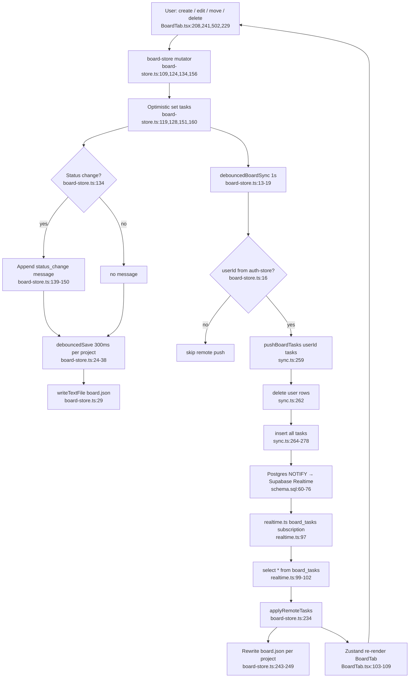

# Feature: board-tasks

## Purpose
Kanban-style task tracker grouped by project/subject. Each task has status, priority, description, and a thread of messages (comments, status changes, actions). Tasks are persisted to per-project local JSON files (`NotterProjects/<project>/board.json`) and mirrored to Supabase `board_tasks` for cross-device sync. Realtime subscriptions push remote edits back into the store.

## Entry Points
- `src/App.tsx:56` — mounts `<BoardTab />` inside the `Layout` tab map.
- `src/components/BoardTab.tsx:153` — `useEffect` calls `loadAllBoards()` on tab mount.
- `src/stores/auth-store.ts:70` — `syncOnLogin` calls `fetchBoardTasks` and seeds the store via `applyRemoteTasks`.
- `src/stores/auth-store.ts:114` / `:124` — `startRealtimeSync` subscribes the `board_tasks` channel after sign-in.

## Flowchart

## Key Files
- `src/App.tsx` — mounts BoardTab.
- `src/components/BoardTab.tsx` — UI: list grouping (project → subject), filters, create/delete dialogs, inline edit (title/description), status & priority dropdowns, message thread with auto-scroll. Calls `useBoardStore` selectors and mutators.
- `src/stores/board-store.ts` — Zustand store. `tasks: BoardTask[]`, `selectedTaskId`. CRUD: `createTask`, `updateTask`, `changeStatus`, `deleteTask`, `addMessage`. Bulk creators `createTaskFromPlanner`, `createTasksFromNote`. Project lifecycle hooks `onProjectRenamed`, `onProjectDeleted`. Remote merge via `applyRemoteTasks`. Two debouncers: 300 ms local FS save (per project) and 1000 ms Supabase push (global).
- `src/lib/sync.ts:232-283` — `fetchBoardTasks` (select-by-user) and `pushBoardTasks` (delete-then-insert all-rows-of-user; not partial upsert).
- `src/lib/realtime.ts:95-119` — postgres_changes subscription on `board_tasks` filtered by `user_id`; on any event re-selects all rows and pushes via `applyRemoteTasks`.
- `supabase/schema.sql:60-76` — table `board_tasks (user_id, id, project_name, subject_name, title, description, status, priority, created_at, updated_at, messages JSONB)`, PK `(user_id, id)`, RLS policy `users own board_tasks` using `auth.uid() = user_id`.
- `src/stores/auth-store.ts:69-76,114,124,127` — login-time hydration and realtime channel lifecycle (start on SIGNED_IN, stop on SIGNED_OUT).

## CRUD Operations & Sync Side Effects

### Create (`board-store.ts:109`)
1. Generate `id = crypto.randomUUID()`, set `createdAt = updatedAt = now`, `messages = []`.
2. Optimistic `set({ tasks })`.
3. `debouncedSave(projectName, …)` → write `NotterProjects/<project>/board.json` after 300 ms.
4. `debouncedBoardSync(…)` → after 1 s, if user signed in, `pushBoardTasks` deletes all user rows and re-inserts the full set.
5. Postgres triggers realtime; the local subscription would fire but `applyRemoteTasks` reseeds with the same payload, so result is idempotent.

### Move column / change status (`board-store.ts:134`, `BoardTab.tsx:502`)
1. Lookup task; capture `oldStatus`.
2. Synthesize `TaskMessage{type:'status_change', content:'open → in_progress'}` and append to `task.messages`.
3. Update `status`, `updatedAt`. Optimistic `set`.
4. Same debounced local save + remote push pipeline as create.
5. Status thread is rendered inline as italic separator (`BoardTab.tsx:570-578`).

### Edit (`board-store.ts:124`, `BoardTab.tsx:241,248,511`)
- `updateTask(id, { title?, description?, priority? })` → patches fields, bumps `updatedAt`, runs both debouncers.
- Title/description editing is double-click/click-to-edit with `onBlur` save (`BoardTab.tsx:474-552`).

### Delete (`board-store.ts:156`, `BoardTab.tsx:227-233`)
1. Filter task out, clear `selectedTaskId` if it pointed at deleted task.
2. Local debounced save rewrites the project's `board.json` without that task.
3. Remote push wipes the user's `board_tasks` rows and re-inserts the rest.

### Add message (`board-store.ts:168`, `BoardTab.tsx:235-239`)
- Pushes `comment` (default), `status_change`, or `action`-typed entries onto `task.messages`. Same debounced save + remote push.

## Happy Path: Create Task → Move to "Done"
1. User clicks **+ New Task** (`BoardTab.tsx:325`) → opens create dialog.
2. Fills project, subject, title, description, priority → `handleCreateTask` (`BoardTab.tsx:208`).
3. `createTask` (`board-store.ts:109`) appends task with status `open`, optimistic UI updates immediately.
4. After 300 ms `debouncedSave` writes `NotterProjects/<project>/board.json` via Tauri FS.
5. After 1 s `debouncedBoardSync` reads `useAuthStore.getState().user?.id`; if present, calls `pushBoardTasks` (`sync.ts:259`) → DELETE all user rows + INSERT full set.
6. Supabase emits `postgres_changes`; local `realtime.ts:97` channel receives event, re-selects, calls `applyRemoteTasks`, which sets the store and rewrites local JSON files (idempotent).
7. User opens task; status dropdown change fires `changeStatus(id, 'in_progress')` → appends status_change message, repeats save+push.
8. Successive status changes (`in_progress` → `in_review` → `done`) each append their own status_change messages and re-trigger the same debounced sync pipeline. The latest debounced timer wins, so rapid clicks coalesce into one Supabase round-trip.

## Side Effects Summary
- **Local FS**: per-project `NotterProjects/<projectName>/board.json` written via Tauri `writeTextFile` (debounced 300 ms in `board-store.ts:24`, immediate in `applyRemoteTasks`).
- **Supabase**: full delete-then-insert against `board_tasks` filtered by `user_id` (debounced 1 s, gated by signed-in user). No partial upsert — every mutation rewrites every row of the user.
- **Realtime broadcast**: `board_tasks` postgres_changes subscription in `realtime.ts:95` re-fetches and reseeds the store via `applyRemoteTasks` on any `INSERT/UPDATE/DELETE`. This includes echoes from this client itself.
- **Optimistic UI**: `set({ tasks })` fires before any I/O so the UI updates instantly; persistence and remote sync happen in the background.
- **Project lifecycle**: `onProjectRenamed` and `onProjectDeleted` (`board-store.ts:220,228`) mutate task list and trigger remote push but skip the local FS debouncer (potential drift if app exits before next mutation).

## External Dependencies
- **auth-sync (`auth-store.ts`)**: `debouncedBoardSync` reads `useAuthStore.getState().user?.id` to gate writes; without a session, remote push is silently skipped (`board-store.ts:16-17`). `syncOnLogin` (`auth-store.ts:69-76`) seeds the store from `fetchBoardTasks` on sign-in. `startRealtimeSync` (`auth-store.ts:114,124`) wires the realtime channel.
- **planner-store**: `loadAllBoards` iterates `usePlannerStore.getState().projects` to discover which `board.json` files to read (`board-store.ts:70`). Create dialog uses `loadSubjects(project)` to populate the subject dropdown (`BoardTab.tsx:158`).
- **Supabase tables**: `public.board_tasks` (composite PK `(user_id, id)`, RLS `auth.uid() = user_id`). Realtime publication must include this table for the subscription to deliver events.
- **Tauri FS plugin**: `@tauri-apps/plugin-fs` — `readTextFile`, `writeTextFile`, `exists`, `BaseDirectory.AppLocalData`.

## Risks / Notes
- `pushBoardTasks` performs a destructive `DELETE … WHERE user_id = $1` followed by an `INSERT` of the entire task set on every debounced flush. With concurrent clients editing simultaneously, the last writer's debounced flush erases and replaces the row set — there is no conflict resolution other than realtime echo. A network failure between DELETE and INSERT also risks data loss (no transaction wrapping in JS code).
- Realtime echo causes `applyRemoteTasks` to overwrite local optimistic state with the just-pushed payload, which can clobber an in-flight optimistic edit made between push and echo.
- `onProjectRenamed`/`onProjectDeleted` skip `debouncedSave`, so local `board.json` files retain stale `projectName` until something else triggers a save in those projects.
- `addMessage` and message timestamps rely on client clocks; multi-device ordering is approximate.
