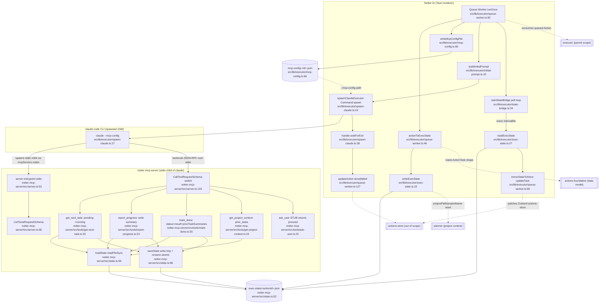

# mcp-server-bridge — flowchart

## Sources consulted
- `notter-mcp-server/src/server.ts:1-200`
- `notter-mcp-server/src/state.ts:1-72`
- `notter-mcp-server/src/tools/get-next-task.ts:1-67`
- `notter-mcp-server/src/tools/report-progress.ts:1-41`
- `notter-mcp-server/src/tools/mark-done.ts:1-59`
- `notter-mcp-server/src/tools/get-project-context.ts:1-38`
- `notter-mcp-server/src/tools/ask-user.ts:1-29`
- `src/lib/executor/mcp-config.ts:1-71`
- `src/lib/executor/spawn-claude.ts:1-63`
- `src/lib/executor/queue-worker.ts:1-154`
- `src/lib/executor/state-bridge.ts:1-68`
- `src/lib/executor/exec-state.ts:1-35`
- `src/lib/executor/types.ts:1-54`
- `src/lib/executor/initial-prompt.ts:1-25`

## Happy path
The Queue Worker (`runOnce`, `src/lib/executor/queue-worker.ts:92`) picks the next `queued` Action, projects it into an `ExecStateFile`, and writes `<appLocalData>/exec-state/<actionId>.json` (`writeExecState`, `src/lib/executor/exec-state.ts:22`). It then writes a per-Action `mcp-config-<id>.json` (`writeMcpConfigFile`, `src/lib/executor/mcp-config.ts:60`) pointing claude-code at `notter-mcp-server/dist/server.js` with `--action-id` and `--state-dir` args. `spawnClaudeExecutor` (`src/lib/executor/spawn-claude.ts:24`) launches `claude --print --mcp-config <path> --strict-mcp-config --dangerously-skip-permissions <initialPrompt>`. Claude reads the initial prompt from `buildInitialPrompt` (`src/lib/executor/initial-prompt.ts:10`) and loops over the five tools. The MCP server (`notter-mcp-server/src/server.ts:53`) boots a stdio transport scoped to one `actionId`. On `notter.get_next_task` (`server.ts:139` → `tools/get-next-task.ts:33`) the server loads the JSON file, marks the first `pending` task as `running` with `startedAt`, and saves atomically (write-tmp + rename, `state.ts:66`). Claude works the task and calls `notter.report_progress` (`tools/report-progress.ts:23`) to write a `summary` field, then `notter.mark_done` (`tools/mark-done.ts:30`) which sets `status` to `done` (or `failed` if `error_message`), populates `result`, sets `completedAt`, and appends a `{title, summary}` entry to `priorTaskSummaries`. Optionally `notter.get_project_context` (`tools/get-project-context.ts:23`) returns project path/name plus the prior summaries, and `notter.ask_user` (`tools/ask-user.ts:22`) is a stub that always returns `{answer:'proceed'}`. While claude runs, `startStateBridge` (`src/lib/executor/state-bridge.ts:34`) polls the same exec-state JSON every `intervalMs`, computes a `snapshotKey` over `id:status:summary:result.summary`, and on change calls `mirrorStateToStore` (`queue-worker.ts:69`) which fans out `updateTask` patches into the Zustand store. When claude exits, `waitForExit` resolves and the Queue Worker sets the Action to `done` or `failed` based on the exit code, then stops the bridge.

## Mermaid

## Side effects
- `src/lib/executor/queue-worker.ts:104` — `writeExecState` seeds the JSON file before claude is spawned (single source of truth handoff).
- `src/lib/executor/mcp-config.ts:68` — writes `mcp-config-<id>.json` per Action; never cleaned up by this module (claude needs it for spawn).
- `src/lib/executor/mcp-config.ts:53` — `mkdir` of `<appLocalData>/exec-state` if missing.
- `src/lib/executor/spawn-claude.ts:50` — spawns long-lived `claude` child process (NOT `Command.execute`); receives `--dangerously-skip-permissions`.
- `src/lib/executor/state-bridge.ts:56` — `setTimeout` polling loop reading the JSON every `intervalMs`; suppresses errors with a `console.warn`.
- `notter-mcp-server/src/state.ts:67-70` — atomic write via `writeFileSync` to `<id>.json.tmp` then `renameSync` (Windows + POSIX safe).
- `notter-mcp-server/src/tools/get-next-task.ts:48-50` — mutates the picked task to `running` + `startedAt = Date.now()` AND saves before responding (the act of fetching IS a state transition).
- `notter-mcp-server/src/tools/mark-done.ts:52` — appends to `priorTaskSummaries` (unbounded growth across an Action's tasks).
- `notter-mcp-server/src/tools/mark-done.ts:44` — coerces to `failed` whenever `error_message` is present, regardless of any other inputs.
- `notter-mcp-server/src/tools/report-progress.ts:7-9` — `status` input is intentionally ignored in Phase E despite being part of the schema (contract drift risk).
- `notter-mcp-server/src/tools/ask-user.ts:25-27` — stub logs to stderr and returns `proceed` immediately, defeating manual-trust gating.
- `src/lib/executor/queue-worker.ts:88` — `void` discards the `updateTask` promise; mirroring is fire-and-forget.
- `src/lib/executor/queue-worker.ts:38` — module-level `busy` + `timer` singletons; `__resetQueueWorkerForTests` resets both.

## Error / fallback branches
- `notter-mcp-server/src/server.ts:182-192` — every tool error is caught and returned as `{isError: true, content:[text]}` so claude sees the message but the server keeps running.
- `notter-mcp-server/src/tools/*` — every loadState miss throws `exec state for action <id> not found`, which surfaces to claude as the wrapped error above.
- `notter-mcp-server/src/tools/get-next-task.ts:43-45` — empty pending queue returns `{done:true}` (terminator the initial prompt is told to honor).
- `src/lib/executor/spawn-claude.ts:43-48` — `close` and `error` events both resolve the exit promise; `error` resolves with `-1`, treated as failure by the worker.
- `src/lib/executor/queue-worker.ts:130-133` — try/catch around `runOnce`; any thrown error → Action marked `failed` and the bridge stopped via `finally`.
- `src/lib/executor/state-bridge.ts:51-54` — JSON read/parse failures are logged and the loop continues (no surface to UI).
- `src/lib/executor/queue-worker.ts:96` — no queued action → no-op early return; `busy` stays false so next interval can run.
- `src/lib/executor/spawn-claude.ts:55-58` — `kill` swallows errors when the process is already gone.

## External dependencies
- executor (parent feature; this bridge is the executor's transport — Queue Worker, spawn, bridge all live in `src/lib/executor/`)
- actions-foundation (data model; `Action`/`ActionTask`/`ActionTaskStatus` shapes consumed at `src/lib/executor/queue-worker.ts:19,46-66`; output of `mark_done` mutates these via `mirrorStateToStore`)
- planner (project context; `projectPath` and `projectName` are seeded from the Action when `actionToExecState` runs at `src/lib/executor/queue-worker.ts:48-49` and read back by `notter.get_project_context`)
- claude-code CLI (out-of-process; `Command.create('claude', ...)` at `src/lib/executor/spawn-claude.ts:36`; spawns notter-mcp-server as its own stdio child via the `--mcp-config` JSON)
- @modelcontextprotocol/sdk (`Server` + `StdioServerTransport` at `notter-mcp-server/src/server.ts:14-19`; `tools/call` JSON-RPC over stdio is the only IPC channel between claude and the bridge — there is no HTTP)
- Tauri plugin-fs / plugin-shell (`@tauri-apps/plugin-fs` for state I/O, `@tauri-apps/plugin-shell` `Command` for spawning claude)
- Zustand actions-store (out of scope; `deps.updateAction`/`deps.updateTask` callbacks are how the bridge feeds the UI without importing the store directly)

## Confidence + gaps
high — full happy path is traced through both runtimes from one JSON file, and every tool's read/write surface on that file is explicit. Only soft gaps: (1) `is_greenfield` is hard-coded `false` in both `get_next_task` and `get_project_context` (TODO not surfaced anywhere in source); (2) `mcp-config-<id>.json` lifecycle has no documented cleanup — comment in `spawn-claude.ts:11-13` says "the caller is responsible" but the Queue Worker never deletes it; (3) the `priorTaskSummaries` array is the only cross-task memory channel between claude invocations within an Action and is reset only when a new Action runs (next `actionToExecState` overwrites the file).
