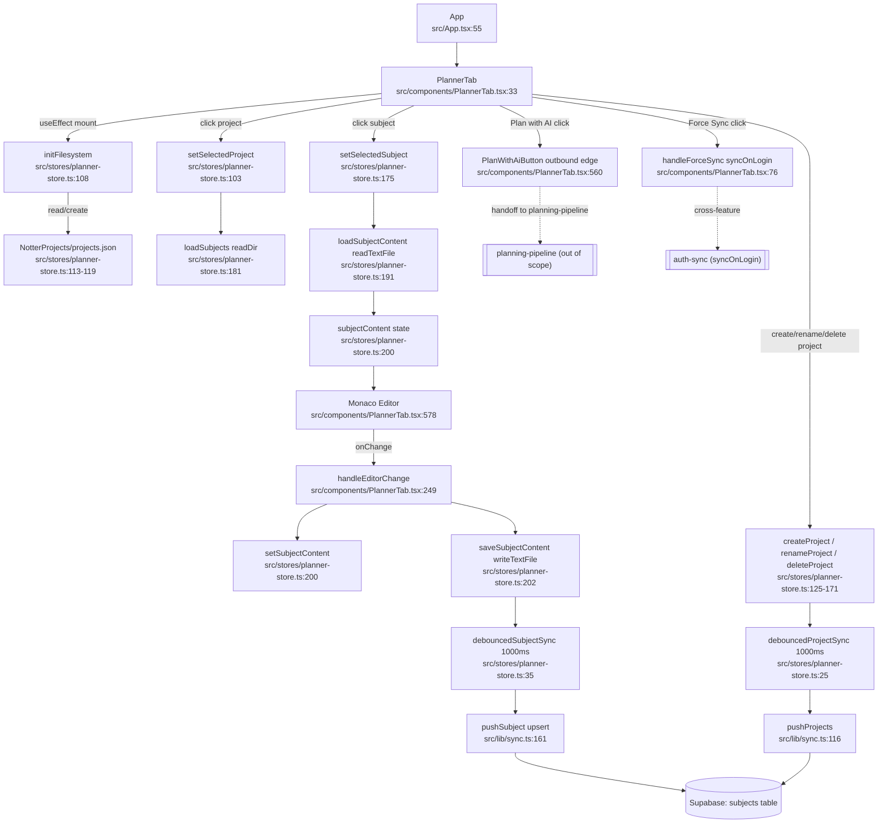

# planner — flowchart

## Sources consulted
- `src/App.tsx:1-66`
- `src/components/PlannerTab.tsx:1-985`
- `src/stores/planner-store.ts:1-313`
- `src/lib/sync.ts:1-230` (planner-relevant: pushProjects, pushSubject, deleteRemoteSubject, deleteRemoteSubjectsByProject, renameRemoteSubjectsProject, SubjectRecord)

## Happy path
On mount, `App` renders `<PlannerTab />` which calls `initFilesystem()` to create `NotterProjects/` under `BaseDirectory.AppLocalData` and load `projects.json`. The user clicks a project (loading its `.md` files via `readDir`) and a subject (loading content via `readTextFile`). Edits in the Monaco editor trigger `handleEditorChange` → `setSubjectContent` (immediate state) → `saveSubjectContent` which writes the file with `writeTextFile` and starts a 1s debounced `pushSubject` to Supabase. `PlanWithAiButton` is rendered in the editor header for the AI handoff (single outbound edge to the planning-pipeline feature).

## Mermaid

## Side effects
- `src/stores/planner-store.ts:111` — `mkdir NotterProjects/` on filesystem (Tauri AppLocalData).
- `src/stores/planner-store.ts:118` — `writeTextFile projects.json` initial seed.
- `src/stores/planner-store.ts:126,159,166,204,214,226,242` — local `.md` create/write/rename/remove for projects and subjects.
- `src/stores/planner-store.ts:131,142,155,167` — debounced `pushProjects` (Supabase delete-then-insert per user).
- `src/stores/planner-store.ts:39,205,221,236` — debounced/direct `pushSubject` upserts (Supabase `subjects`).
- `src/stores/planner-store.ts:144` — `renameRemoteSubjectsProject` cascade on project rename.
- `src/stores/planner-store.ts:169` — `deleteRemoteSubjectsByProject` cascade on project delete; also calls `useBoardStore.onProjectDeleted` (cross-feature).
- `src/stores/planner-store.ts:145,170` — `useBoardStore.onProjectRenamed/onProjectDeleted` mutate board feature state.
- `src/components/PlannerTab.tsx:362-369` — `addAction` + clear note + switch to Actions tab (cross-feature side effect of inline `handleProcess`).
- `src/components/PlannerTab.tsx:314` — `createTasksFromNote` writes into board store.

## Error / fallback branches
- `initFilesystem` swallows errors (`src/stores/planner-store.ts:120`) — silently logs and leaves projects empty.
- `loadSubjectContent` falls back to `subjectContent = '# Erro ao carregar'` on read failure (`src/stores/planner-store.ts:196`).
- `saveSubjectContent` logs and continues; remote sync still scheduled (`src/stores/planner-store.ts:206`).
- `handleForceSync` toasts `planner.sync_error` on rejection; UI re-enables button (`src/components/PlannerTab.tsx:82-86`).
- All `sync.ts` exports early-return if `!isSupabaseConfigured`, making sync a silent no-op for unauthenticated/offline users.
- `renameSubject` swallows missing-content read errors and relies on next save (`src/stores/planner-store.ts:237`).

## External dependencies
- planning-pipeline (via `PlanWithAiButton` at `src/components/PlannerTab.tsx:560` — outbound only)
- auth-sync (via `syncOnLogin` import at `src/components/PlannerTab.tsx:29`, and `useAuthStore.getState().user?.id` reads in `src/stores/planner-store.ts:28,38,143,168,220,231,248`)
- board (via `useBoardStore.onProjectRenamed/onProjectDeleted` at `src/stores/planner-store.ts:145,170` and `createTasksFromNote/createTaskFromPlanner` at `src/components/PlannerTab.tsx:60,314,943`)
- actions (via `useActionsStore.addAction` + `processNoteToAction` at `src/components/PlannerTab.tsx:354-369` — overlaps with planning-pipeline scope; the inline `handleProcess` path is a separate non-pipeline AI route)
- agents (via `useAgentsStore.profiles` + `translateNote` at `src/components/PlannerTab.tsx:61,310`)
- ai (via `useAiStore` provider/model state at `src/components/PlannerTab.tsx:66-69`)
- app (via `useAppStore.setActiveTab` for tab navigation at `src/components/PlannerTab.tsx:88,369`)
- supabase (via `src/lib/sync.ts:1` import of `@/lib/supabase`)

## Confidence + gaps
high — all primary paths traced from source; only ambiguity is whether the inline `handleProcess`/`processNoteToAction` route should be considered part of planning-pipeline or a separate "actions" pipeline. Treated here as a side effect rather than a flow node since the prompt scopes the pipeline handoff specifically to `PlanWithAiButton`.
