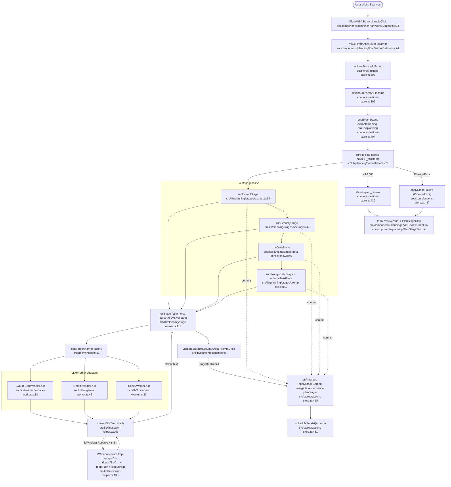

# Feature: planning-pipeline

The v2 autonomous planning pipeline. A single click ("Plan with AI") on a Markdown note runs four sequential LLM stages — **extract → security → data_consistency → prompt_critic** — each invoked through a uniform `LLMWorker` adapter that spawns a CLI (`claude`, `gemini`, `codex`) via Tauri's shell plugin. Each stage commits a snapshot of `ActionTask[]` to the actions store; the trust floor is enforced at the end.

## Entry Points

- `PlanWithAiButton` (UI button in the Planner note header) — `src/components/planning/PlanWithAiButton.tsx:50`
- `useActionsStore.startPlanning()` — `src/stores/actions-store.ts:396`
- `runPipeline()` (orchestrator) — `src/lib/planning/orchestrator.ts:76`

## Data Flow

1. User clicks Plan-with-AI on a Markdown note in the Planner.
2. Button creates a draft `Action` (`status: 'draft'`) and calls `startPlanning(actionId, project)`.
3. Store seeds `planStages` (extract = running) and flips `action.status = 'planning'`.
4. Orchestrator iterates `STAGE_ORDER = [extract, security, data_consistency, prompt_critic]`. Each stage:
   - builds a user prompt from `(rawMarkdown | existingTasks, project)`,
   - calls `runStage()` which gets a worker via `getWorker('claude-code')` and runs it,
   - the worker spawns its CLI through `spawnCli()` (on Windows: temp file + `cmd.exe < tempPath > stdoutPath` redirect),
   - parses + validates JSON, returns `StageRunResult { tasks, tokenUsage, durationMs, rawOutput }`.
5. After every stage commit the orchestrator invokes `onProgress(result)`; the store merges `result.tasks` into the Action and advances `planStages`.
6. After `prompt_critic`, store flips `action.status = 'plan_review'`. The Actions tab's `PlanReviewPanel` lets the user accept/edit before execution.

## Side Effects

- Spawns external CLI processes: `claude.exe`, `gemini.cmd`, `codex.cmd` (all four stages currently route through `claude-code` per the comments in stage files).
- Windows-only: writes prompt to `$APPLOCALDATA/tmp-prompts/prompt-<uuid>.txt` and reserves `stdout-<uuid>.txt`, then `cmd.exe /S /C "chcp 65001 >nul && cli.cmd args < tempPath > stdoutPath 2>nul"`. Both temp files are removed in `finally`.
- Zustand store mutations on every stage: `actions[].planStages`, `actions[].tasks`, `actions[].status`, `actions[].updatedAt`.
- Persistence: `schedulePersist(() => get().actions)` after every store write.
- No DB or network I/O outside the CLI processes.

## Flowchart

## External Dependencies

- **planner** (UI host): `PlanWithAiButton` is mounted in the Planner note header; reads `project`, `subjectName`, `noteMarkdown` from planner state and routes to the Actions tab via `onStarted`.
- **ai-providers** (config/auth): the worker adapters depend on the `claude` / `gemini` / `codex` CLIs being installed and authenticated in the user's shell — the providers feature surfaces auth state and configuration.
- **actions-foundation**: the pipeline's only persistence target. `addAction`, `startPlanning`, `retryPlanStage` mutate `useActionsStore` (`src/stores/actions-store.ts`); `Action.tasks`, `Action.planStages`, `Action.status` belong to that store. There is no separate "planner store" write.
- **types/actions** (`src/types/actions.ts`): defines `Action`, `ActionTask`, `PlanStage`, `PlanStageName`, `TokenUsage`, `TrustLevel` consumed everywhere.
- **@tauri-apps/plugin-shell** + **plugin-fs** + **api/path**: process spawning + temp-file I/O for the Windows BatBadBut workaround.

## Notes / Gotchas

- All four stages currently use `workerName: 'claude-code'`. Comments in `extract.ts:79`, `security.ts:55`, `data-consistency.ts:53` document the migration history (gemini-cli → codex-cli → claude-code) — gemini was too slow on the user's install; codex misinterpreted the prompt as an executable task and returned `{"status":"blocked"}`. The `gemini-cli` and `codex-cli` adapters remain wired through `getWorker()` for future use.
- Stages 2–4 verify the LLM did not invent or drop task ids by passing `expectedIds` to the validator (`security.ts:51`, `data-consistency.ts:49`, `prompt-critic.ts:61`). Schema violations become `PipelineError(reason: 'schema_error')`.
- `enforceTrustFloor` (`src/lib/planning/types.ts:79`) only escalates trust (`auto + flags → semi`); it never de-escalates. Applied per-task at the end of stage 4.
- Cancellation is checked between stages only (`orchestrator.ts:119`) — there is no in-flight CLI kill; an aborted run still finishes the current stage's spawn before throwing `PipelineError(reason: 'cancelled')`.
- Resume: `runPipeline({ resumeFrom, existingTasks })` skips earlier stages. `retryPlanStage()` (`actions-store.ts:477`) resets the failed stage and everything after it, then calls `runPipeline` with `resumeFrom`.
- Windows spawn quirk: prompts containing `\n`, `"`, `<`, `>`, `|`, `&` cannot be passed as `.cmd` args (Rust's CVE-2024-24576 sanitizer rejects them), so `spawn-helper` writes to a temp file and uses `cmd.exe`'s `<` redirect. Stdout is also redirected to a temp file and decoded with a lossy `TextDecoder` so stray non-UTF-8 bytes from `codex.cmd` don't fail Tauri's strict UTF-8 decoder.
