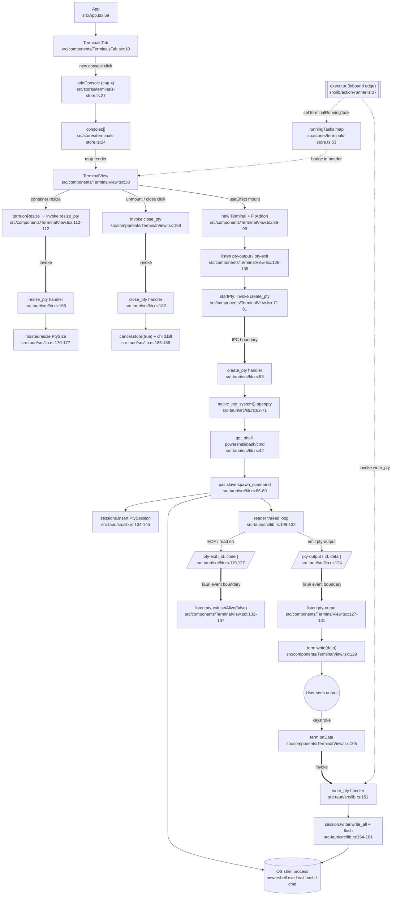

# terminal-panes — flowchart

## Sources consulted
- `src/App.tsx:1-66`
- `src/components/TerminalsTab.tsx:1-128`
- `src/components/TerminalView.tsx:1-290`
- `src/stores/terminals-store.ts:1-75`
- `src-tauri/src/lib.rs:1-189` (PTY-related: payloads, `PtySession`, `PtyManager`, `get_shell`, `create_pty`, `write_pty`, `resize_pty`, `close_pty`, registration at `:257-264`)
- `src/lib/action-runner.ts:1-56` (executor inbound edge — `write_pty` invocation only; not traced further)

## Happy path
On mount, `App` renders `<TerminalsTab />`, which lets the user click "New Console" to open a project picker, then `addConsole(name, cwd)` appends a `ConsoleInstance` to the Zustand store (capped at 4). Each console renders a `<TerminalView />` that boots an xterm.js `Terminal` in a `useEffect`, registers `pty-output` / `pty-exit` listeners, then invokes the Tauri `create_pty` command (id, cols, rows, cwd, shell). The Rust side opens a portable_pty pair, spawns the configured shell (`powershell -NoLogo` by default; `wsl bash` or `cmd`) inheriting parent env + cwd, stores a `PtySession` in `PtyManager.sessions`, and launches a reader thread that loops `reader.read(buf)` and emits `pty-output { id, data }` chunks to the webview. The frontend's listener writes each chunk into xterm. xterm's `onData` (keystrokes) and `onResize` are wired to `write_pty` and `resize_pty` respectively, completing the bidirectional loop. On unmount or close, the cleanup invokes `close_pty`, which sets the cancel flag and `child.kill()`s the shell.

## Mermaid

## Side effects
- `src-tauri/src/lib.rs:86-89` — spawns OS shell process (`powershell.exe`, `wsl bash`, or `cmd.exe`) inheriting all env vars from `std::env::vars()` (`:82-84`) and parent cwd (`:79-81`).
- `src-tauri/src/lib.rs:109-132` — long-lived OS thread per PTY (`thread::spawn`) reading from the master end into a 4 KiB buffer.
- `src-tauri/src/lib.rs:124` — `app.emit("pty-output", ...)` on every read; broadcast to all webview listeners (filtered client-side by `event.payload.id === id`).
- `src-tauri/src/lib.rs:119,127` — `app.emit("pty-exit", ...)` on EOF or read error.
- `src-tauri/src/lib.rs:134-145` — `PtyManager.sessions` HashMap mutation under `Mutex`; key is the frontend-supplied id (`${Date.now()}-${rand}` from `src/stores/terminals-store.ts:29`).
- `src-tauri/src/lib.rs:185-186` — `AtomicBool` cancel flag toggled and `child.kill()` issued on close; reader thread exits on next iteration.
- `src/components/TerminalView.tsx:115-118` — DOM `ResizeObserver` per pane that calls `fitAddon.fit()`, which transitively triggers `term.onResize` → `resize_pty` invoke.
- `src/components/TerminalView.tsx:165-172` — re-applies xterm theme/font when `terminalSettings` change (no PTY interaction).
- `src/stores/terminals-store.ts:42-50` — `removeConsole` mutation also wipes the matching `runningTasks[id]` slot (cross-feature state owned by executor).

## Error / fallback branches
- `startPty` catches `create_pty` rejection and stores it in `error` state, marking the pane red and offering a Retry button (`src/components/TerminalView.tsx:77-80, 268-280`).
- `term.onData` and `term.onResize` swallow `write_pty` / `resize_pty` errors with `.catch(() => {})` (`:106, :111`) — keystrokes/resizes during a dead PTY are silently dropped.
- Cleanup `close_pty` on unmount also `.catch(() => {})`s — best-effort kill (`:158`).
- Backend handlers all return `Result<(), String>`: lock-poison, missing session, write/flush/resize failures bubble up as the rejected invoke (`src-tauri/src/lib.rs:151-178`). Frontend `onData`/`onResize` paths suppress these; only `create_pty` surfaces them in UI.
- Reader thread on `read` error emits `pty-exit { code: -1 }` and breaks (`src-tauri/src/lib.rs:126-129`); EOF emits `code: 0` (`:117-121`). Frontend marks the pane non-alive and shows a Restart icon (`src/components/TerminalView.tsx:132-137, 251-258`).
- Restart path (`handleRestart` `:181-187`) and shell-switch (`handleSwitchShell` `:189-204`) call `close_pty` then `create_pty` against the *same id* — relies on `close_pty` removing the entry from `sessions` first (`src-tauri/src/lib.rs:184`).
- Reader-thread vs `child.kill` race: `cancel` is checked at the top of the loop, but a blocked `reader.read` won't observe it until the next read returns; in practice EOF arrives quickly because the kill closes the slave.
- `TerminalsTab.handleOpenPicker` enforces the 4-console UI cap (`src/components/TerminalsTab.tsx:18-22`); `addConsole` enforces it again at the store level (`src/stores/terminals-store.ts:28`).

## External dependencies
- **executor (inbound edge — diagrammed but not traced):** `src/lib/action-runner.ts:37` invokes `write_pty` against a user-selected terminal id; `:42-46` writes a `TerminalRunningTask` into `useTerminalsStore.runningTasks`, which `TerminalView` reads at `:49` to render the running-task badge. The selection itself happens in `src/components/actions/TaskItem.tsx:61,93`. Internals of executor are out of scope.
- **app-store:** `src/stores/app-store.ts` provides `terminalSettings` (theme name, font family/size, ligatures) and the `TERMINAL_THEMES` palette consumed at `src/components/TerminalView.tsx:8, 48, 57-60, 165-172`.
- **planner-store (read-only):** `usePlannerStore().projects` is read in `TerminalsTab.tsx:13` to populate the project picker; clicking a project passes its `path` as the PTY `cwd`.
- **Tauri runtime:** `@tauri-apps/api/core` (`invoke`) and `@tauri-apps/api/event` (`listen`) bridge to the Rust commands; the `PtyManager` state is registered at `src-tauri/src/lib.rs:257-260` and the four commands at `:261-264`.
- **portable_pty crate:** `native_pty_system`, `CommandBuilder`, `MasterPty`, `PtySize` — abstracts ConPTY (Windows) / openpty (Unix). Carries the OS-shell side effect.
- **xterm.js:** `@xterm/xterm`, `@xterm/addon-fit`, `@xterm/addon-ligatures` render the terminal surface; xterm's input/resize events drive the outbound IPC.
- **i18n / sonner / lucide / shadcn Dialog:** UI-only (translations, toast, icons, modal); no PTY involvement.

## Confidence + gaps
high — every PTY command name (`create_pty`, `write_pty`, `resize_pty`, `close_pty`) and every event name (`pty-output`, `pty-exit`) is matched between `src/components/TerminalView.tsx` and `src-tauri/src/lib.rs`, and the executor inbound edge is grounded in `src/lib/action-runner.ts:37`. One subtle gap noted but not pursued: the reader-thread cancel loop only checks `cancel` between reads, so the `close_pty` → kill sequence relies on the kill closing the slave to unblock `read`; this is a known property of portable_pty rather than a bug, and was not traced further per scope.
