# 03 — Unified Proposal

Date: 2026-05-09
Author: Pathfinder orchestrator (synthesis only).
Inputs: `00-features.md`, `01-flowcharts/*.md`, `02-duplication-report.md`.

This proposes the **simplest** unified architecture for the duplications surfaced in Phase 2. Each section names a single component, its single entry point, and what each old call site becomes. Anti-patterns to reject: registries-for-flexibility, feature-flag-gated dual paths, and abstractions that exist "for future symmetry."

Five unified systems + one retirement.

---

## System 1 — `SyncedStore` primitive (cross-cutting)

**Replaces:** sync-push duplication (`02-duplication-report.md` #2), realtime listeners (#3), per-store debounce (#4), boot-singleton race (#13).

**New file:** `src/lib/synced-store.ts`. Single entry point: a small set of named exports — no class, no factory.

```ts
// shape only — implementation guidance
export function upsertUserRows<TLocal, TRow>(
  table: string,
  userId: string,
  rows: TLocal[],
  toRow: (r: TLocal) => TRow,
): Promise<void>; // upsert keyed by (user_id, id) — no destructive delete

export function deleteUserRow(table: string, userId: string, id: string): Promise<void>;

export function subscribeUserTable(
  channel: RealtimeChannel,
  table: string,
  userId: string,
  refetchAndApply: () => Promise<void>,
): void;

export function makeDebouncedSync<T>(
  pushFn: (userId: string, payload: T) => Promise<void>,
  ms: number,
): { schedule(payload: T): void; flush(): Promise<void> };

export function runOnce(key: string, fn: () => Promise<void>): Promise<void>;
// flips the per-key flag AFTER success; failed init can be retried
```

**Old call sites become:**
- `src/lib/sync.ts:76-98 (pushAgentProfiles)` → `upsertUserRows('agent_profiles', userId, profiles, toAgentProfileRow)`
- `src/lib/sync.ts:116-133 (pushProjects)` → same pattern with project mapper
- `src/lib/sync.ts:259-283 (pushBoardTasks)` → same
- `src/lib/sync.ts:301-318 (pushActions)` → same
- `src/lib/realtime.ts:37-59 (agent_profiles listener)` → `subscribeUserTable(channel, 'agent_profiles', uid, fetchAndApplyProfiles)`
- `src/lib/realtime.ts:60-76 / 77-94 / 95-119 / 120-133` → same shape, four lines each
- `src/stores/actions-store.ts:200-208 + 245-262` → `const sync = makeDebouncedSync(pushActions, 1000); …schedule…/…flush…`
- `src/stores/board-store.ts:11-19 / 22-38` → same
- `src/stores/planner-store.ts:23-41` → same
- `src/stores/agents-store.ts:17-25` → same (gains a `flush()` it lacked)
- `src/stores/app-store.ts:34-42` → same (gains a `flush()` it lacked)
- `src/stores/actions-store.ts:39-50 (bootExecutor)` → wraps `startQueueWorker` in `runOnce('queue-worker', ...)` so a failed init is retryable
- `src/lib/realtime.ts:12-18` → already idempotent; convert for symmetry, not for behavior change

**Behavior change to call out:**
- `delete-then-insert` becomes `upsert keyed by (user_id, id)` + explicit `deleteUserRow` calls on real deletions. **This closes the "concurrent writer wipes the server" race window** flagged in `01-flowcharts/auth-sync.md`. Net behavior gain. Each store's local delete path must call `deleteUserRow` (a one-line addition in the existing delete reducer).

**Capability lost:** none.

**Hard "do not" guards:**
- Don't introduce a `class SyncedStore` — these are 5 functions, not an OO container.
- Don't add a generic "field mapping config" — call sites pass a tiny `toRow` lambda. If a store has nontrivial mapping, the lambda is the right place for it.
- Don't gate the new path behind a flag. Migrate one store at a time and delete the old function from `sync.ts` as soon as its last caller flips.

---

## System 2 — Planning primitives + promoted helpers

**Replaces:** stage glue duplication (#5), `mergePatchById` (#6), CLI error classifier (#7), LLM JSON cleaning (#8).

**New files:**
- `src/lib/planning/stages/_shared.ts` — stage helpers
- `src/lib/llm/json-utils.ts` — promoted `extractJsonObject`
- `src/lib/llm/error-classifier.ts` — promoted `classifyCliError`

```ts
// _shared.ts
export function buildTaskListPrompt<T>(opts: {
  project: ProjectContext;
  tasks: T[];
  projectFields: (t: T) => Record<string, unknown>;
  label: string;
}): string;

export function mergePatchById<T extends { id: string }, P extends { id: string }>(
  tasks: T[], patches: P[], merge: (t: T, p: P) => T,
): T[];

export function runFlaggingStage<P>(opts: {
  stageName: PlanStageName;
  systemPrompt: string;
  validate: (parsed: unknown, expectedIds: Set<string>, raw: string) => P[];
  workerName?: 'claude-code' | 'codex' | 'gemini';
}): Promise<{ tokenUsage; durationMs; rawOutput; parsed: P[] }>;
```

```ts
// llm/json-utils.ts
export function extractJsonObject(raw: string): string;
// strip ``` fences, slice from first { to last }, return cleaned string
```

```ts
// llm/error-classifier.ts
export function classifyCliError(opts: {
  cli: 'claude-code' | 'codex' | 'gemini';
  exitCode: number | null;
  stderr: string;
  patterns: { auth: string[]; rate: string[]; network?: string[] };
  defaultMessage?: (code: number | null) => string;
}): LLMWorkerError;
```

**Old call sites become:**
- `src/lib/planning/stages/security.ts:15-70` → ~30 lines: build per-stage `projectFields` lambda, call `runFlaggingStage`, run `mergePatchById`, return `StageRunResult`.
- `src/lib/planning/stages/data-consistency.ts:12-66` → same structure as security.
- `src/lib/planning/stages/prompt-critic.ts:23-90` → same, plus the legitimate `enforceTrustFloor` call after merge (kept manual since it's specific).
- `src/lib/llm/claude-code-worker.ts:107-159` → 1 call to `classifyCliError({ cli: 'claude-code', exitCode, stderr, patterns: CLAUDE_PATTERNS })`.
- `src/lib/llm/codex-worker.ts:107-158` → same with `CODEX_PATTERNS`.
- `src/lib/llm/gemini-worker.ts:121-172` → same with `GEMINI_PATTERNS`.
- `src/lib/action-processor.ts:55-96 (extractJson)` → import + use `extractJsonObject`.
- `src/lib/callback-analyzer.ts:62-99 (parseAnalysisResponse)` → same.
- `src/lib/planning/stage-runner.ts:45-72 (stripJsonNoise)` → same; remove the local copy.

**Capability lost:** none. The `extract` stage doesn't share `_shared.ts` (different shape: raw markdown, not a task list) — leave it as-is.

**Hard "do not" guards:**
- Don't pass `runFlaggingStage` a generic "stage config" object — keep `validate` and `systemPrompt` as required params.
- Don't unify `extract` stage into the same helper. It's legitimately different.
- Don't add a `classifyHttpError` to the same file unless we actually need it — that's a future-proofing trap.

---

## System 3 — `actions-store` mutate envelope + `runPlanning` helper

**Replaces:** the hottest single duplication (#1) — 11+ `set + schedulePersist` postludes and the wholesale-copied `startPlanning` / `retryPlanStage` try/catch (~60 lines).

**Refactor inside:** `src/stores/actions-store.ts`. No new file.

```ts
// inside the store factory
function mutate(updater: (s: ActionsState) => Partial<ActionsState>) {
  set(updater);
  schedulePersist(() => get().actions);
}

function mapAction(id: string, fn: (a: Action) => Action) {
  mutate((s) => ({
    actions: s.actions.map((a) => a.id === id ? { ...fn(a), updatedAt: nowIso() } : a),
  }));
}

function mapTask(actionId: string, taskId: string, fn: (t: ActionTask) => ActionTask) {
  mapAction(actionId, (a) => ({ ...a, tasks: a.tasks.map((t) => t.id === taskId ? fn(t) : t) }));
}

async function runPlanning(
  actionId: string,
  project: ProjectContext,
  resumeFrom?: PlanStageName,
  existingTasks?: ActionTask[],
) {
  // single owner of: onProgress closure, runPipeline call, success/failure set blocks
}
```

**Old call sites become:**
- `actions-store.ts:347-350 (addAction)` → `mutate((s) => ({ actions: [...s.actions, a] }))`
- `actions-store.ts:352-359 (updateAction)` → `mapAction(id, (a) => ({ ...a, ...patch }))`
- `actions-store.ts:361-367 (deleteAction)` → `mutate((s) => ({ actions: s.actions.filter((a) => a.id !== id) }))` + `deleteUserRow('actions', uid, id)` from System 1
- `actions-store.ts:373-385 (updateTask)` → `mapTask(actionId, taskId, (t) => ({ ...t, ...patch }))`
- `actions-store.ts:404-473 (startPlanning)` → seed prelude + `runPlanning(id, project)`
- `actions-store.ts:483-563 (retryPlanStage)` → seed prelude + `runPlanning(id, project, resumeFrom, existingTasks)`
- `actions-store.ts:568-647 (approvePlan / rejectPlan / requeueExecution)` → `mapAction(id, ...)` patterns

**Capability lost:** none. The `updatedAt` stamp is centralized (currently re-inlined ~10 times — easy place for divergence today).

**Hard "do not" guards:**
- Don't make `mutate`/`mapAction`/`mapTask` exports — they're store-private.
- Don't generalize `runPlanning` to "any pipeline" — it's specific to the planning stages.
- Don't move `runPlanning` to a separate file just for "cleanliness" — it needs `set`/`get` closure access.

---

## System 4 — Provider adapter registry (ai-providers)

**Replaces:** `generateCloud` switch + repeated request/extract scaffolding (#9).

**Refactor inside:** `src/lib/ai-providers.ts`. No new file.

```ts
type ProviderAdapter = {
  label: string;
  buildRequest(model: string, apiKey: string, prompt: string): {
    url: string;
    headers: Record<string, string>;
    body: object;
  };
  extractText(parsed: unknown): string | undefined;
};

const ADAPTERS: Record<CloudProviderId, ProviderAdapter> = {
  claude:   { ... },
  gemini:   { ... },
  groq:     { ... },
  openai:   { ... },
  deepseek: { ... },
};

export async function generateCloud(p: GenerateCloudParams): Promise<string> {
  const adapter = ADAPTERS[p.providerId];
  if (!adapter) throw new Error(`Unknown provider: ${p.providerId}`);
  const { url, headers, body } = adapter.buildRequest(p.model, p.apiKey, p.prompt);
  const raw = await llmRequest({ url, method: 'POST', headers, body: JSON.stringify(body) });
  const parsed = JSON.parse(raw);
  const text = adapter.extractText(parsed);
  if (typeof text !== 'string') throw new Error(`${adapter.label} response missing text`);
  return text;
}
```

**Old call sites become:**
- `src/lib/ai-providers.ts:74-94 (Gemini branch)` → `ADAPTERS.gemini` row
- `src/lib/ai-providers.ts:96-119 (Claude branch)` → `ADAPTERS.claude` row
- `src/lib/ai-providers.ts:121-150 (Groq/OpenAI/DeepSeek nested ternary)` → three separate `ADAPTERS.groq`/`openai`/`deepseek` rows. The nested `?:` at line 124-129 is deleted.

**Capability lost:** none.

**Hard "do not" guards:**
- Don't make `ADAPTERS` exported or pluggable. Five providers, hard-coded keys.
- Don't add a `streaming` field "for later." The codebase doesn't support streaming for cloud today; add the field when streaming is actually implemented.

---

## System 5 — Small helpers (MCP + Rust PTY + TerminalView)

**Replaces:** items #10, #11, #12.

### 5a. MCP server: `loadStateOrThrow` / `findTaskOrThrow`

In `notter-mcp-server/src/state.ts`:
```ts
export function loadStateOrThrow(stateDir: string, actionId: string): ExecStateFile;
export function findTaskOrThrow(state: ExecStateFile, taskId: string): ExecTaskSnapshot;
```

Old call sites become 1-line each in `tools/get-next-task.ts`, `tools/report-progress.ts`, `tools/mark-done.ts`, `tools/get-project-context.ts`.

### 5b. Rust PTY: `PtyManager::with_session`

In `src-tauri/src/lib.rs`:
```rust
impl PtyManager {
  fn with_session<F, R>(&self, id: &str, f: F) -> Result<R, String>
    where F: FnOnce(&mut PtySession) -> Result<R, String>;
}
```

`write_pty` and `resize_pty` become one-liners. `close_pty` keeps its `.remove()` body (legitimate divergence).

### 5c. TerminalView: `handleSwitchShell` calls `startPty`

In `src/components/TerminalView.tsx:189-204`, replace the inlined body with:
```ts
term.clear();
await invoke('close_pty', { id }).catch(() => {});
await startPty(term);
```

(Modeled on `handleRestart` at `:181-187` which already does this.)

**Capability lost:** none.

---

## Retirement (NOT a consolidation)

### Delete v1 execution path

Two execution paths are live (`02-cross-duplication.md` #E v1/v2). v1 (`src/lib/action-runner.ts` → `write_pty`) and v2 (queue-worker → `spawn-claude.ts`) disagree on task status enums (`waiting`/`processing` vs `pending`/`queued`/`running`).

Per the Phase E spec (`docs/superpowers/specs/2026-04-09-phase-e-executor-design.md`), v2 is the intended path. v1 should be retired:

1. Migrate `src/components/ActionsTab.tsx:48` and any other v1 callers to v2 (`startQueueWorker`).
2. Remove `src/lib/action-runner.ts`.
3. Remove v1-only statuses (`waiting`, `processing`, `skipped`) from `src/types/actions.ts` and any branching that handles them.
4. Update `src/types/actions.ts:155-162` (`nextTaskStatus`) and any v1/v2 branches in stores.

This is a **deletion task**, not a refactor. It belongs in its own `/make-plan` so it's not bundled with consolidation work.

---

## Combined unified architecture

```mermaid
flowchart TD
  subgraph P1["src/lib/synced-store.ts (NEW)"]
    upsertUserRows
    deleteUserRow
    subscribeUserTable
    makeDebouncedSync
    runOnce
  end

  subgraph P2["src/lib/planning/stages/_shared.ts (NEW)"]
    buildTaskListPrompt
    mergePatchById
    runFlaggingStage
  end

  subgraph P3["src/lib/llm/json-utils.ts (NEW)"]
    extractJsonObject
  end

  subgraph P4["src/lib/llm/error-classifier.ts (NEW)"]
    classifyCliError
  end

  subgraph Stores["Zustand stores (refactored)"]
    actionsStore["actions-store<br/>+ mutate / mapAction / mapTask / runPlanning<br/>src/stores/actions-store.ts"]
    boardStore["board-store<br/>src/stores/board-store.ts"]
    plannerStore["planner-store<br/>src/stores/planner-store.ts"]
    agentsStore["agents-store<br/>src/stores/agents-store.ts"]
    appStore["app-store<br/>src/stores/app-store.ts"]
  end

  subgraph Pipeline["Planning stages (declarative)"]
    securityStage["security<br/>src/lib/planning/stages/security.ts"]
    consistencyStage["data-consistency<br/>src/lib/planning/stages/data-consistency.ts"]
    criticStage["prompt-critic<br/>src/lib/planning/stages/prompt-critic.ts"]
  end

  subgraph Workers["LLM workers (CLI)"]
    claudeWorker["claude-code-worker<br/>src/lib/llm/claude-code-worker.ts"]
    codexWorker["codex-worker<br/>src/lib/llm/codex-worker.ts"]
    geminiWorker["gemini-worker<br/>src/lib/llm/gemini-worker.ts"]
  end

  subgraph Cloud["Cloud providers"]
    aiProviders["generateCloud + ADAPTERS registry<br/>src/lib/ai-providers.ts"]
  end

  subgraph V1Consumers["JSON-output consumers"]
    actionProcessor["action-processor<br/>src/lib/action-processor.ts"]
    callbackAnalyzer["callback-analyzer<br/>src/lib/callback-analyzer.ts"]
    stageRunner["stage-runner<br/>src/lib/planning/stage-runner.ts"]
  end

  P1 --> actionsStore
  P1 --> boardStore
  P1 --> plannerStore
  P1 --> agentsStore
  P1 --> appStore

  P2 --> securityStage
  P2 --> consistencyStage
  P2 --> criticStage

  P3 --> stageRunner
  P3 --> actionProcessor
  P3 --> callbackAnalyzer

  P4 --> claudeWorker
  P4 --> codexWorker
  P4 --> geminiWorker

  retired["RETIRED<br/>src/lib/action-runner.ts (v1 PTY runner)"]:::strike

  classDef strike stroke-dasharray: 5 5,color:#888
```



## Anti-patterns explicitly rejected in this proposal

1. **No registry/factory for SyncedStore.** Five named exports, not a class.
2. **No feature-flagged dual paths.** Each store migrates and the old `sync.ts` function is deleted in the same PR.
3. **No "future-proofing" config knobs.** No streaming field on `ProviderAdapter`, no `classifyHttpError` in `error-classifier.ts`, no pluggable adapter loader.
4. **No abstraction of legitimately specialized code.** The Codex/Gemini Windows-stdin sentinel and the v1↔v2 execution paths are *not* unified — v1 is retired instead.
5. **No new files for store-private helpers.** `mutate`/`mapAction`/`mapTask`/`runPlanning` live inside `actions-store.ts`.
