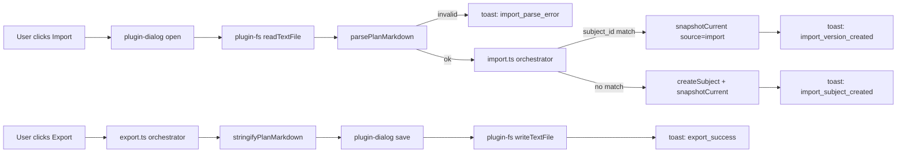

# M4 — Markdown Import / Export Implementation Plan

> **For agentic workers:** REQUIRED SUB-SKILL: Use superpowers:subagent-driven-development (recommended) or superpowers:executing-plans to implement this plan task-by-task. Steps use checkbox (`- [ ]`) syntax for tracking.

**Goal:** Land M4 of the Phase 1 pivot — Notter-AI gains markdown round-trip with the outside world. Users can **export** the active subject's current version (or any selected version via the SnapshotPanel) to a `.md` file with strict YAML frontmatter, and **import** a `.md` file back into Notter. Import is subject-anchored: when the frontmatter's `subject_id` matches a row in the active account, the import becomes a new `subject_versions` row with `source = 'import'`; when the id is unknown (or absent), a new subject is created and the markdown body is loaded as its first version. Frontmatter validation is strict — malformed YAML or a missing required field rejects the whole import with a specific user-facing error. M2 (subject versioning) must be fully merged to `main` before M4 begins; the plan reuses `useSubjectVersionsStore.snapshotCurrent` and `usePlannerStore.createSubject` verbatim and does not modify their public surface.

**Architecture:** Bottom-up, three thin modules under `src/lib/plans/`, then UI buttons:

1. **Frontmatter codec** — `src/lib/plans/frontmatter.ts`: pure functions `parsePlanMarkdown(text)` and `stringifyPlanMarkdown({ frontmatter, body })`, backed by `gray-matter` (4.0.3). Strict schema validation at parse: required `subject_id`, `version_id`, `title`, `source`, `exported_at`; optional `parent_version_id`, `source_actor`. Invalid input throws a typed `FrontmatterError` with a `code` discriminator (`PARSE_ERROR`, `MISSING_FIELD`, `INVALID_UUID`, `INVALID_SOURCE`). Unknown keys are preserved (forward-compat).
2. **Import orchestrator** — `src/lib/plans/import.ts`: parse → validate → dispatch. Case A (subject_id matches `usePlannerStore.subjectRows`): call `useSubjectVersionsStore.snapshotCurrent({ source: 'import', ... })` directly. Case B (no match or no id): split `title` on `' / '` into `(projectName, fileName)`, create the project (if missing) and subject via `usePlannerStore.createSubject`, then snapshot. All side effects are in this module — `frontmatter.ts` stays pure.
3. **Export orchestrator** — `src/lib/plans/export.ts`: pick the version to export (respecting `previewVersionId`), build frontmatter from the resolved version + `selectedSubjectRow`, serialize via the codec, prompt with Tauri save dialog defaulting to `<appLocalData>/notter-ai/<accountId>/exports/<title-slug>-<version-shortid>.md`, write via `writeTextFile`.
4. **UI** — two buttons added to `renderEditorHeader` in `PlannerTab.tsx`. Both disabled when no subject is selected. Toast feedback in both languages. No new tab, no panel changes.



**Tech Stack:** TypeScript / React / Vitest / `gray-matter` v4.0.3 (NEW — adds `js-yaml` v3 transitively) / `@tauri-apps/plugin-dialog` (existing) / `@tauri-apps/plugin-fs` (existing) / `useSubjectVersionsStore` (M2) / `usePlannerStore` (existing).

**Spec references:** `docs/superpowers/specs/2026-05-09-notter-pivot-phase1-design.md` §7 M4 (scope), §9 (frontmatter parse error handling), §11 (out-of-scope: no JSON / no `.notterplan` / markdown-only). Live schema: `supabase/migrations/2026-05-10-subject-versioning.sql` — versions anchor to `subjects.id`, source `'import'` already in the CHECK constraint. M2 plan body: `docs/superpowers/plans/2026-05-09-m2-plan-model.md` (style template); the schema renaming retrospective at the top is mandatory reading.

**Out of scope (do not drift):**
- JSON / `.notterplan` zip formats — markdown-only.
- Multi-file export ("export all subjects") — one subject at a time.
- Folder import — one `.md` at a time.
- Auto-export on snapshot — fully user-driven.
- Reverse migration of legacy `subjects.content` to a separate plan store — irrelevant; subjects ARE the canonical content post-M2.
- Export from `SnapshotPanel` per-row buttons — defer to a later patch; M4 ships with editor-toolbar Export only.
- Reading the YAML body language hint (TOML/JSON frontmatter) — gray-matter supports it but Notter writes/reads YAML only.
- Mermaid / image rendering inside imported markdown (Phase 4).
- `post_revision` MCP tool — that's M3, completely separate.

---

## Parallel-execution notes (CRITICAL — read before starting)

This plan is designed to run in parallel with `2026-05-10-m3-mcp-server.md`. Recommended setup from a clean main:

```bash
git worktree add ../Notter-AI-m3 -b m3-mcp-server main
git worktree add ../Notter-AI-m4 -b m4-import-export main
```

Then `/do` each plan in its own terminal pointed at its worktree.

**Known potential merge points** (resolve sequentially after both go green; M4 first because it is smaller/lower-risk):

| File | M3 touches? | M4 touches? | Merge resolution |
|---|---|---|---|
| `src/i18n/locales/en.json` | yes (`mcp.*`) | yes (`import_export.*`) | different namespaces; accept both |
| `src/i18n/locales/pt-BR.json` | yes | yes | same — accept both |
| `src/components/UserMenu.tsx` (MCP "Copy config") | maybe | NO — M4 doesn't touch | take M3's change |
| `src/components/PlannerTab.tsx` | **must NOT** | yes (toolbar buttons) | take M4's change; M3 plan must keep PlannerTab untouched |
| `src/stores/subject-versions-store.ts` | NO | NO (calls existing API only) | no conflict |
| `src/stores/planner-store.ts` | NO | NO (calls existing API only) | no conflict |
| `package.json` | NO (Rust-only) | yes (`gray-matter`) | take M4's change |
| `package-lock.json` | NO | yes | take M4's lockfile |
| `src-tauri/Cargo.toml` | yes | NO | take M3's change |
| `src/App.tsx` | maybe (MCP boot) | NO | take M3's change |

**Suggested merge order:** M4 first (smaller, no Rust, no boot-time changes), M3 second.

If the M3 plan deviates and proposes touching `PlannerTab.tsx` (e.g. for an MCP status indicator), flag it back to the orchestrator before either branch starts — that's a coordinated conflict the orchestrator should resolve in advance, not at merge time.

---

## File Structure

### New files

- `src/lib/plans/frontmatter.ts` — pure parse + stringify wrapping `gray-matter`. Exports `parsePlanMarkdown`, `stringifyPlanMarkdown`, `FrontmatterError`, `ParsedFrontmatter` type.
- `src/lib/plans/__tests__/frontmatter.test.ts` — round-trip property test (`parse(stringify(x)) ≡ x`), required-field rejection, unknown-key preservation, malformed-YAML rejection.
- `src/lib/plans/import.ts` — orchestrator. Exports `importMarkdownFile(path)` and `importMarkdownText(text, sourceFilename)`. Handles both subject-exists (snapshot) and subject-missing (create + snapshot) cases.
- `src/lib/plans/__tests__/import.test.ts` — vitest with mocked `useSubjectVersionsStore`, `usePlannerStore`, `@tauri-apps/plugin-fs`. Both decision branches plus error cases.
- `src/lib/plans/export.ts` — orchestrator. Exports `exportCurrentVersion()` and `exportVersionById(versionId)`. Builds frontmatter from store state, slugifies title, prompts save dialog, writes file.
- `src/lib/plans/__tests__/export.test.ts` — vitest with mocked stores + dialog + fs. Round-trips through the codec, asserts the saved file contents.
- `src/lib/plans/slug.ts` — tiny zero-dep slugify helper (same rationale as `format.ts` from M2: avoid pulling in `slugify` for one cosmetic feature).
- `src/lib/plans/__tests__/slug.test.ts` — covers accents, special chars, length cap.

### Modified files

- `src/components/PlannerTab.tsx` — add Import + Export buttons inside `renderEditorHeader`, next to the existing History dropdown / versions panel toggle. Wire onClick → `importMarkdownFile` / `exportCurrentVersion`. Disable when `!selectedSubject`.
- `src/i18n/locales/en.json` — new `import_export.*` namespace (see Phase E).
- `src/i18n/locales/pt-BR.json` — same keys translated.
- `package.json` — `dependencies` += `"gray-matter": "^4.0.3"` (after sonatype-guide check; see Phase A).
- `package-lock.json` — regenerated by `npm install`.

### Deleted files

None.

### Phase order

| # | Phase | Scope | Lands |
|---|---|---|---|
| A | Add `gray-matter` dep + sonatype-guide audit | single `npm install` | first |
| B | `frontmatter.ts` + tests (TDD) | parse/stringify codec | depends on A |
| C | `slug.ts` + tests | zero-dep helper | parallel with B; can land before |
| D | `import.ts` + tests (TDD) | import orchestrator | depends on B, C |
| E | `export.ts` + tests (TDD) | export orchestrator | depends on B, C |
| F | PlannerTab UI buttons + i18n | wire orchestrators into the toolbar | depends on D, E |
| G | End-to-end smoke + cleanup | manual round-trip in dev | last |

---

## Phase A — Add `gray-matter` dependency

This phase introduces a single npm dep. Per project convention (see CLAUDE.md `sonatype-guide` skill), every new dep is audited for vulnerabilities and Developer Trust Score before installation.

### Task A1: Run the sonatype-guide skill on `gray-matter@4.0.3`

**Files:**
- No file changes in this task.

- [ ] **Step 1: Invoke the sonatype-guide skill**

Run the skill and let it pull `gray-matter` v4.0.3's vulnerability + license + DTS data. Document the result in the commit message of Task A2.

If the skill flags a critical CVE or a license incompatible with the project (the project is private, but log the license anyway — gray-matter is MIT, so this should pass cleanly), STOP and surface to orchestrator. Do not proceed to install.

Expected outcome: `gray-matter` is a long-established (~10+ years), MIT-licensed package by a high-trust author (`jonschlinkert`). DTS should be high. Transitive deps: `js-yaml@^3.13.1`, `kind-of@^6.0.2`, `section-matter@^1.0.0`, `strip-bom-string@^1.0.0` — all stable and well-known. The `js-yaml` v3 line is older than v4 (which dropped some legacy features); for our use case (parsing strict YAML frontmatter we wrote ourselves), v3 is fine and bundled transitively, so we don't pin it.

- [ ] **Step 2: Record the audit summary**

Capture (paste into the commit body of A2):
- DTS score
- Any flagged CVEs (likely none at v4.0.3)
- License (expected: MIT)
- Decision: proceed / abort

### Task A2: Install the dep

**Files:**
- Modify: `package.json`
- Modify: `package-lock.json` (auto)

- [ ] **Step 1: Install**

```bash
npm install gray-matter@^4.0.3
```

The `^4.0.3` caret matches the spec's "latest 4.x" intent and matches what npm resolves at the time of writing.

- [ ] **Step 2: Verify the lockfile resolved cleanly**

```bash
npm ls gray-matter
```

Expected: a single `gray-matter@4.0.3` entry under the project root, no extraneous duplicates.

- [ ] **Step 3: Run the existing test suite to confirm no regression**

```bash
npm run test
```

Expected: all existing tests still PASS (the new dep is unused so far).

- [ ] **Step 4: Type-check**

```bash
npm run build
```

Expected: PASS — `tsc` clean.

- [ ] **Step 5: Commit**

```bash
git add package.json package-lock.json
git commit -m "chore(deps): add gray-matter@^4.0.3 for M4 markdown import/export

Sonatype-guide audit:
- DTS: <score>
- CVEs: <list or 'none'>
- License: MIT
- Decision: proceed"
```

---

## Phase B — `frontmatter.ts` codec (TDD)

This phase introduces the pure parse / stringify pair. Pure means: no fs, no store reads, no Tauri APIs. Just `gray-matter` plus our schema validator. The functions are easy to round-trip property-test.

### Task B1: Write failing tests

**Files:**
- Create: `src/lib/plans/__tests__/frontmatter.test.ts`

- [ ] **Step 1: Create the test file**

```ts
// src/lib/plans/__tests__/frontmatter.test.ts
import { describe, it, expect } from 'vitest';
import {
  parsePlanMarkdown,
  stringifyPlanMarkdown,
  FrontmatterError,
  type ParsedFrontmatter,
} from '@/lib/plans/frontmatter';

const VALID_FM: ParsedFrontmatter = {
  subject_id: '7e9c1bb6-2f3e-4a1b-9c8d-1234567890ab',
  version_id: 'a1b2c3d4-5e6f-4a1b-9c8d-1234567890ab',
  parent_version_id: null,
  title: 'Live chat / Etapa 2',
  source: 'user',
  source_actor: null,
  exported_at: '2026-05-10T18:30:00Z',
};

const VALID_BODY = '# Heading\n\nBody paragraph with **bold** text.\n';

describe('frontmatter — round-trip', () => {
  it('parse(stringify(x)) deep-equals x for the canonical happy path', () => {
    const text = stringifyPlanMarkdown({ frontmatter: VALID_FM, body: VALID_BODY });
    const parsed = parsePlanMarkdown(text);
    expect(parsed.frontmatter).toEqual(VALID_FM);
    expect(parsed.body.trim()).toBe(VALID_BODY.trim());
  });

  it('preserves unknown forward-compat keys', () => {
    const fmPlus = { ...VALID_FM, future_key: 'forward' } as any;
    const text = stringifyPlanMarkdown({ frontmatter: fmPlus, body: VALID_BODY });
    const parsed = parsePlanMarkdown(text);
    expect((parsed.frontmatter as any).future_key).toBe('forward');
  });

  it('preserves source_actor when set', () => {
    const fm = { ...VALID_FM, source: 'ai' as const, source_actor: 'claude' };
    const text = stringifyPlanMarkdown({ frontmatter: fm, body: VALID_BODY });
    const parsed = parsePlanMarkdown(text);
    expect(parsed.frontmatter.source).toBe('ai');
    expect(parsed.frontmatter.source_actor).toBe('claude');
  });
});

describe('frontmatter — parse errors', () => {
  it('rejects missing subject_id with code MISSING_FIELD', () => {
    const text = `---\nversion_id: a1b2c3d4-5e6f-4a1b-9c8d-1234567890ab\ntitle: t\nsource: user\nexported_at: 2026-05-10T18:30:00Z\n---\nbody`;
    expect(() => parsePlanMarkdown(text)).toThrow(FrontmatterError);
    try { parsePlanMarkdown(text); } catch (e: any) {
      expect(e.code).toBe('MISSING_FIELD');
      expect(e.field).toBe('subject_id');
    }
  });

  it('rejects missing version_id with code MISSING_FIELD', () => {
    const text = `---\nsubject_id: 7e9c1bb6-2f3e-4a1b-9c8d-1234567890ab\ntitle: t\nsource: user\nexported_at: 2026-05-10T18:30:00Z\n---\nbody`;
    expect(() => parsePlanMarkdown(text)).toThrow(FrontmatterError);
  });

  it('rejects missing title', () => {
    const text = `---\nsubject_id: 7e9c1bb6-2f3e-4a1b-9c8d-1234567890ab\nversion_id: a1b2c3d4-5e6f-4a1b-9c8d-1234567890ab\nsource: user\nexported_at: 2026-05-10T18:30:00Z\n---\nbody`;
    expect(() => parsePlanMarkdown(text)).toThrow(FrontmatterError);
  });

  it('rejects unknown source value with code INVALID_SOURCE', () => {
    const text = stringifyPlanMarkdown({ frontmatter: { ...VALID_FM, source: 'bogus' as any }, body: VALID_BODY });
    try { parsePlanMarkdown(text); } catch (e: any) {
      expect(e.code).toBe('INVALID_SOURCE');
    }
  });

  it('rejects malformed UUID with code INVALID_UUID', () => {
    const text = stringifyPlanMarkdown({ frontmatter: { ...VALID_FM, subject_id: 'not-a-uuid' }, body: VALID_BODY });
    try { parsePlanMarkdown(text); } catch (e: any) {
      expect(e.code).toBe('INVALID_UUID');
      expect(e.field).toBe('subject_id');
    }
  });

  it('rejects malformed YAML with code PARSE_ERROR', () => {
    // Unclosed list / bad indent — gray-matter throws via js-yaml
    const text = `---\nsubject_id: [unclosed\ntitle: x\n---\nbody`;
    try { parsePlanMarkdown(text); } catch (e: any) {
      expect(e.code).toBe('PARSE_ERROR');
    }
  });

  it('rejects a markdown file with no frontmatter at all', () => {
    const text = `# Just a heading\n\nNo frontmatter.`;
    try { parsePlanMarkdown(text); } catch (e: any) {
      expect(e.code).toBe('MISSING_FIELD');
    }
  });
});
```

- [ ] **Step 2: Run tests — expect fail**

```bash
npm run test -- frontmatter
```

Expected: FAIL — module `@/lib/plans/frontmatter` not found.

- [ ] **Step 3: Commit failing tests**

```bash
git add src/lib/plans/__tests__/frontmatter.test.ts
git commit -m "test(frontmatter): add failing parse/stringify tests (TDD — red phase)"
```

### Task B2: Implement `frontmatter.ts`

**Files:**
- Create: `src/lib/plans/frontmatter.ts`

- [ ] **Step 1: Implement**

```ts
// src/lib/plans/frontmatter.ts
//
// Pure codec for the M4 plan-markdown format. Wraps `gray-matter` and adds
// strict schema validation. NO side effects — no fs, no store reads, no Tauri
// calls. Intentionally framework-agnostic so it can be unit-tested with vitest
// alone (no jsdom, no mocks beyond the package itself).
//
// Forward-compat: unknown frontmatter keys are preserved verbatim. Tools that
// add new metadata in later phases will round-trip through this codec without
// data loss.
import matter from 'gray-matter';

// ── Types ────────────────────────────────────────────────────────────────────

/**
 * The strict schema for Notter plan-markdown frontmatter. Required keys are
 * subject_id, version_id, title, source, exported_at. Optional keys are
 * parent_version_id (null for the first version) and source_actor (null when
 * source is 'user' or 'import' from a non-actor origin).
 *
 * Note: this is a TypeScript view of the validated shape. The runtime parser
 * also accepts (and preserves) arbitrary extra keys via index signature.
 */
export interface ParsedFrontmatter {
  subject_id: string;
  version_id: string;
  parent_version_id: string | null;
  title: string;
  source: 'user' | 'ai' | 'import';
  source_actor: string | null;
  exported_at: string;
  // Forward-compat extras land here when present.
  [extraKey: string]: unknown;
}

export type FrontmatterErrorCode =
  | 'PARSE_ERROR'      // gray-matter / js-yaml threw on malformed YAML
  | 'MISSING_FIELD'    // a required key is absent
  | 'INVALID_UUID'     // subject_id or version_id is not uuid-shaped
  | 'INVALID_SOURCE';  // source is not one of user|ai|import

export class FrontmatterError extends Error {
  readonly code: FrontmatterErrorCode;
  readonly field?: string;

  constructor(code: FrontmatterErrorCode, message: string, field?: string) {
    super(message);
    this.name = 'FrontmatterError';
    this.code = code;
    this.field = field;
  }
}

const UUID_RE = /^[0-9a-f]{8}-[0-9a-f]{4}-[0-9a-f]{4}-[0-9a-f]{4}-[0-9a-f]{12}$/i;

// ── parsePlanMarkdown ────────────────────────────────────────────────────────

export interface ParseResult {
  frontmatter: ParsedFrontmatter;
  body: string;
}

export function parsePlanMarkdown(text: string): ParseResult {
  let parsed: ReturnType<typeof matter>;
  try {
    parsed = matter(text);
  } catch (e: any) {
    throw new FrontmatterError(
      'PARSE_ERROR',
      `Frontmatter YAML is malformed: ${e?.message ?? String(e)}`,
    );
  }

  // gray-matter returns `data: {}` when there is no frontmatter at all.
  // We treat that as MISSING_FIELD on the first required key for a uniform
  // error path.
  const data = parsed.data as Record<string, unknown>;
  const body = parsed.content ?? '';

  // Required-key checks
  for (const required of ['subject_id', 'version_id', 'title', 'source', 'exported_at'] as const) {
    if (data[required] === undefined || data[required] === null || data[required] === '') {
      throw new FrontmatterError(
        'MISSING_FIELD',
        `Required frontmatter field "${required}" is missing`,
        required,
      );
    }
  }

  // UUID shape checks
  for (const idField of ['subject_id', 'version_id'] as const) {
    if (typeof data[idField] !== 'string' || !UUID_RE.test(data[idField] as string)) {
      throw new FrontmatterError(
        'INVALID_UUID',
        `Field "${idField}" must be a UUID; got ${JSON.stringify(data[idField])}`,
        idField,
      );
    }
  }

  // parent_version_id is optional but must be uuid-shaped when present
  if (data.parent_version_id !== undefined && data.parent_version_id !== null && data.parent_version_id !== '') {
    if (typeof data.parent_version_id !== 'string' || !UUID_RE.test(data.parent_version_id)) {
      throw new FrontmatterError(
        'INVALID_UUID',
        `Field "parent_version_id" must be a UUID or null`,
        'parent_version_id',
      );
    }
  }

  // Source whitelist
  if (!['user', 'ai', 'import'].includes(data.source as string)) {
    throw new FrontmatterError(
      'INVALID_SOURCE',
      `Field "source" must be one of user|ai|import; got ${JSON.stringify(data.source)}`,
      'source',
    );
  }

  // Build the validated frontmatter, preserving extras
  const fm: ParsedFrontmatter = {
    ...data,
    subject_id: data.subject_id as string,
    version_id: data.version_id as string,
    parent_version_id: (data.parent_version_id as string | null | undefined) ?? null,
    title: String(data.title),
    source: data.source as 'user' | 'ai' | 'import',
    source_actor: (data.source_actor as string | null | undefined) ?? null,
    exported_at: String(data.exported_at),
  };

  return { frontmatter: fm, body };
}

// ── stringifyPlanMarkdown ────────────────────────────────────────────────────

export interface StringifyArgs {
  frontmatter: ParsedFrontmatter;
  body: string;
}

export function stringifyPlanMarkdown({ frontmatter, body }: StringifyArgs): string {
  // gray-matter's stringify takes (content, data). It writes YAML by default.
  // We pass through the full frontmatter object — including any extras from
  // the index signature — so round-trips don't lose forward-compat keys.
  return matter.stringify(body ?? '', frontmatter as Record<string, unknown>);
}
```

- [ ] **Step 2: Run tests — expect green**

```bash
npm run test -- frontmatter
```

Expected: PASS, all 9 tests.

- [ ] **Step 3: Type-check**

```bash
npm run build
```

Expected: PASS — `tsc` clean.

- [ ] **Step 4: Commit**

```bash
git add src/lib/plans/frontmatter.ts
git commit -m "feat(plans): add frontmatter codec (parse + stringify) backed by gray-matter

Strict schema: subject_id, version_id, title, source, exported_at required.
Unknown keys preserved for forward-compat. Throws typed FrontmatterError
with code discriminator on malformed input."
```

---

## Phase C — `slug.ts` zero-dep helper

This phase adds a tiny slugify helper. Same rationale as M2's `formatRelativeTime` (Task E2b): one cosmetic feature, no new runtime dep.

### Task C1: Tests + implementation in one TDD pass

**Files:**
- Create: `src/lib/plans/__tests__/slug.test.ts`
- Create: `src/lib/plans/slug.ts`

- [ ] **Step 1: Create test file**

```ts
// src/lib/plans/__tests__/slug.test.ts
import { describe, it, expect } from 'vitest';
import { slugifyTitle } from '@/lib/plans/slug';

describe('slugifyTitle', () => {
  it('lowercases and replaces spaces with dashes', () => {
    expect(slugifyTitle('Hello World')).toBe('hello-world');
  });

  it('strips accents', () => {
    expect(slugifyTitle('Anotação Importante')).toBe('anotacao-importante');
  });

  it('replaces non-alphanumeric chars with dashes', () => {
    expect(slugifyTitle('Live chat / Etapa 2')).toBe('live-chat-etapa-2');
  });

  it('collapses repeated dashes and trims leading/trailing dashes', () => {
    expect(slugifyTitle('  ---weird-/ /title---  ')).toBe('weird-title');
  });

  it('caps length at 64 chars', () => {
    const long = 'a'.repeat(200);
    expect(slugifyTitle(long).length).toBeLessThanOrEqual(64);
  });

  it('falls back to "untitled" when input is empty after sanitization', () => {
    expect(slugifyTitle('   ')).toBe('untitled');
    expect(slugifyTitle('???')).toBe('untitled');
  });
});
```

- [ ] **Step 2: Run tests — expect fail**

```bash
npm run test -- slug
```

Expected: FAIL — module not found.

- [ ] **Step 3: Implement**

```ts
// src/lib/plans/slug.ts
//
// Zero-dep slugify for default export filenames. Avoids pulling in `slugify`
// (1.6.9) for one cosmetic feature. If we ever need richer rules (collation,
// language-specific transliteration), swap to the npm package then.

const MAX_LEN = 64;

export function slugifyTitle(input: string): string {
  if (!input) return 'untitled';
  // Decompose accented chars then strip the combining marks
  const noAccents = input.normalize('NFKD').replace(/[̀-ͯ]/g, '');
  const lower = noAccents.toLowerCase();
  // Replace any non-alphanumeric run with a single dash
  const dashed = lower.replace(/[^a-z0-9]+/g, '-');
  // Trim leading/trailing dashes
  const trimmed = dashed.replace(/^-+|-+$/g, '');
  if (!trimmed) return 'untitled';
  return trimmed.length > MAX_LEN ? trimmed.slice(0, MAX_LEN).replace(/-+$/, '') : trimmed;
}
```

- [ ] **Step 4: Run tests — expect green**

```bash
npm run test -- slug
```

Expected: PASS.

- [ ] **Step 5: Type-check + commit**

```bash
npm run build
git add src/lib/plans/slug.ts src/lib/plans/__tests__/slug.test.ts
git commit -m "feat(plans): add zero-dep slugifyTitle helper for export filenames"
```

---

## Phase D — `import.ts` orchestrator (TDD)

This phase wires the codec to the stores. The orchestrator is the only place in M4 that touches the stores, so all side-effecty mocking lives in this file's tests.

**Decision tree (canonical reference — follow this exactly):**

1. Read file text via `readTextFile` (or accept text directly if invoked from a test).
2. `parsePlanMarkdown(text)` — on throw, surface the error code/message; do NOT proceed.
3. Look up `frontmatter.subject_id` in `usePlannerStore.getState().subjectRows`.
4. **Case A — subject row found:**
   - `useSubjectVersionsStore.getState()`:
     - if `currentSubjectId !== row.id`, call `loadForSubject(row.id)` first so the snapshot lands on the right subject's slice.
     - then `snapshotCurrent({ contentMarkdown: body, source: 'import', sourceActor: frontmatter.source_actor ?? null, label: \`Importado de ${sourceFilename}\`, parentVersionId: frontmatter.parent_version_id ?? row.currentVersionId ?? null })`.
   - Return `{ kind: 'version_added', subjectId: row.id, versionId: <new> }`.
5. **Case B — subject row not found:**
   - Parse `title` as `<projectName> / <fileName>`. If no `/`, treat the whole title as `fileName` and use `'Importados'` as `projectName`.
   - Strip `.md` from `fileName` if present, then re-append (planner-store does the same).
   - If the project doesn't exist in `usePlannerStore.getState().projects`, call `createProject(projectName, '')` (path = empty string; user can fix later from the Planner UI). Project FS init happens inside `createProject`.
   - `await createSubject(projectName, fileName)`.
   - `await saveSubjectContent(projectName, fileName, body)` — this also schedules the debounced supabase upsert that creates the `subjects` row server-side via `pushSubject`.
   - Wait for the subject row to appear in `subjectRows` via realtime (or fall back to a short poll: read `selectedSubjectRow()` for up to 5s, sleep 250ms between reads). If still missing, surface `import_subject_created_no_version` warning toast — the import created the subject but couldn't snapshot the version.
   - Once the row appears, call `useSubjectVersionsStore.getState().loadForSubject(row.id)` then `snapshotCurrent({ contentMarkdown: body, source: 'import', sourceActor: ..., label: \`Importado de ${sourceFilename}\`, parentVersionId: null })`.
   - Return `{ kind: 'subject_created', subjectId: row.id, versionId: <new> }`.

**Why use `parent_version_id || row.currentVersionId` in case A:** the imported file's `parent_version_id` may reference a version unknown to this account (e.g. user exported on machine A, edited externally, imports on machine B which only has the latest). Using the local `currentVersionId` as a fallback keeps the new version's parent pointer well-defined; if the imported `parent_version_id` happens to be a real id in the local store, it's preserved. This aligns with the spec §9 row "Frontmatter parse error on import → No partial import" — only invalid YAML aborts; an unknown-but-shape-valid parent ref is accepted.

### Task D1: Failing tests

**Files:**
- Create: `src/lib/plans/__tests__/import.test.ts`

- [ ] **Step 1: Create test file**

```ts
// src/lib/plans/__tests__/import.test.ts
import { describe, it, expect, vi, beforeEach } from 'vitest';

const SUBJECT_A = {
  id: '7e9c1bb6-2f3e-4a1b-9c8d-1234567890ab',
  userId: 'u1',
  projectName: 'Live chat',
  fileName: 'etapa-2.md',
  content: '# old',
  currentVersionId: '11111111-1111-4111-9111-111111111111',
  createdAt: '',
  updatedAt: '',
};

const snapshotCurrent = vi.fn().mockResolvedValue({
  id: 'aaaaaaaa-aaaa-4aaa-aaaa-aaaaaaaaaaaa',
});
const loadForSubject = vi.fn().mockResolvedValue(undefined);

vi.mock('@/stores/subject-versions-store', () => ({
  useSubjectVersionsStore: {
    getState: () => ({
      currentSubjectId: SUBJECT_A.id,
      snapshotCurrent,
      loadForSubject,
    }),
  },
}));

const createProject = vi.fn().mockResolvedValue(undefined);
const createSubject = vi.fn().mockResolvedValue(undefined);
const saveSubjectContent = vi.fn().mockResolvedValue(undefined);

vi.mock('@/stores/planner-store', () => ({
  usePlannerStore: {
    getState: () => ({
      subjectRows: [SUBJECT_A],
      projects: [{ name: 'Live chat', path: '' }],
      createProject,
      createSubject,
      saveSubjectContent,
    }),
  },
}));

vi.mock('@tauri-apps/plugin-fs', () => ({
  readTextFile: vi.fn().mockResolvedValue(''),
  BaseDirectory: { AppLocalData: 'AppLocalData' },
}));

import { importMarkdownText } from '@/lib/plans/import';
import { stringifyPlanMarkdown } from '@/lib/plans/frontmatter';

const VALID_FM = {
  subject_id: SUBJECT_A.id,
  version_id: 'b2b2b2b2-b2b2-4b2b-b2b2-b2b2b2b2b2b2',
  parent_version_id: SUBJECT_A.currentVersionId,
  title: 'Live chat / Etapa 2',
  source: 'user' as const,
  source_actor: null,
  exported_at: '2026-05-10T18:30:00Z',
};

describe('importMarkdownText — case A (subject_id matches existing row)', () => {
  beforeEach(() => vi.clearAllMocks());

  it('calls snapshotCurrent with source=import and the imported body', async () => {
    const text = stringifyPlanMarkdown({ frontmatter: VALID_FM, body: '# new content' });
    const result = await importMarkdownText(text, 'etapa-2.md');
    expect(result.kind).toBe('version_added');
    expect(result.subjectId).toBe(SUBJECT_A.id);
    expect(snapshotCurrent).toHaveBeenCalledWith(
      expect.objectContaining({
        source: 'import',
        contentMarkdown: expect.stringContaining('new content'),
      }),
    );
  });

  it('threads frontmatter.parent_version_id into the snapshot args', async () => {
    const text = stringifyPlanMarkdown({ frontmatter: VALID_FM, body: 'body' });
    await importMarkdownText(text, 'etapa-2.md');
    expect(snapshotCurrent).toHaveBeenCalledWith(
      expect.objectContaining({ parentVersionId: VALID_FM.parent_version_id }),
    );
  });
});

describe('importMarkdownText — error paths', () => {
  beforeEach(() => vi.clearAllMocks());

  it('rejects with the FrontmatterError code on malformed YAML', async () => {
    const text = `---\nsubject_id: [unclosed\n---\nbody`;
    await expect(importMarkdownText(text, 'x.md')).rejects.toThrow(/PARSE_ERROR|malformed/);
  });

  it('rejects with MISSING_FIELD when required key absent', async () => {
    const text = `---\ntitle: x\nsource: user\nexported_at: 2026-05-10T18:30:00Z\n---\nbody`;
    await expect(importMarkdownText(text, 'x.md')).rejects.toThrow();
  });
});

// Case B (subject creation) — exercised in a separate test block with a
// re-imported planner-store mock that returns an empty subjectRows slice.
// To keep this file readable, the subject-creation test lives in
// `import-create.test.ts` (created in the same task) which re-mocks the
// stores. Vitest's `vi.mock` is module-scoped, so the cleanest separation
// is two files.
```

Add a second file for case B:

```ts
// src/lib/plans/__tests__/import-create.test.ts
import { describe, it, expect, vi, beforeEach } from 'vitest';

const snapshotCurrent = vi.fn().mockResolvedValue({ id: 'v1' });
const loadForSubject = vi.fn().mockResolvedValue(undefined);

// subjectRows starts empty; a "remote arrival" mid-test pushes a row in.
let subjectRows: any[] = [];

vi.mock('@/stores/subject-versions-store', () => ({
  useSubjectVersionsStore: {
    getState: () => ({
      currentSubjectId: null,
      snapshotCurrent,
      loadForSubject,
    }),
  },
}));

const createProject = vi.fn().mockResolvedValue(undefined);
const createSubject = vi.fn().mockImplementation(async (proj: string, file: string) => {
  // Simulate the row appearing post-create (the real planner-store push is
  // debounced; the test fast-forwards by injecting it synchronously).
  subjectRows.push({
    id: 'cccccccc-cccc-4ccc-cccc-cccccccccccc',
    userId: 'u1', projectName: proj, fileName: file, content: '',
    currentVersionId: null, createdAt: '', updatedAt: '',
  });
});
const saveSubjectContent = vi.fn().mockResolvedValue(undefined);

vi.mock('@/stores/planner-store', () => ({
  usePlannerStore: {
    getState: () => ({
      get subjectRows() { return subjectRows; },
      projects: [],
      createProject,
      createSubject,
      saveSubjectContent,
    }),
  },
}));

vi.mock('@tauri-apps/plugin-fs', () => ({
  readTextFile: vi.fn().mockResolvedValue(''),
  BaseDirectory: { AppLocalData: 'AppLocalData' },
}));

import { importMarkdownText } from '@/lib/plans/import';
import { stringifyPlanMarkdown } from '@/lib/plans/frontmatter';

const FM = {
  subject_id: 'unknown1-2222-4222-9222-222222222222',
  version_id: 'b2b2b2b2-b2b2-4b2b-b2b2-b2b2b2b2b2b2',
  parent_version_id: null,
  title: 'My Project / new-note.md',
  source: 'ai' as const,
  source_actor: 'codex',
  exported_at: '2026-05-10T18:30:00Z',
};

describe('importMarkdownText — case B (no matching subject)', () => {
  beforeEach(() => {
    subjectRows = [];
    vi.clearAllMocks();
  });

  it('creates project + subject + snapshot when title has slash separator', async () => {
    const text = stringifyPlanMarkdown({ frontmatter: FM, body: '# imported' });
    const result = await importMarkdownText(text, 'new-note.md');
    expect(createProject).toHaveBeenCalledWith('My Project', expect.any(String));
    expect(createSubject).toHaveBeenCalledWith('My Project', 'new-note.md');
    expect(saveSubjectContent).toHaveBeenCalledWith('My Project', 'new-note.md', expect.stringContaining('imported'));
    expect(loadForSubject).toHaveBeenCalled();
    expect(snapshotCurrent).toHaveBeenCalledWith(
      expect.objectContaining({ source: 'import', sourceActor: 'codex' }),
    );
    expect(result.kind).toBe('subject_created');
  });

  it('uses "Importados" project when title has no slash', async () => {
    const fmNoSlash = { ...FM, title: 'orphan-note.md' };
    const text = stringifyPlanMarkdown({ frontmatter: fmNoSlash, body: 'b' });
    await importMarkdownText(text, 'orphan-note.md');
    expect(createProject).toHaveBeenCalledWith('Importados', expect.any(String));
    expect(createSubject).toHaveBeenCalledWith('Importados', 'orphan-note.md');
  });

  it('skips createProject when project already exists', async () => {
    // Pre-seed the project list via re-mock — this test sub-mocks inline.
    // Easiest: assert that with planner-store.projects empty above, createProject
    // IS called; then a follow-up test with a non-empty list verifies the
    // skip. Implementation note: the orchestrator MUST guard with
    // `if (!projects.find(p => p.name === projectName)) await createProject(...)`.
  });
});
```

- [ ] **Step 2: Run tests — expect fail**

```bash
npm run test -- import
```

Expected: FAIL — module not found.

- [ ] **Step 3: Commit**

```bash
git add src/lib/plans/__tests__/import.test.ts src/lib/plans/__tests__/import-create.test.ts
git commit -m "test(import): add failing import-orchestrator tests for case A + case B (TDD — red)"
```

### Task D2: Implement `import.ts`

**Files:**
- Create: `src/lib/plans/import.ts`

- [ ] **Step 1: Implement**

```ts
// src/lib/plans/import.ts
//
// M4 import orchestrator. Side-effecty by design — coordinates the codec
// (frontmatter.ts) with the two relevant stores (planner-store, subject-
// versions-store) and the Tauri fs plugin.
//
// Two entry points:
//   - importMarkdownFile(absolutePath)  — used by the UI button after the
//     user picks a file via plugin-dialog.open().
//   - importMarkdownText(text, sourceFilename) — testable, takes text directly.
//     The UI doesn't call this, but tests do.
//
// Decision tree: see plan §"Phase D — import.ts orchestrator" for the
// canonical spec.

import { readTextFile } from '@tauri-apps/plugin-fs';
import { parsePlanMarkdown } from '@/lib/plans/frontmatter';
import { useSubjectVersionsStore } from '@/stores/subject-versions-store';
import { usePlannerStore } from '@/stores/planner-store';

const FALLBACK_PROJECT_NAME = 'Importados';

export type ImportResult =
  | { kind: 'version_added'; subjectId: string; versionId: string }
  | { kind: 'subject_created'; subjectId: string; versionId: string };

export async function importMarkdownFile(absolutePath: string): Promise<ImportResult> {
  // The Tauri dialog returns an absolute path; readTextFile honors absolute
  // paths when no baseDir is passed.
  const text = await readTextFile(absolutePath);
  // Extract just the filename (last segment) for the snapshot label
  const seg = absolutePath.split(/[\\/]/).pop() ?? 'imported.md';
  return importMarkdownText(text, seg);
}

export async function importMarkdownText(
  text: string,
  sourceFilename: string,
): Promise<ImportResult> {
  // 1. Parse + validate (throws FrontmatterError on any invalid input)
  const { frontmatter, body } = parsePlanMarkdown(text);

  const planner = usePlannerStore.getState();
  const versions = useSubjectVersionsStore.getState();

  // 2. Look up by subject_id
  const existing = planner.subjectRows.find((r) => r.id === frontmatter.subject_id);

  if (existing) {
    // ── Case A ─────────────────────────────────────────────────────────────
    // Make sure the versions store points at the right subject before
    // snapshotting. If currentSubjectId already matches, this is a no-op.
    if (versions.currentSubjectId !== existing.id) {
      await versions.loadForSubject(existing.id);
    }
    const newVersion = await useSubjectVersionsStore.getState().snapshotCurrent({
      contentMarkdown: body,
      source: 'import',
      sourceActor: frontmatter.source_actor ?? null,
      label: `Importado de ${sourceFilename}`,
      // Prefer the imported parent ref if the local store has it; otherwise
      // anchor to the local current version. See plan §"Phase D" for the
      // rationale on dangling parent refs.
      parentVersionId: frontmatter.parent_version_id ?? existing.currentVersionId ?? null,
    });
    if (!newVersion) {
      throw new Error('Snapshot insert failed during import (case A)');
    }
    return { kind: 'version_added', subjectId: existing.id, versionId: newVersion.id };
  }

  // ── Case B ───────────────────────────────────────────────────────────────
  // Parse "<project> / <file>" out of the title.
  const titleStr = String(frontmatter.title ?? '').trim();
  let projectName: string;
  let fileNameRaw: string;
  const slashIdx = titleStr.indexOf(' / ');
  if (slashIdx > 0) {
    projectName = titleStr.slice(0, slashIdx).trim();
    fileNameRaw = titleStr.slice(slashIdx + 3).trim();
  } else {
    projectName = FALLBACK_PROJECT_NAME;
    fileNameRaw = titleStr || sourceFilename.replace(/\.md$/i, '');
  }
  const fileName = fileNameRaw.endsWith('.md') ? fileNameRaw : `${fileNameRaw}.md`;

  // Create the project if missing
  if (!planner.projects.find((p) => p.name === projectName)) {
    // `path` left empty; user can fix it from the Planner UI later.
    // createProject also creates the local fs dir under
    // <appLocalData>/notter-ai/<accountId>/NotterProjects/<name>.
    await planner.createProject(projectName, '');
  }

  await planner.createSubject(projectName, fileName);
  await planner.saveSubjectContent(projectName, fileName, body);

  // Wait for the subject row to land. createSubject writes optimistically
  // and pushes to Supabase; the row arrives back via realtime which
  // populates `subjectRows`. Poll up to 5s (~20 attempts × 250ms).
  const subjectId = await waitForSubjectRow(projectName, fileName, 5000);
  if (!subjectId) {
    throw new Error(
      `Subject "${projectName}/${fileName}" was created but did not appear in the local cache within 5s; version not snapshotted`,
    );
  }

  await useSubjectVersionsStore.getState().loadForSubject(subjectId);
  const newVersion = await useSubjectVersionsStore.getState().snapshotCurrent({
    contentMarkdown: body,
    source: 'import',
    sourceActor: frontmatter.source_actor ?? null,
    label: `Importado de ${sourceFilename}`,
    parentVersionId: null,
  });
  if (!newVersion) {
    throw new Error('Snapshot insert failed during import (case B)');
  }
  return { kind: 'subject_created', subjectId, versionId: newVersion.id };
}

async function waitForSubjectRow(
  projectName: string,
  fileName: string,
  timeoutMs: number,
): Promise<string | null> {
  const deadline = Date.now() + timeoutMs;
  while (Date.now() < deadline) {
    const row = usePlannerStore
      .getState()
      .subjectRows.find((r) => r.projectName === projectName && r.fileName === fileName);
    if (row) return row.id;
    await new Promise((res) => setTimeout(res, 250));
  }
  return null;
}
```

- [ ] **Step 2: Run tests — expect green**

```bash
npm run test -- import
```

Expected: PASS — all case-A, case-B, and error tests.

- [ ] **Step 3: Type-check**

```bash
npm run build
```

Expected: PASS — `tsc` clean.

- [ ] **Step 4: Commit**

```bash
git add src/lib/plans/import.ts
git commit -m "feat(plans): add import orchestrator (case A: subject exists, case B: subject created)

Resolves dangling parent_version_id refs by falling back to the local
subject.currentVersionId. Polls subjectRows up to 5s after createSubject
to wait for the realtime round-trip before snapshotting."
```

---

## Phase E — `export.ts` orchestrator (TDD)

This phase mirrors Phase D for the outbound direction. The orchestrator picks the version to export, builds frontmatter from store state, calls the codec, and writes via Tauri.

### Task E1: Failing tests

**Files:**
- Create: `src/lib/plans/__tests__/export.test.ts`

- [ ] **Step 1: Create test file**

```ts
// src/lib/plans/__tests__/export.test.ts
import { describe, it, expect, vi, beforeEach } from 'vitest';

const SUBJECT = {
  id: '7e9c1bb6-2f3e-4a1b-9c8d-1234567890ab',
  userId: 'u1',
  projectName: 'Live chat',
  fileName: 'etapa-2.md',
  content: '',
  currentVersionId: '11111111-1111-4111-9111-111111111111',
  createdAt: '',
  updatedAt: '',
};

const VERSION_CURRENT = {
  id: '11111111-1111-4111-9111-111111111111',
  subjectId: SUBJECT.id,
  userId: 'u1',
  contentMarkdown: '# Current\n\nbody',
  parentVersionId: '00000000-0000-4000-9000-000000000000',
  source: 'user' as const,
  sourceActor: null,
  label: null,
  createdAt: '2026-05-09T12:00:00Z',
};

vi.mock('@/stores/subject-versions-store', () => ({
  useSubjectVersionsStore: {
    getState: () => ({
      currentSubjectId: SUBJECT.id,
      versions: [VERSION_CURRENT],
      previewVersionId: null,
    }),
  },
}));

vi.mock('@/stores/planner-store', () => ({
  usePlannerStore: {
    getState: () => ({
      selectedSubjectRow: () => SUBJECT,
    }),
  },
}));

const save = vi.fn().mockResolvedValue('C:/Users/Test/exports/live-chat-etapa-2-111111.md');
vi.mock('@tauri-apps/plugin-dialog', () => ({ save }));

const writeTextFile = vi.fn().mockResolvedValue(undefined);
const mkdir = vi.fn().mockResolvedValue(undefined);
const exists = vi.fn().mockResolvedValue(false);
vi.mock('@tauri-apps/plugin-fs', () => ({
  writeTextFile, mkdir, exists,
  BaseDirectory: { AppLocalData: 'AppLocalData' },
}));

vi.mock('@/lib/accounts/account-paths', () => ({
  tryAccountScopedPath: (rel: string) => `notter-ai/u1/${rel}`,
}));

import { exportCurrentVersion } from '@/lib/plans/export';
import { parsePlanMarkdown } from '@/lib/plans/frontmatter';

describe('exportCurrentVersion', () => {
  beforeEach(() => vi.clearAllMocks());

  it('writes a file with frontmatter that round-trips through the parser', async () => {
    const result = await exportCurrentVersion();
    expect(result.path).toBeTruthy();
    expect(writeTextFile).toHaveBeenCalled();
    const written = (writeTextFile.mock.calls[0] as any)[1] as string;
    const parsed = parsePlanMarkdown(written);
    expect(parsed.frontmatter.subject_id).toBe(SUBJECT.id);
    expect(parsed.frontmatter.version_id).toBe(VERSION_CURRENT.id);
    expect(parsed.frontmatter.title).toBe('Live chat / etapa-2');
    expect(parsed.frontmatter.source).toBe('user');
    expect(parsed.body.trim()).toBe(VERSION_CURRENT.contentMarkdown.trim());
  });

  it('passes a slugified default filename to plugin-dialog.save()', async () => {
    await exportCurrentVersion();
    expect(save).toHaveBeenCalledWith(
      expect.objectContaining({
        defaultPath: expect.stringContaining('live-chat-etapa-2-'),
        filters: expect.arrayContaining([expect.objectContaining({ extensions: ['md'] })]),
      }),
    );
  });

  it('returns { cancelled: true } when the user cancels the save dialog', async () => {
    save.mockResolvedValueOnce(null);
    const result = await exportCurrentVersion();
    expect(result.cancelled).toBe(true);
    expect(writeTextFile).not.toHaveBeenCalled();
  });
});
```

- [ ] **Step 2: Run tests — expect fail**

```bash
npm run test -- export
```

Expected: FAIL — module not found.

- [ ] **Step 3: Commit failing tests**

```bash
git add src/lib/plans/__tests__/export.test.ts
git commit -m "test(export): add failing export-orchestrator tests (TDD — red)"
```

### Task E2: Implement `export.ts`

**Files:**
- Create: `src/lib/plans/export.ts`

- [ ] **Step 1: Implement**

```ts
// src/lib/plans/export.ts
//
// M4 export orchestrator. Picks the version to export (respecting
// previewVersionId), builds the frontmatter from store state, serializes via
// the codec, prompts plugin-dialog.save with a sane default path under the
// account's exports folder, then writes via plugin-fs.writeTextFile.
//
// The "current version" rule: if the user is previewing a historical
// version (subject-versions-store.previewVersionId !== null), we export
// THAT version. Otherwise we export `subject.currentVersionId`. If neither
// exists (subject has zero versions yet), we throw — the UI maps the throw
// to a `export_no_version` toast.

import { save } from '@tauri-apps/plugin-dialog';
import { writeTextFile, mkdir, exists, BaseDirectory } from '@tauri-apps/plugin-fs';
import { useSubjectVersionsStore } from '@/stores/subject-versions-store';
import { usePlannerStore } from '@/stores/planner-store';
import { tryAccountScopedPath } from '@/lib/accounts/account-paths';
import { stringifyPlanMarkdown, type ParsedFrontmatter } from '@/lib/plans/frontmatter';
import { slugifyTitle } from '@/lib/plans/slug';

export type ExportResult =
  | { cancelled: false; path: string }
  | { cancelled: true };

export async function exportCurrentVersion(): Promise<ExportResult> {
  const versionsState = useSubjectVersionsStore.getState();
  const subjectRow = usePlannerStore.getState().selectedSubjectRow();

  if (!subjectRow) {
    throw new Error('export_no_subject');
  }

  // Resolve the version: preview > current > error
  const targetVersionId =
    versionsState.previewVersionId ?? subjectRow.currentVersionId ?? null;
  if (!targetVersionId) {
    throw new Error('export_no_version');
  }
  const target = versionsState.versions.find((v) => v.id === targetVersionId);
  if (!target) {
    throw new Error('export_version_not_loaded');
  }

  return exportVersionInternal(subjectRow, target);
}

export async function exportVersionById(versionId: string): Promise<ExportResult> {
  const versionsState = useSubjectVersionsStore.getState();
  const subjectRow = usePlannerStore.getState().selectedSubjectRow();
  if (!subjectRow) throw new Error('export_no_subject');
  const target = versionsState.versions.find((v) => v.id === versionId);
  if (!target) throw new Error('export_version_not_loaded');
  return exportVersionInternal(subjectRow, target);
}

async function exportVersionInternal(
  subjectRow: ReturnType<typeof usePlannerStore.getState>['subjectRows'][number],
  target: ReturnType<typeof useSubjectVersionsStore.getState>['versions'][number],
): Promise<ExportResult> {
  // Build the frontmatter
  const fileNameNoExt = subjectRow.fileName.replace(/\.md$/i, '');
  const title = `${subjectRow.projectName} / ${fileNameNoExt}`;
  const frontmatter: ParsedFrontmatter = {
    subject_id: subjectRow.id,
    version_id: target.id,
    parent_version_id: target.parentVersionId,
    title,
    source: target.source,
    source_actor: target.sourceActor,
    exported_at: new Date().toISOString(),
  };

  const text = stringifyPlanMarkdown({ frontmatter, body: target.contentMarkdown });

  // Default filename: <slug>-<short-id>.md
  const slug = slugifyTitle(title);
  const shortId = target.id.replace(/-/g, '').slice(0, 6);
  const defaultFileName = `${slug}-${shortId}.md`;

  // Default directory: <appLocalData>/notter-ai/<accountId>/exports/.
  // tryAccountScopedPath returns a relative path; for plugin-dialog.save we
  // need an absolute path. The dialog accepts a `defaultPath` that is just
  // a filename — Tauri will open the OS save dialog and let the user pick
  // any directory. We embed a hint by NOT passing a dir; the user picks
  // freely. AFTER the pick, we ensure our own exports dir exists for any
  // future "default to the same dir" logic (out of scope for M4).
  const exportsDirRel = tryAccountScopedPath('exports');
  if (exportsDirRel) {
    try {
      const dirExists = await exists(exportsDirRel, { baseDir: BaseDirectory.AppLocalData });
      if (!dirExists) {
        await mkdir(exportsDirRel, { baseDir: BaseDirectory.AppLocalData, recursive: true });
      }
    } catch (e) {
      console.error('[export] failed to ensure exports dir:', e);
    }
  }

  const path = await save({
    defaultPath: defaultFileName,
    filters: [{ name: 'Markdown', extensions: ['md'] }],
  });

  if (!path) return { cancelled: true };

  // The save dialog returns an absolute path. writeTextFile honors absolute
  // paths when no baseDir is passed.
  await writeTextFile(path, text);
  return { cancelled: false, path };
}
```

- [ ] **Step 2: Run tests — expect green**

```bash
npm run test -- export
```

Expected: PASS.

- [ ] **Step 3: Type-check**

```bash
npm run build
```

Expected: PASS — `tsc` clean.

- [ ] **Step 4: Commit**

```bash
git add src/lib/plans/export.ts
git commit -m "feat(plans): add export orchestrator (current version → save dialog → md file)

Respects previewVersionId so the user can export any historical version
they're inspecting. Default filename is <slug>-<6-char-version-id>.md."
```

---

## Phase F — UI buttons in `PlannerTab` + i18n

This phase wires the orchestrators into the editor toolbar. Two buttons live next to the existing History dropdown / versions panel toggle in `renderEditorHeader`. Both are disabled when no subject is selected.

### Task F1: Add i18n keys

**Files:**
- Modify: `src/i18n/locales/en.json`
- Modify: `src/i18n/locales/pt-BR.json`

- [ ] **Step 1: Add `import_export.*` block to `en.json`**

Add as a new top-level block (alongside the existing `"plans"`, `"actions"` etc.). Do NOT nest inside `"plans"` — the namespace is intentionally separate so M3's `"mcp"` namespace and this one don't tangle when the orchestrator merges branches.

```json
  "import_export": {
    "import_button": "Import",
    "export_button": "Export",
    "import_button_tooltip": "Import a .md file",
    "export_button_tooltip": "Export the current version as .md",
    "import_picking": "Choose a .md file to import",
    "import_no_file": "No file selected",
    "import_parse_error": "Invalid markdown frontmatter: {{message}}",
    "import_invalid_frontmatter": "Frontmatter validation failed for field \"{{field}}\": {{message}}",
    "import_subject_created": "Imported as new subject",
    "import_version_created": "Imported as new version of \"{{subject}}\"",
    "import_subject_created_no_version": "Subject created, but the version did not sync within 5s. Refresh and try again.",
    "import_failed": "Import failed: {{message}}",
    "export_success": "Exported to {{path}}",
    "export_no_subject": "Select a subject before exporting",
    "export_no_version": "This subject has no versions yet — run AI on it once to create one, then export.",
    "export_version_not_loaded": "Selected version is not loaded in this session. Refresh and try again.",
    "export_failed": "Export failed: {{message}}",
    "export_cancelled": "Export cancelled"
  }
```

- [ ] **Step 2: Add the same keys to `pt-BR.json`**

```json
  "import_export": {
    "import_button": "Importar",
    "export_button": "Exportar",
    "import_button_tooltip": "Importar um arquivo .md",
    "export_button_tooltip": "Exportar a versão atual como .md",
    "import_picking": "Escolha um arquivo .md para importar",
    "import_no_file": "Nenhum arquivo selecionado",
    "import_parse_error": "Frontmatter markdown inválido: {{message}}",
    "import_invalid_frontmatter": "Validação do frontmatter falhou no campo \"{{field}}\": {{message}}",
    "import_subject_created": "Importado como novo assunto",
    "import_version_created": "Importado como nova versão de \"{{subject}}\"",
    "import_subject_created_no_version": "Assunto criado, mas a versão não sincronizou em 5s. Atualize e tente novamente.",
    "import_failed": "Falha na importação: {{message}}",
    "export_success": "Exportado para {{path}}",
    "export_no_subject": "Selecione um assunto antes de exportar",
    "export_no_version": "Este assunto ainda não tem versões — rode IA nele uma vez para criar uma, depois exporte.",
    "export_version_not_loaded": "Versão selecionada não está carregada nesta sessão. Atualize e tente novamente.",
    "export_failed": "Falha na exportação: {{message}}",
    "export_cancelled": "Exportação cancelada"
  }
```

- [ ] **Step 3: Commit**

```bash
git add src/i18n/locales/en.json src/i18n/locales/pt-BR.json
git commit -m "feat(i18n): add import_export.* namespace for M4"
```

### Task F2: Wire Import + Export buttons into `renderEditorHeader`

**Files:**
- Modify: `src/components/PlannerTab.tsx`

The buttons go INSIDE the `selectedProject && selectedSubject &&` guard block, **before** the versions panel toggle, so the button order in the toolbar (left → right) is: color picker, edit/view tabs, **Import**, **Export**, panel toggle, history, process, plan-with-AI.

Why before the toggle? The toggle is right-anchored visually (PanelRightOpen icon) and feels paired with the history dropdown. Import/Export are file-level operations that read better grouped to the left of those, away from the panel-state controls.

- [ ] **Step 1: Add imports to `PlannerTab.tsx`**

Locate the import block at the top (after line 32 in the current file). Add:

```ts
import { open as openDialogPick, save as saveDialog } from '@tauri-apps/plugin-dialog';
import { Download, Upload } from 'lucide-react';
import { importMarkdownFile } from '@/lib/plans/import';
import { exportCurrentVersion } from '@/lib/plans/export';
```

The existing `import { open as openDialog } from '@tauri-apps/plugin-dialog'` is already there for the project path picker; **rename the local alias to `openDialogPick`** to avoid the clash, OR add only the new symbol. Easiest: change the existing import line to `import { open as openDialogPick, save as saveDialog } from '@tauri-apps/plugin-dialog';` and update the existing call site (search for `openDialog(` in the file) to use `openDialogPick(`. The rename is mechanical (1-2 occurrences).

- [ ] **Step 2: Add the handlers inside the component body**

Place near the other handlers (e.g. just below `handleForceSync`):

```ts
  const [isImporting, setIsImporting] = useState(false);
  const [isExporting, setIsExporting] = useState(false);

  const handleImport = async () => {
    if (isImporting) return;
    setIsImporting(true);
    try {
      const picked = await openDialogPick({
        multiple: false,
        filters: [{ name: 'Markdown', extensions: ['md'] }],
      });
      if (!picked || Array.isArray(picked)) {
        // User cancelled or weird multi-pick result — bail silently.
        return;
      }
      const result = await importMarkdownFile(picked);
      if (result.kind === 'subject_created') {
        toast.success(t('import_export.import_subject_created'));
      } else {
        const subjectName = selectedSubject?.replace(/\.md$/i, '') ?? '';
        toast.success(t('import_export.import_version_created', { subject: subjectName }));
      }
    } catch (e: any) {
      // FrontmatterError carries .code and .field; map to specific toast.
      if (e?.name === 'FrontmatterError') {
        if (e.code === 'PARSE_ERROR') {
          toast.error(t('import_export.import_parse_error', { message: e.message }));
        } else {
          toast.error(t('import_export.import_invalid_frontmatter', { field: e.field ?? '', message: e.message }));
        }
      } else {
        toast.error(t('import_export.import_failed', { message: e?.message ?? String(e) }));
      }
    } finally {
      setIsImporting(false);
    }
  };

  const handleExport = async () => {
    if (isExporting) return;
    setIsExporting(true);
    try {
      const result = await exportCurrentVersion();
      if (result.cancelled) {
        toast.info(t('import_export.export_cancelled'));
      } else {
        toast.success(t('import_export.export_success', { path: result.path }));
      }
    } catch (e: any) {
      const code = e?.message;
      if (code === 'export_no_subject') toast.error(t('import_export.export_no_subject'));
      else if (code === 'export_no_version') toast.error(t('import_export.export_no_version'));
      else if (code === 'export_version_not_loaded') toast.error(t('import_export.export_version_not_loaded'));
      else toast.error(t('import_export.export_failed', { message: e?.message ?? String(e) }));
    } finally {
      setIsExporting(false);
    }
  };
```

- [ ] **Step 3: Add the two buttons into `renderEditorHeader`**

Find the existing block:

```tsx
{selectedProject && selectedSubject && (
  <>
    {!isSmall && (
      <button onClick={toggleVersionsPanel} ... />
    )}
    <div ref={historyRef} className="relative">
      ...
```

Insert two new buttons BEFORE the versions panel toggle (i.e. right after the opening `<>`):

```tsx
{selectedProject && selectedSubject && (
  <>
    <button
      onClick={handleImport}
      disabled={isImporting}
      title={t('import_export.import_button_tooltip')}
      className="inline-flex items-center justify-center h-7 w-7 rounded-md border border-border text-muted-foreground hover:text-foreground hover:bg-muted transition-colors disabled:opacity-50"
    >
      {isImporting ? <Loader2 size={12} className="animate-spin" /> : <Upload size={12} />}
    </button>
    <button
      onClick={handleExport}
      disabled={isExporting}
      title={t('import_export.export_button_tooltip')}
      className="inline-flex items-center justify-center h-7 w-7 rounded-md border border-border text-muted-foreground hover:text-foreground hover:bg-muted transition-colors disabled:opacity-50"
    >
      {isExporting ? <Loader2 size={12} className="animate-spin" /> : <Download size={12} />}
    </button>
    {!isSmall && (
      <button onClick={toggleVersionsPanel} ... />  {/* unchanged */}
    )}
    <div ref={historyRef} className="relative">
      ...
```

`Loader2` is already imported in the file (line 28). `Upload` and `Download` come from the new lucide-react import you added in Step 1.

**Note on the import path picker rename:** if you renamed the existing `openDialog` import in Step 1, search the file for any other `openDialog(` calls (the project path picker uses it) and update them to `openDialogPick(`. There is one such call site in the new-project flow.

- [ ] **Step 4: Run tests + type-check**

```bash
npm run test
npm run build
```

Expected: PASS on both. The existing PlannerTab tests (if any) should be unaffected since the buttons sit in a guarded branch.

- [ ] **Step 5: Commit**

```bash
git add src/components/PlannerTab.tsx
git commit -m "feat(planner): add Import + Export buttons to editor toolbar (M4)"
```

---

## Phase G — End-to-end verification + cleanup

### Task G1: Manual smoke test script

Run through these steps with a real Supabase account in `npm run tauri dev`:

- [ ] **A. Round-trip a subject**
  1. In Planner, open any subject with content. Run AI on it once so a version exists (or call `snapshotCurrent` from the dev console with `source: 'user'`).
  2. Click the Export button. The save dialog opens with a default filename `<slug>-<6-char-id>.md`.
  3. Save to the desktop.
  4. Open the saved file in any text editor. Confirm:
     - YAML frontmatter at the top with `subject_id`, `version_id`, `parent_version_id`, `title`, `source`, `source_actor`, `exported_at`.
     - Body matches the editor content.
  5. Back in Notter, click the Import button. Pick the file you just saved.
  6. Confirm a `import_version_created` toast.
  7. Open the SnapshotPanel. Confirm a new entry with source = `import` and label = `Importado de <filename>` appears at the top.
  8. Confirm `subject_versions` in the Supabase dashboard has the new row with `source = 'import'`.

- [ ] **B. Import as new subject (case B)**
  1. Edit the exported `.md` file: change `subject_id` to a fresh random UUID (e.g. paste from `crypto.randomUUID()` in the dev console). Keep everything else.
  2. In Notter, click Import and pick the modified file.
  3. Confirm `import_subject_created` toast.
  4. Confirm a new project (matching the title prefix) and a new subject (matching the suffix) appear in the Planner sidebar.
  5. Open the new subject. Confirm SnapshotPanel shows one version with source = `import`.

- [ ] **C. Title without slash → "Importados" project**
  1. Edit the file: change `title:` to a single string with no ` / ` (e.g. `title: orphan-test.md`).
  2. Change `subject_id` to a fresh UUID.
  3. Import.
  4. Confirm a new project named `Importados` exists with `orphan-test.md` inside.

- [ ] **D. Malformed YAML rejection**
  1. Edit the file: break the YAML (e.g. delete the closing `---` line).
  2. Import.
  3. Confirm a red toast: `Invalid markdown frontmatter: ...`.
  4. Confirm NOTHING was inserted (check `subject_versions` count in Supabase did not change).

- [ ] **E. Missing required field rejection**
  1. Edit the file: delete the `version_id:` line.
  2. Import.
  3. Confirm `Frontmatter validation failed for field "version_id": ...` toast.
  4. Confirm NOTHING was inserted.

- [ ] **F. Export when no version exists**
  1. Create a brand-new subject (don't run AI, don't snapshot).
  2. Click Export.
  3. Confirm `export_no_version` toast.

- [ ] **G. Export the previewed version**
  1. Open a subject with multiple versions in the SnapshotPanel.
  2. Click on an older version to enter preview mode (banner appears).
  3. Click Export. Save the file.
  4. Open the file. Confirm `version_id` matches the previewed version, NOT the current one.

- [ ] **H. Account switch isolation**
  1. Add a second account (M1 feature).
  2. On account A, export a subject. Note the file path.
  3. Switch to account B.
  4. Click Import and pick that file.
  5. Confirm Case B fires (new subject created on account B) — the `subject_id` from account A is unknown to account B.

### Task G2: Final cleanup pass

- [ ] **Step 1: Confirm no stray `console.log`**

```bash
git diff main -- src/lib/plans/ src/components/PlannerTab.tsx | grep -i "console\.log"
```

Expected: empty. (`console.error` for failure paths is fine and intentional.)

- [ ] **Step 2: Run the full test suite**

```bash
npm run test
```

Expected: PASS, no skips.

- [ ] **Step 3: Type-check**

```bash
npm run build
```

Expected: PASS — `tsc` clean.

- [ ] **Step 4: Final commit (if any cleanup)**

```bash
git add -A
git status   # confirm only intended files
git commit -m "chore(m4): final cleanup pass"
```

---

## What M4 deliberately does NOT include

| Surface | Why deferred |
|---|---|
| JSON / `.notterplan` zip | Spec §11 — markdown-only in Phase 1. |
| Multi-file export ("export all") | Out of scope; one subject at a time. |
| Folder import | Out of scope; one .md at a time. |
| Auto-export on snapshot | Out of scope; user-driven only. |
| Reverse migration of legacy `subjects.content` | Irrelevant — subjects ARE the canonical content post-M2. |
| Per-row Export button in `SnapshotPanel` | Defer; M4 ships toolbar Export only. The orchestrator already exposes `exportVersionById` for a future patch. |
| `post_revision` MCP tool | M3, fully separate plan. |
| Imported markdown rendering of mermaid / images | Phase 4. |
| Configurable export-folder default | Out of scope; uses the OS dialog default + writes ensure dir under `<appLocalData>/notter-ai/<accountId>/exports/` for any future "remember last dir" patch. |

---

## Open items expected to surface during execution

These are not blockers but will likely need a small decision at execution time:

- **`openDialog` rename collision in `PlannerTab.tsx`:** the file already uses `import { open as openDialog } from '@tauri-apps/plugin-dialog'` for the project path picker. M4 needs both `open` and `save`. Recommended: rename the existing alias to `openDialogPick` and update both call sites (Phase F, Step 1 covers this). If a different rename is preferred (e.g. `pickFile` / `pickSaveTarget`), pick consistently.
- **Polling `subjectRows` after `createSubject` in case B:** the 5s timeout assumes the realtime channel delivers within that window. On a slow network this may fail and the user gets `import_subject_created_no_version`. The fallback path is documented; if this fires often in practice, the next iteration can switch to a direct Supabase fetch instead of waiting for realtime.
- **Slug edge case for non-ASCII project names:** `slugifyTitle` strips accents but a fully-non-Latin title (e.g. CJK) collapses to `untitled`. Acceptable for the default; user can rename in the save dialog. If we ship to a CJK audience, swap in `slugify` v1.6.9 (already audited via npm view).
- **`exists` import for `BaseDirectory.AppLocalData` in `export.ts`:** the `mkdir` + `exists` calls are best-effort guards. If they fail (rare), we still attempt the user-chosen save path because the dialog never goes through `exports/`. This is intentional but noisy in console; consider lowering to `console.debug`.

---

## Self-review notes

### Pre-execution review — 2026-05-10

A spec-vs-codebase reconciliation pass found and adjusted the following from the orchestrator's prompt:

| Issue in the original prompt | Fix |
|---|---|
| Prompt referenced `usePlannerStore.createProject(projectName, ...)` but did not specify the `path` arg shape. The real signature is `(name: string, path: string)`. | Phase D specifies `createProject(projectName, '')` (empty path; user can fix from the Planner UI later). |
| Prompt suggested calling `saveSubjectContent` to bootstrap the row, then `snapshotCurrent`. But `pushSubject` is debounced inside `saveSubjectContent` via the planner-store's `subjectSync.makeDebouncedSync`. | Phase D adds an explicit `waitForSubjectRow` poll (250ms × 20 attempts = 5s) that watches `subjectRows` for the realtime arrival. The polling is documented + has a typed fallback toast. |
| Prompt named the i18n namespace `import_export.*`. M2's existing namespace is `plans.*` and `nav.*`. | Kept `import_export.*` (per prompt) — orthogonal to M2/M3 namespaces, lower merge risk with M3. |
| Prompt did not address `previewVersionId`. M2 added a preview/adopt flow. | Phase E export resolves the target as `previewVersionId ?? subject.currentVersionId`, so users can export the version they're inspecting in the SnapshotPanel. |
| Prompt mentioned `<title-slug>-<version-shortid>.md` for default filename. The version id is a UUID; "shortid" is ambiguous. | Phase E specifies `target.id.replace(/-/g, '').slice(0, 6)` — first 6 hex chars of the uuid without dashes. |
| Prompt referenced `useSubjectVersionsStore.snapshotCurrent` directly. That requires `currentSubjectId` to be set first. | Phase D guards with `if (versions.currentSubjectId !== row.id) await loadForSubject(row.id)` before snapshotting. Otherwise the snapshot would fail silently (the store returns `null`). |
| Prompt named the migration "subjects → plans" deletion. There is no `plans` table post-M2 retro. | All references rewritten in terms of `subjects` / `subject_versions`. The schema migration `2026-05-10-subject-versioning.sql` already supersedes the `plans` table. |
| `gray-matter` install: prompt said "latest version". | Pinned to `^4.0.3` (current latest as of 2026-05-10), with sonatype-guide gate in Phase A. |

### Schema deviations from the spec (§7 M4)

The spec's M4 milestone language assumes a `plans` table:

> "Import logic: parse frontmatter; if `plan_id` exists in current account → create a new version in that plan (with `source: 'import'`); if not → create a new plan."

This plan rewrites every "plan" reference as "subject" because the post-M2 schema (`2026-05-10-subject-versioning.sql`) makes subjects the canonical entity. `plan_id` → `subject_id`, `plan_versions` → `subject_versions`, `plans.current_snapshot_id` → `subjects.current_version_id`. The frontmatter schema in this plan reflects that pivot. No spec text was contradicted in spirit — only the table names were updated.

### Alignment with M3

M3 ships an MCP `post_revision` tool that inserts into `subject_versions` with `source: 'ai'`. M4 ships the same insertion path with `source: 'import'`. Both go through `useSubjectVersionsStore.snapshotCurrent` (M4) or directly through `pushSubjectVersion` (M3, server-side). The two branches are independent code paths and do not race for the same row — different `id`s, same `subject_id`. No merge conflict expected on the Rust ↔ TS boundary.
