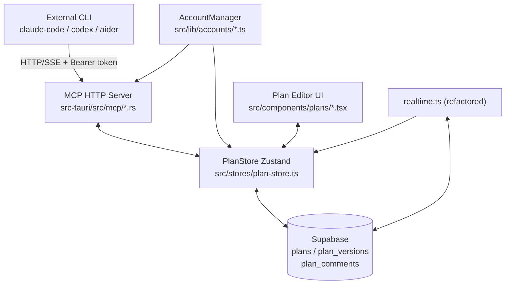
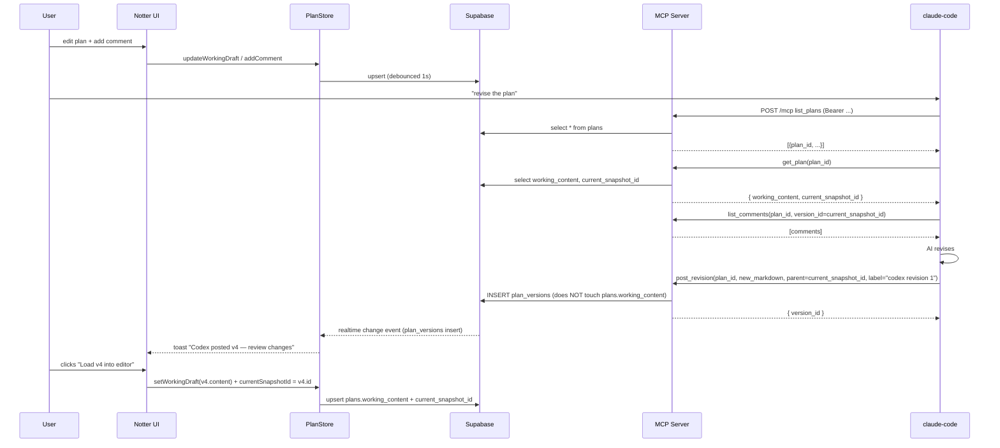

# Notter-AI Phase 1 Pivot — Design Spec

Date: 2026-05-09
Author: Brainstorming session (Claude + user)
Status: Draft pending Codex review and user approval.
Supersedes the vision doc at `2026-05-09-notter-pivot-vision.md` for Phase 1 scope.

## 1. Goal

Pivot Notter-AI from "autonomous local CLI executor" to "collaborative plan-review IDE for AI development workflows, with bidirectional MCP for any external CLI/agent."

Phase 1 scope is the **bidirectional MVP**: a user can manage multiple accounts, create/edit plans inside Notter, and any external CLI (claude-code, codex, aider, …) can read the plan + comments and post revisions via a persistent local MCP server. Realtime collaboration and rich rendering are deferred to later phases.

## 2. Phase 1 scope (locked)

| Pillar | In Phase 1? | Notes |
|---|---|---|
| 0. Multi-account | ✅ | Multi-user fast switcher (separate Supabase users, instant session swap). |
| 1. Plan document model | ✅ | Markdown plans + working draft + explicit snapshots + version-scoped comments. |
| 2. Persistent MCP server | ✅ | Local HTTP/SSE server in Tauri Rust, per-account token auth, MCP Streamable HTTP transport. |
| 3. Realtime collaboration | ❌ | Deferred. |
| 4. Rich rendering (Mermaid, images) | ❌ | Deferred. |
| 5. Import / export | ✅ | Markdown + YAML frontmatter; round-trip with CLI. |

## 3. Locked decisions (from brainstorm)

| Decision | Choice | Rationale |
|---|---|---|
| Account model | Multi-user fast switcher | N Supabase users on disk; instant swap; RLS isolates naturally. |
| MCP transport | HTTP/SSE on `127.0.0.1`, dynamic port + token auth | Persistent, multi-CLI concurrent, OS-portable. |
| Plan content shape | Pure markdown + version-scoped comments | Simplest; CLI roundtrip is lossless; comment anchoring deferred to Phase 3. |
| Versioning trigger | Working draft + explicit snapshots | Clean history; snapshots created on user click or AI roundtrip. |
| Disk format | Markdown + YAML frontmatter | Familiar to AI tools; CLIs already speak markdown. |
| Rollout shape | Bottom-up by pillar (M1..M4) | Each milestone independently shippable; each gets its own `/make-plan`. |
| MCP server packaging | In-process Rust (axum) inside Tauri | Zero process management; reuses existing Tauri runtime. |
| Plan store | New `PlanStore` is the canonical content store; legacy `actions-store` keeps powering only the frozen Actions tab | Avoids code rot in the active surface; legacy stays alive for the frozen tab until Phase 2/3 decides. |

## 4. Architecture

### 4.1 Component boundary



### 4.2 Component summary

**New components:**
- `AccountManager` (TS, `src/lib/accounts/`) — holds N Supabase sessions in Tauri secure store; exposes `currentAccount`, `switchAccount(id)`, `addAccount(emailFlow)`, `removeAccount(id)`, `listAccounts()`. Single Supabase client with session swap; not multiple clients.
- `PlanStore` (Zustand, `src/stores/plan-store.ts`) — replaces `actions-store` as the central content store for plans, working drafts, snapshots, and comments.
- **MCP HTTP Server** (Rust, `src-tauri/src/mcp/`) — long-running `axum` server bound on `127.0.0.1:<dynamic-port>`. Token-authenticated. Single endpoint `POST /mcp` implementing MCP Streamable HTTP transport (JSON-RPC 2.0).

**Refactored:**
- `auth-sync` — manages multiple sessions instead of one; integrates with `AccountManager`.
- `realtime.ts` — re-targets new tables (`plans`, `plan_versions`, `plan_comments`); refactored on top of the `subscribeUserTable` primitive (PATHFINDER System 1).
- All existing Zustand stores — gain a `reset()` method called during account switch; converted to use the `SyncedStore` primitives (PATHFINDER System 1).

**Deprecated / killed during Phase 1:**
- `planning-pipeline` (4 stages, `src/lib/planning/`, `src/components/planning/`) — zero callers after M2; deleted in M2.
- `src/lib/llm/*` (CLI workers) — review after M2 to confirm no remaining callers, then delete.

**Kept alive in Phase 1, targeted for Phase 3 decision:**
- `notter-mcp-server/` (Node stdio child) — still spawned by `executor`, which stays frozen. Deletion bundled with the executor's Phase 3 resolution. The new persistent Rust MCP and the legacy Node stdio MCP coexist; they do not share code or state.

**Frozen, not touched:**
- `executor`, `terminal-panes`, `action-runner.ts`, `board-tasks`, `agent-chat`, `ai-providers`, `auto-updater`. They keep working; Phase 2/3 decides their fate.

## 5. Data model

### 5.1 Supabase schema

```sql
-- plans
create table plans (
  id uuid primary key default gen_random_uuid(),
  user_id uuid not null references auth.users(id) on delete cascade,
  title text not null default 'Untitled plan',
  working_content text not null default '',
  current_snapshot_id uuid, -- FK added after plan_versions exists
  created_at timestamptz not null default now(),
  updated_at timestamptz not null default now()
);
create index plans_user_id_idx on plans(user_id);

-- plan_versions (append-only)
-- user_id is DENORMALIZED from plans.user_id — set by trigger or app on insert,
-- never updated. Avoids correlated-subquery RLS perf hit at scale.
create table plan_versions (
  id uuid primary key default gen_random_uuid(),
  plan_id uuid not null references plans(id) on delete cascade,
  user_id uuid not null references auth.users(id) on delete cascade,
  content_markdown text not null,
  parent_version_id uuid references plan_versions(id) on delete set null,
  source text not null check (source in ('user', 'ai', 'import')),
  source_actor text,                           -- 'claude-code' | 'codex' | null
  label text,                                  -- optional human-readable name
  created_at timestamptz not null default now()
);
create index plan_versions_plan_id_idx on plan_versions(plan_id);
create index plan_versions_user_id_idx on plan_versions(user_id);

alter table plans
  add constraint plans_current_snapshot_fk
  foreign key (current_snapshot_id) references plan_versions(id) on delete set null;

-- plan_comments
-- user_id is DENORMALIZED plan owner (NOT necessarily author). Author tracked separately.
-- In Phase 1, author = owner always (no sharing). Phase 3 will revisit.
create table plan_comments (
  id uuid primary key default gen_random_uuid(),
  plan_id uuid not null references plans(id) on delete cascade,
  version_id uuid not null references plan_versions(id) on delete cascade,
  user_id uuid not null references auth.users(id) on delete cascade,
  author_user_id uuid not null references auth.users(id) on delete cascade,
  body text not null,
  resolved boolean not null default false,
  created_at timestamptz not null default now(),
  updated_at timestamptz not null default now()
);
create index plan_comments_version_id_idx on plan_comments(version_id);
create index plan_comments_user_id_idx on plan_comments(user_id);

-- RLS: simple ownership check, no correlated subqueries.
alter table plans          enable row level security;
alter table plan_versions  enable row level security;
alter table plan_comments  enable row level security;

create policy "plans_user_isolation"    on plans         for all using (auth.uid() = user_id);
create policy "versions_user_isolation" on plan_versions for all using (auth.uid() = user_id);
create policy "comments_user_isolation" on plan_comments for all using (auth.uid() = user_id);

-- Trigger to denormalize user_id from plans → plan_versions / plan_comments on insert.
-- Keeps clients from having to compute it; prevents data drift.
create function set_plan_owner_id() returns trigger as $$
begin
  select user_id into new.user_id from plans where id = new.plan_id;
  if new.user_id is null then
    raise exception 'plan_id % not found', new.plan_id;
  end if;
  return new;
end;
$$ language plpgsql security definer;

create trigger set_user_id_on_plan_versions
  before insert on plan_versions
  for each row execute function set_plan_owner_id();

create trigger set_user_id_on_plan_comments
  before insert on plan_comments
  for each row execute function set_plan_owner_id();
```

Not in Phase 1: `plan_assets` (deferred to Phase 4).

### 5.2 Local storage layout (multi-account)

All paths below are under Tauri's `<appLocalData>/notter-ai/` directory (e.g. `%LOCALAPPDATA%\com.notter.ai\notter-ai\` on Windows; `~/Library/Application Support/com.notter.ai/notter-ai/` on macOS):

```
<appLocalData>/notter-ai/
  accounts/
    index.json           — [{ id, email, displayName, addedAt }, ...]
    active.json          — { accountId: "..." }
  mcp/
    endpoint.json        — { url, pid }   (written by MCP server on boot, deleted on exit)
  <accountId>/
    cache/plans.json     — local snapshot of plans (offline / fast boot)
    exports/             — default destination for `Export .md`
```

**Migration from pre-multi-account layout (M1):** existing data today lives flat under `<appLocalData>/com.notter.ai/NotterProjects/`, `AgentProfiles/`, etc. M1 must move that data into `<appLocalData>/notter-ai/<currentUserId>/...` on first launch after upgrade. The "currentUserId" comes from the existing single Supabase session at upgrade time. Idempotent: if target dir already exists, treat as already migrated and skip.

Tauri secure store keys (per account):
- `notter:account:<id>:refresh_token` — Supabase refresh token
- `notter:account:<id>:mcp_token` — MCP server bearer token

Access tokens (Supabase) live in memory only.

### 5.3 LocalStorage / Zustand persistence

All keys namespaced: `notter:<accountId>:<key>`. Each store's persisted slice scoped to active account; on switch, current keys ignored and target keys read.

### 5.4 Account switch — non-destructive flow

`AccountManager.switchAccount(targetId)` — ordered so that destructive operations (Zustand reset, realtime unsubscribe) only happen **after** the new session is committed. No rollback needed because nothing is destroyed before commit.

1. **Validate** — read `notter:account:<targetId>:refresh_token` from secure store. If missing, throw immediately (no state changed).
2. **Acquire** — call `supabase.auth.setSession({ refresh_token })` and await success. On failure: surface "session expired, please re-login this account" CTA; do not touch any store.
3. **Commit** — only when step 2 succeeds:
   a. Tear down old realtime subscription.
   b. `for (store of stores) store.reset()` — Zustand purge.
   c. `await syncOnLogin(newUserId)` — re-hydrate.
   d. Re-subscribe realtime with new uid.
   e. Notify the in-process MCP server (via Tauri event) that the active token map has new entry / updated active account.
4. **Update active pointer** — write `accounts/active.json` last; treated as the canonical "switch happened" marker.

If step 3 fails partway (rare — Supabase available but a specific table fetch errors), the user is left in a degraded state on the **new** account, not the old one. The repair path is "reload" (which re-runs `syncOnLogin`), not "rollback to old." This is intentional: a successful `setSession` already invalidated the old session in Supabase's internal state.

## 6. MCP HTTP server (M3)

### 6.1 Lifecycle

- Boots as Tauri main-thread async task at app start.
- Binds `127.0.0.1:0` (OS-assigned port). On success, writes `<appLocalData>/notter-ai/mcp/endpoint.json`:
  ```json
  {
    "url": "http://127.0.0.1:54781/mcp",
    "pid": 12345,
    "nonce": "f3a8...",          // 16 random bytes hex; also held in server memory
    "started_at": "2026-05-09T14:32:00Z"
  }
  ```
- Tauri `tauri://close-requested` deletes the file. **Stale-file detection on next boot:** read existing `endpoint.json`, then attempt `GET <url>/health` with `X-Notter-Nonce: <file's nonce>`. If the response matches, the previous instance is still running — abort startup and surface "another instance is running". If the request fails or the nonce mismatches (e.g. PID was reused by Word.exe), treat the file as stale, delete it, and bind anew. Do not rely on PID liveness alone.
- Bind failure: 3 retries with port 0 → mark `mcp.disabled = true` in app store → surface in MCP config UI. App still runs.

### 6.2 Auth + token lifecycle

**Per-account MCP bearer token (stable):**
- Generated when an account is added: 32 random bytes → base64url → prefix `notter_acc_`. Stored in secure store as `notter:account:<id>:mcp_token`.
- Server holds an in-memory map `token → accountId`, rebuilt at boot and on every account add/remove (notified via Tauri event from the front-end).
- Every request must carry `Authorization: Bearer notter_acc_<token>`. Missing/invalid → 401.
- This token does NOT expire and is the only thing the user copies into the CLI config. Stable across app restarts even if the URL changes.

**Per-account Supabase access token (rotating) — front-end is the sole refresh owner:**
- The Rust MCP server NEVER calls Supabase's refresh endpoint. Only the React/Tauri front-end's Supabase client refreshes tokens (its existing behavior).
- On every successful refresh in the front-end, the new access token is pushed to the Rust MCP server via Tauri command (`mcp_update_account_token(accountId, accessToken, expiresAt)`). The server stores `(accountId → accessToken, expiresAt)` in memory.
- When a tool call arrives, the server uses the in-memory access token for that account. If the token is expired or absent (e.g. front-end hasn't refreshed yet), the server returns a JSON-RPC error code `auth_pending` and the CLI is expected to retry once. The front-end refreshes proactively (default Supabase behavior is to refresh well before expiry), so this should be rare.
- **Avoids the dual-refresh race:** there is exactly one party calling Supabase's refresh endpoint, ever.

**Stable MCP config file (UX mitigation for dynamic port):**
- In addition to "Copy MCP config", Notter writes `<appLocalData>/notter-ai/mcp/<accountId>-config.json` on every boot with the current URL + bearer token. Users point their CLI config at this file path (some MCP clients support file-based config; for those that don't, the user must re-copy after restarts). The path is stable across restarts; the contents update.

### 6.3 Transport

- Single endpoint: `POST /mcp`.
- MCP Streamable HTTP transport (per spec 2025-03-26): JSON-RPC 2.0 request body. Response is `application/json` for synchronous tools; Phase 1 has no streaming tools.
- Optional fallback: `notter-mcp-bridge.js` (small Node script in `notter-mcp-server/` repurposed) for any CLI that only speaks stdio. Distributed as a published npm package later if demand arises; not in Phase 1 scope to ship the bridge.

### 6.4 Phase 1 tools

| Tool | Args | Returns |
|---|---|---|
| `list_plans` | — | `[{ id, title, current_snapshot_id, updated_at }]` |
| `get_plan` | `plan_id` | `{ id, title, working_content, current_snapshot_id, updated_at }` |
| `get_version` | `version_id` | `{ id, plan_id, content_markdown, parent_version_id, source, source_actor, label, created_at }` |
| `list_versions` | `plan_id` | `[{ id, source, source_actor, label, created_at }, ...]` ordered desc |
| `list_comments` | `plan_id`, `version_id?` | `[{ id, version_id, body, resolved, author_user_id, created_at }]` |
| `post_revision` | `plan_id`, `content_markdown`, `parent_version_id?`, `label?` | `{ version_id }` — **only inserts into `plan_versions`. Does NOT mutate `plans.working_content` or `plans.current_snapshot_id`.** Adoption is opt-in by the user via UI (see §6.5). |

Not exposed in Phase 1:
- `post_comment` — comments are human-authored. AI revises in response, not chats.
- `subscribe_changes` — SSE notifications. Deferred to Phase 3 with realtime collab.
- `delete_*` — managed via UI only.

### 6.5 Happy-path sequence



## 7. Milestones

Each milestone is independently shippable and gets its own `/make-plan`.

### M1 — Multi-account

- `AccountManager` class + secure-store wrapper.
- Custom Supabase storage adapter that reads/writes secure-store keys for the active account.
- `AccountSwitcher` UI in the app header (avatar + dropdown, "Add account" → existing OAuth/email flow).
- Refactor every Zustand store: add `reset()`, namespace localStorage keys, namespace fs paths.
- "Add account" flow: OAuth deep-link or email/password → on success, persist tokens, append to `index.json`, optionally switch to the new account.
- Generate the per-account `mcp_token` here (used by M3 later but persisted from M1).
- **Fs migration** (idempotent, runs once at first M1 launch): move existing flat data (`<appLocalData>/com.notter.ai/NotterProjects/`, `AgentProfiles/`, `exec-state/`, `tmp-prompts/`) into `<appLocalData>/notter-ai/<currentUserId>/...`. **Idempotency via sentinel file** `<appLocalData>/notter-ai/.migration-v1-complete` written ONLY after all moves succeed. On startup, check sentinel — if present, skip; if absent, run migration. Directory existence alone is NOT trusted (a partial migration could leave the dir present but incomplete). Failure: log + show banner "fs migration partial — see logs"; do not block app startup.
- **Hard prereq from PATHFINDER:** System 1 (`SyncedStore` primitive — `upsertUserRows`, `subscribeUserTable`, `makeDebouncedSync`, `runOnce`) must ship before M2 starts. Either include it as M1 sub-work or as a "M0" pre-milestone. Without it, M2 has no clean base to build on. Recommendation: M1 includes the SyncedStore extraction; M2 builds on top.

### M2 — Plan model + UI

- Supabase migration `2026-05-XX-plan-model.sql`.
- `PlanStore` (Zustand). Slices: `plans[]`, `currentPlanId`, `workingDraft`, `snapshots[]`, `comments[]`. Built on top of the `SyncedStore` primitives from PATHFINDER System 1 (which becomes a hard prereq).
- `PlanList`, `PlanEditor` (Monaco markdown), `SnapshotPanel`, `CommentsPanel` components.
- Working draft: 1s debounced upsert to `plans.working_content`.
- Snapshot button: insert `plan_versions` row, update `plans.current_snapshot_id`.
- One-shot data migration on first M2 launch per account: each existing `subjects` row becomes a `plan` row. Title format: `<project_title> / <subject_title>` (project association is flattened into the title; the `projects` table itself stays in place but stops being a foreign key target for plans). `working_content` = `subject.markdown`. No initial snapshot. The legacy `Planner` UI shows a banner "Migrated to Plans tab — read-only" and a link.
- Delete `src/lib/planning/`, `src/components/planning/`, and the matching exports from `src/lib/llm/*` (only those with no other callers — keep what `actions-foundation` v1 still uses until v1 retires).

### M3 — Persistent MCP server

- New Rust module `src-tauri/src/mcp/`. `axum` (or `hyper` directly) server bound `127.0.0.1:0`.
- Token map maintained from secure store at boot + on add/remove account.
- Implement the 6 Phase 1 tools, each backed by Supabase queries via the user's stored access token (server gets it from a per-account refresh→access exchange held alongside the MCP token).
- Endpoint discovery file `<appLocalData>/notter-ai/mcp/endpoint.json`.
- "Copy MCP config" UI in account switcher.
- Bind failure handling + UI surface.

**Coexistence with `notter-mcp-server/` (Node):** the legacy stdio MCP keeps running (still spawned by frozen `executor`). The new Rust HTTP MCP is independent — different port, different transport, different tool surface. No code sharing in Phase 1. Phase 3 (executor revival or retirement) decides the legacy server's fate.

**Table-level isolation guarantee:** the legacy Node MCP server only reads/writes `<appLocalData>/notter-ai/<accountId>/exec-state/<actionId>.json` (per `01-flowcharts/mcp-server-bridge.md`). It does NOT touch any Supabase table. The new Rust MCP server only touches the new tables (`plans`, `plan_versions`, `plan_comments`). Zero overlap by table. This boundary is asserted in M3 acceptance: a code review checklist item confirms `notter-mcp-server/` has zero `from('plans')`, `from('plan_versions')`, `from('plan_comments')` Supabase queries.

### M4 — Import / export

- `gray-matter` (npm) for frontmatter parse/serialize.
- `src/lib/plans/frontmatter.ts`, `src/lib/plans/export.ts`, `src/lib/plans/import.ts`.
- UI: "Import .md" in `PlanList` (file picker), "Export current version" in `PlanEditor`.
- Import logic: parse frontmatter; if `plan_id` exists in current account → create a new version in that plan (with `source: 'import'`); if not → create a new plan.
- Export logic: serialize `{ plan_id, version_id, parent_version_id, title, source, source_actor, exported_at }` as YAML frontmatter + body markdown. Default location `<appLocalData>/<accountId>/exports/<title-slug>-<version-shortid>.md`.
- Frontmatter validation: schema-checked; reject malformed imports with explicit error.

## 8. Migration / coexistence map

| Feature | M1 | M2 | M3 | M4 | End of Phase 1 |
|---|---|---|---|---|---|
| `planner` (legacy) | intact | banner + read-only; subjects → plans (one-shot) | intact | intact | UI legacy present, data migrated |
| `board-tasks` | intact | intact | intact | intact | frozen, Phase 2 decision |
| `agent-chat` | intact | intact | intact | intact | frozen, Phase 2 decision |
| `ai-providers` | intact | intact | intact | intact | kept (AI still called by user) |
| `planning-pipeline` | intact | dead, deleted | gone | gone | gone |
| `actions-foundation` v1+v2 | intact | partially superseded by `PlanStore` | partially superseded | partially superseded | actions tab legacy + frozen until Phase 3 decides |
| `executor` | intact | intact | intact | intact | frozen |
| `terminal-panes` | intact | intact | intact | intact | frozen |
| `auth-sync` | + multi-session refactor | + new tables hooked to `realtime.ts` | intact | intact | refactored |
| `auto-updater` | intact | intact | intact | intact | intact |
| `notter-mcp-server` (Node) | intact | intact | intact (still spawned by executor) | intact | kept alive; Phase 3 decides |

Deletes in their own PRs after each milestone, after `grep` + manual verification of zero callers.

## 9. Error handling

| Failure | Response |
|---|---|
| `switchAccount` step fails | Rollback to previous account; toast with specific step; log structured; `setSession` failure → prompt re-login for that account specifically. |
| MCP bind failure | Retry 3× with port 0; if persistent, set `mcp.disabled = true` in app store; surface in MCP config UI; app still functional. |
| MCP auth failure | 401; log; UI shows "token mismatch — regenerate" CTA per account. |
| Plan op failure (Supabase) | Optimistic local update reverted; toast; structured log. |
| Realtime drop | Existing exponential backoff in `realtime.ts` (kept as-is). |
| Frontmatter parse error on import | Strict schema validation; reject with specific error ("missing version_id", "malformed YAML"). No partial import. |
| Migration failure (M2 subject→plan) | Per-row try/catch; failed rows logged; banner offers manual re-run; legacy UI unchanged for those rows. |

## 10. Testing

- **Unit (vitest)**:
  - `AccountManager` with fake secure store + fake Supabase client (test all 5 switch steps, rollback path).
  - `PlanStore` (working draft transitions, snapshot creation, comment CRUD).
  - Frontmatter parser: round-trip property test (`parse(write(plan)) ≡ plan`).
  - Migration: subject→plan with fixtures.
- **Rust integration (`cargo test` in `src-tauri/`)**: MCP server bind, token auth path, each of the 6 tools against a dedicated Supabase test project (free tier). In-process Supabase mocking is rejected — building one in Rust is non-trivial and the test project is the cheaper, more realistic option. Test schema is reset between runs via the Supabase CLI.
- **End-to-end smoke** (manual or scripted with `curl`): add account → create plan → edit working draft → snapshot → `curl POST /mcp post_revision` with bearer token → verify new version appears in UI via realtime.

## 11. Out of scope (explicit non-goals)

- Realtime collaboration UI (presence, cursors, concurrent editing). Phase 3.
- Mermaid / image rendering inside Notter. Phase 4.
- Plan asset storage (`plan_assets` table + Supabase Storage). Phase 4.
- `post_comment` / `subscribe_changes` MCP tools. Phase 3.
- Stdio-MCP bridge binary. Built only if a target CLI lacks HTTP transport.
- Migration of `actions` to plans. Actions tab stays legacy until Phase 2/3.
- Sharing plans with other users in-app. Out of scope until Phase 3 (collab) or Phase 1.5 (file share is the workaround).
- Plan format JSON / `.notterplan` zip. Markdown-only export in Phase 1.

## 12. Open items expected to surface during `/make-plan`

These are not blockers for the spec but will need decisions in implementation plans:

- Exact Rust HTTP framework (`axum` vs `hyper` direct). Default: `axum`.
- Account-add flow: OAuth deep-link reuses existing pattern (`notterai://auth/callback`)? Confirm during M1 plan.
- Monaco vs textarea for `PlanEditor`: Monaco gives markdown syntax highlighting + folding; textarea is lighter. Default: Monaco (already a dep).
- Where the "Snapshot" button lives in the editor toolbar.
- Exact toast/dialog UX for "Codex posted v4 — review changes" prompt (§6.5).

## 13. Codex review log

The original draft of this spec was reviewed by Codex (GPT-5) on 2026-05-09. Three blockers and four strong concerns were identified; all were resolved inline:

- **Blocker (token refresh race):** Resolved in §6.2. Front-end is the sole Supabase refresh owner; pushes new access tokens to the Rust MCP via Tauri command. Rust never calls Supabase refresh.
- **Blocker (stale `endpoint.json`):** Resolved in §6.1. PID check replaced with nonce + `GET /health` round-trip.
- **Blocker (account switch rollback):** Resolved in §5.4. Reordered to non-destructive flow: validate → acquire → commit. No rollback path needed because nothing destructive happens before commit.
- **Strong (RLS subquery perf):** Resolved in §5.1. `user_id` denormalized onto `plan_versions` and `plan_comments`; populated by `set_plan_owner_id()` trigger.
- **Strong (`post_revision` clobbers working_content):** Resolved in §6.4 / §6.5. Tool only inserts `plan_versions`. UI prompts user to load the new version into the editor.
- **Strong (fs migration sentinel):** Resolved in §7 M1. `.migration-v1-complete` sentinel file gates idempotency, not directory existence.
- **Strong (dual MCP coexistence):** Resolved in §7 M3. Table-level isolation guarantee asserted; M3 acceptance includes a grep-based check.

One strong concern was acknowledged but not resolved in Phase 1:
- **`comments_user_isolation` RLS (Codex Strong 4):** Phase 1 has no plan sharing, so author = owner is always true and the policy works. Phase 3 (collab) will reopen this.

Nits on terminology, test strategy, prereq ordering, and copy-config UX were all addressed inline.
