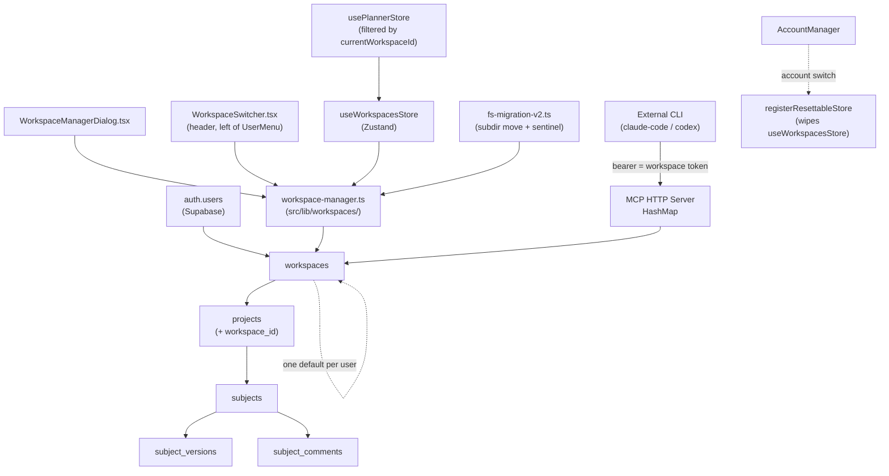

# Notter-AI Workspaces — Design Spec

Date: 2026-05-10
Author: Brainstorming session (Claude + user)
Status: Draft pending user review.
Baseline: `supabase/migrations/2026-05-10-subject-versioning.sql` (subject-anchored M2). NOT the superseded plans-table draft.
Relationship to Phase 1: Strictly additive on top of `main` (post-M1..M4). Workspaces are a follow-on feature, not part of Phase 1.

## 1. Goal

Insert a new "workspace" container layer between an account and its projects so users can organize work into isolated buckets (`Personal`, `Work`, `Side-project X`) without juggling accounts. An account holds one or more workspaces; each workspace is an isolated home for `projects` (+ their `subjects`, `subject_versions`, `subject_comments`, local cache, and exports). The model mirrors the M1 multi-account pattern one level deeper: the same fast-switcher UX, the same secure-store scoped tokens, the same RLS-isolation guarantees, and the same `registerResettableStore` reset hook on switch. Workspaces give users the "multi-tenant within one identity" capability that multi-account did at the auth layer, without requiring a second Supabase user just to keep two project sets apart.

## 2. Scope (locked decisions)

| Decision | Choice | Rationale |
|---|---|---|
| Migration of existing accounts | Auto-create `"User's workspace"` for every existing user; backfill every existing project's `workspace_id` to it. Idempotent via new sentinel file. | Zero-friction upgrade — current users keep their data, no setup screen on first launch post-update. |
| Storage location | Real Supabase table with RLS. Cross-device. | Workspaces ARE a sync target like projects; local-only would defeat the whole point of having an account with N workspaces visible from any device. |
| Project movement | Projects move between workspaces via a single `projects.workspace_id` FK update. | Cheapest possible primitive; the subject/version/comment hierarchy below is scoped via `projects.workspace_id`, so a single row write retargets everything. |
| MCP integration | Workspace is **implicit per token**. Each workspace gets its own `mcp_token`. Selecting a token = selecting a workspace. No new MCP tool argument. CLI must re-copy config when switching workspaces. | Keeps the MCP tool surface stable. Tokens are already per-account; per-workspace is the natural next axis. The CLI does not need to know "workspaces exist" — it just sees the projects/subjects visible to its bearer. |

Explicit non-goals (see §10 for the full list): no sharing across accounts, no per-workspace roles, no per-workspace theming, no local-only workspaces.

## 2b. Tactical decisions locked during user review (2026-05-10)

These were flagged as open items at draft time and resolved with the user before /make-plan:

| Decision | Choice |
|---|---|
| Legacy M3 `<accountId>-config.json` path | **Break cleanly.** Drop the file when a workspace's per-config file replaces it. No backwards-compat shim. The user has no production CLI configs depending on the old path. |
| Token revocation race for in-flight CLI calls | **Let in-flight requests finish; 401 the next.** Middleware re-checks the bearer per request — no active connection-tracking needed. |
| "Set as default" placement in the manage dialog | **Inline link/button on each non-default workspace row.** Keeps the action discoverable next to the workspace it affects. |
| Atomic move-then-delete | **Sequential REST calls protected by `ON DELETE RESTRICT`.** No Supabase RPC. If the UPDATE doesn't move every project, the DELETE fails on the FK constraint — that's the safety net. The UI handles the partial-failure toast. |
| "Move project to workspace" UI affordance | **Ship in this feature.** Right-click on a project (or a kebab menu) → "Move to workspace ▸ <list>". Single FK update. Detailed in §6.6. |
| `projects` PK change to include `workspace_id` | **Defer.** Phase 1 of workspaces keeps the existing `(user_id, name)` PK; same project name across workspaces is forbidden. Reopen only if it becomes a real user complaint. |

## 3. Architecture

### 3.1 Hierarchy



### 3.2 Component summary

**New TS modules** (mirror `src/lib/accounts/*`):
- `src/lib/workspaces/workspace-manager.ts` — singleton. `bootstrap()`, `list()`, `currentWorkspaceId`, `switchWorkspace(id)`, `add({ name, isDefault? })`, `rename(id, name)`, `remove(id, { moveTargetWorkspaceId | purge: true })`. CRUD-of-workspaces goes through this so the Zustand store, the MCP bridge, and the fs-migration sentinel stay in lockstep.
- `src/lib/workspaces/workspace-paths.ts` — returns `notter-ai/<accountId>/<workspaceId>/...`. Two helpers: `workspaceScopedPath(rel)` (throws if no active workspace), `tryWorkspaceScopedPath(rel)` (returns `null`). Direct analogue of `account-paths.ts`.
- `src/lib/workspaces/workspace-storage.ts` — index file + active pointer reader/writer under `notter-ai/<accountId>/workspaces/index.json` and `active.json`. Same shape as `account-storage.ts`.
- `src/lib/workspaces/fs-migration-v2.ts` — subdirectory mover. On first launch after the workspaces upgrade, moves `<accountId>/cache/` and `<accountId>/exports/` (and any other account-scoped legacy dirs created by Phase 1) into `<accountId>/<defaultWorkspaceId>/...`. Sentinel-gated.

**New Zustand store**:
- `src/stores/workspaces-store.ts` — `useWorkspacesStore`. Slices: `workspaces[]`, `currentWorkspaceId`, `loading`. Built on the same `SyncedStore` primitives the planner store uses (`makeDebouncedSync`, `subscribeUserTable`). Registered with `registerResettableStore` so account-switch wipes both `workspaces[]` and `currentWorkspaceId`.

**Refactored**:
- `usePlannerStore.projects` becomes filtered by `currentWorkspaceId`. A pragmatic implementation: keep the canonical full list in a slice (e.g. `allProjects[]`) and expose `projects` as a derived selector that filters by `currentWorkspaceId`. The existing `applyRemoteProjects` continues to write to `allProjects`; selectors and any UI reading `state.projects` get the filtered view. Switching workspace then becomes a `currentWorkspaceId` setter that triggers a re-render via Zustand subscription — zero refetch needed.
- `pushSubject` / `deleteRemoteSubject` etc. in `src/lib/sync.ts` need no signature change: they're scoped by `user_id` + `project_name` and Supabase RLS still enforces that. The new `workspace_id` lives one hop away on `projects` and is enforced by FK; subjects don't carry it.
- `realtime.ts` — already subscribes to project changes for the active user. No change needed; workspace assignment is just one more column on the row. But the subscription on the new `workspaces` table itself is added, calling `useWorkspacesStore.applyRemoteWorkspaces(rows)`.
- `auth-store.syncOnLogin` — extends to also call `useWorkspacesStore.fetchAll(uid)`. Order: workspaces → projects → subjects. If `currentWorkspaceId` is null after fetch, pick the user's `is_default = true` row.

**New UI components**:
- `src/components/WorkspaceSwitcher.tsx` — header chip + dropdown. Placed in `Layout.tsx` **LEFT** of `<UserMenu />` (around line 54 of current `Layout.tsx`). See §6 for visual spec.
- `src/components/WorkspaceManagerDialog.tsx` — modal with create / rename / delete flows. See §6.
- `src/components/WorkspaceDeleteDialog.tsx` (or an inline sub-modal inside `WorkspaceManagerDialog`) — the "move-or-purge" radio confirmation. See §6.

**MCP server changes** (Rust):
- `src-tauri/src/mcp/auth.rs` — `token_to_account: HashMap<String, String>` becomes `token_to_owner: HashMap<String, AuthOwner>` where `AuthOwner { account_id: String, workspace_id: String }`. `AuthContext` gains `workspace_id`.
- `src-tauri/src/mcp/server.rs` — `McpStateInner.token_to_account` renamed to `token_to_owner` (same map, richer value). `McpStateInner.access_tokens` stays keyed by account; access tokens are per-account, not per-workspace.
- `src-tauri/src/mcp/tools.rs` — every tool (`list_plans`/`list_subjects`, `get_subject`, etc.) adds a `WHERE workspace_id = ?` clause when querying `projects`, and trusts the FK chain to scope subjects/versions/comments.
- New / renamed Tauri commands: `mcp_register_bearer(account_id, workspace_id, bearer_token)`, `mcp_revoke_bearer(bearer_token)` (or revoke-by-workspace), `mcp_remove_account_token(account_id)` keeps revoking all bearers belonging to the account. Front-end `src/lib/mcp.ts` thin wrapper updated.

## 4. Data model

### 4.1 New `workspaces` table

```sql
create table workspaces (
  id uuid primary key default gen_random_uuid(),
  user_id uuid not null references auth.users(id) on delete cascade,
  name text not null,
  is_default boolean not null default false,
  created_at timestamptz not null default now(),
  updated_at timestamptz not null default now(),
  unique (user_id, name)
);
create index workspaces_user_id_idx on workspaces(user_id);

-- One default workspace per account.
create unique index workspaces_one_default_per_user_idx
  on workspaces(user_id) where is_default = true;

alter table workspaces enable row level security;
create policy "workspaces_user_isolation" on workspaces for all
  using (auth.uid() = user_id);

-- Realtime publication — explicit add so postgres_changes events fire
-- when workspaces are created/renamed/deleted on another device.
alter publication supabase_realtime add table workspaces;
```

Notes:
- `unique (user_id, name)` lets workspace names collide across accounts but not within one account. Surface a friendly inline-validation error in the rename UI.
- `workspaces_one_default_per_user_idx` is a partial unique index, the canonical Postgres pattern for "exactly one true per group". The app marks a new default in the same transaction as un-marking the old one (UPDATE ... CASE) so the constraint is never violated mid-statement.
- Workspace deletion does NOT cascade to projects on the DB side — see §4.2 ON DELETE RESTRICT decision below.

### 4.2 `projects.workspace_id`

```sql
-- Phase 1 of the migration (see §5): add the column with a temporary default
-- so the table can be altered without breaking the NOT NULL constraint while
-- the backfill is still in flight.
alter table projects
  add column workspace_id uuid not null
  default '00000000-0000-0000-0000-000000000000'
  references workspaces(id) on delete restrict;

-- After backfill (see §5 step 4-5), drop the temporary default so future
-- inserts must specify a real workspace_id chosen by the app.
alter table projects alter column workspace_id drop default;

create index projects_user_workspace_idx on projects(user_id, workspace_id);
```

**ON DELETE RESTRICT is intentional.** The user-facing delete flow must explicitly choose either "move all projects to <other workspace>" or "delete projects too" (a separate DELETE statement in the UI mutation). Without RESTRICT, an accidental workspace delete would silently wipe every project, subject, version, and comment under it. With RESTRICT, the DB refuses the delete until the UI has explicitly resolved the children. This catches bugs in the UI mutation as well as accidental SQL.

**Locked: sequential REST calls, no RPC.** The delete-with-move flow issues `UPDATE projects SET workspace_id = $target WHERE workspace_id = $deleted AND user_id = $uid` followed by `DELETE FROM workspaces WHERE id = $deleted`. The `ON DELETE RESTRICT` constraint is the safety net — if the UPDATE didn't move every project (rare; user-side data races would be the only cause), the DELETE fails cleanly and the UI surfaces a toast naming the failing step. The workspace stays intact; no half-deleted state.

### 4.3 Subjects / versions / comments are scoped via projects

Subjects continue to be keyed on `(user_id, project_name, file_name)` — their composite primary key is unchanged. They DO NOT gain a `workspace_id` column. Scoping happens via the FK chain `subjects → projects → workspaces` (with `subjects.project_name` matched against `projects.name` for the same `user_id`).

**Composite-key decision (kept):**
- The `subjects` PK stays `(user_id, project_name, file_name)`. Different workspaces may contain projects with the same `name` — that's fine because:
  - `projects` itself has a `UNIQUE (user_id, id)` constraint AND a composite `PRIMARY KEY (user_id, name)`. Two projects with the same name under the same user are forbidden at the project level.
  - This means **within one account, project names are still globally unique across all workspaces**. The user cannot have a "blog" project in their Personal workspace AND a "blog" project in their Work workspace simultaneously.
  - This is a deliberate phase-1 trade-off: it avoids touching the subjects PK (which would ripple through every subject query). If users complain, a follow-on migration can change `projects` PK to `(user_id, workspace_id, name)` and the subjects PK to `(user_id, workspace_id, project_name, file_name)`. **Out of scope for this spec.**

**Display disambiguation:** if a user happens to have projects with very similar names across workspaces, the UI should optionally show a small workspace-name badge next to the project name in the planner sidebar — surfaced in the implementation plan, not blocking the spec.

### 4.4 No changes to other tables

`subject_versions`, `subject_comments`, `board_tasks`, `actions`, `agent_profiles`, `user_preferences` are unchanged. Their scoping continues to be by `user_id` only. Workspaces deliberately do NOT scope per-account settings (theme, agents, preferences) — those remain account-wide. See §10.

## 5. Migration plan

A new migration file: `supabase/migrations/2026-05-XX-workspaces.sql` (date TBD when shipped).

### 5.1 SQL migration steps

1. **Create the `workspaces` table** with indexes, RLS, and realtime publication (the SQL block in §4.1).
2. **Backfill one default workspace per existing user**. Single `INSERT ... SELECT DISTINCT`:
   ```sql
   insert into workspaces (user_id, name, is_default)
   select distinct user_id, 'User''s workspace', true
   from projects;
   ```
   For accounts that exist (in `auth.users`) but have zero projects, no workspace is created here — `auth-store.syncOnLogin` will lazily create one on next sign-in via `workspace-manager.bootstrap()`. This keeps the migration linear and avoids a second join.
3. **Add the `workspace_id` column** to `projects` with the temporary all-zero default + FK + RESTRICT (the first `alter table` in §4.2).
4. **Backfill** existing projects' `workspace_id`:
   ```sql
   update projects p
   set workspace_id = w.id
   from workspaces w
   where w.user_id = p.user_id
     and w.is_default = true;
   ```
5. **Drop the temporary default**:
   ```sql
   alter table projects alter column workspace_id drop default;
   ```
6. **Add the composite index**: `create index projects_user_workspace_idx on projects(user_id, workspace_id);` (see §4.2).
7. **Verification step inside the migration** (idempotency aid): `do $$ begin if exists (select 1 from projects where workspace_id = '00000000-0000-0000-0000-000000000000') then raise exception 'workspaces backfill incomplete'; end if; end $$;` — fails fast if the migration is re-run on a partial state.

### 5.2 App-side migration (filesystem layout)

Sentinel file: `<appLocalData>/notter-ai/.migration-v2-workspaces-complete` — **account-wide, not per-account**. Same pattern as the M1 sentinel (`.migration-v1-complete`), but at the v2 level. Contents: JSON `{ migratedAt, perAccount: [{ accountId, workspaceId, moved: [...] }] }`.

For each account in `accounts/index.json`, on first launch post-update:
1. Bootstrap `WorkspaceManager` for that account → resolves the default workspace (creating one client-side if the SQL backfill missed a project-less account).
2. Read its `id`. Call it `defaultWorkspaceId`.
3. Move `notter-ai/<accountId>/cache/` → `notter-ai/<accountId>/<defaultWorkspaceId>/cache/`.
4. Move `notter-ai/<accountId>/exports/` → `notter-ai/<accountId>/<defaultWorkspaceId>/exports/`.
5. Move any other top-level subdirs under `<accountId>/` that are clearly workspace-owned content (TBD list at implementation time — for Phase 1, `cache` and `exports` are the only known cross-launch dirs the app writes).

The sentinel is written only after every account migration succeeds. On any failure, leave the sentinel absent so the next launch retries; per-account `moved: [...]` lists let the retry skip the already-moved directories. Idempotency check: before each `rename`, verify the target doesn't already exist (if it does, the partial migration already moved it — skip).

### 5.3 What does NOT migrate

- The `accounts/index.json` and `active.json` files. Workspace-related files live under `<accountId>/workspaces/index.json` and `<accountId>/workspaces/active.json` (note: account-id scoped, since workspaces ARE account-scoped).
- The secure-store `notter:account:<id>:mcp_token` key. **That key is being replaced** with `notter:account:<id>:workspace:<wsId>:mcp_token`. The migration:
  1. Reads the old `notter:account:<id>:mcp_token`.
  2. Re-writes it under the new key for the **default workspace**.
  3. Deletes the old key.
  4. Calls `mcp_register_bearer` with the new `(account_id, workspace_id, bearer)` tuple.
  This means the user's existing MCP config keeps working — the bearer is preserved, but it now refers to the user's default workspace specifically.

## 6. UI design

### 6.1 `WorkspaceSwitcher` (header)

Placed in `Layout.tsx`, immediately to the LEFT of `<UserMenu />` (line 54 in the current file). Visual treatment: a small pill-shaped button showing the current workspace name and a `ChevronDown` icon. Click → opens a dropdown.

Dropdown contents (top-to-bottom):
1. **Current account's workspaces**, listed by name, each with a `Check` mark on the active one. Click switches.
2. A divider.
3. `[+] Add workspace` entry → opens an inline input or jumps directly to `WorkspaceManagerDialog` in create mode.
4. `[⚙] Manage workspaces` entry → opens `WorkspaceManagerDialog`.

When the active account has only one workspace, the switcher still renders (so the user discovers the feature exists) but the dropdown header reads "Only one workspace — add another to switch."

### 6.2 `WorkspaceManagerDialog`

Modal dialog. Three sections in a single column:

**Section 1: Current workspaces** — a list, each row:
- Workspace name (editable inline on click — `Enter` commits, `Esc` cancels). Inline validation against duplicate-name within account.
- `is_default` indicator (a small "Default" badge for the default row). Hovering on any non-default row reveals a "Set as default" button (which clears `is_default` on the old default in the same UPDATE).
- A `Delete` button (trash icon). **Disabled** when `is_default = true` AND there is more than one workspace (user must demote the default first). Disabled when only one workspace exists (you can't delete the last one).

**Section 2: Create** — a single-line input + "Set as default" toggle + a "Create" submit button. Uses `workspace-manager.add({ name, isDefault })`. On success, the list re-renders and the new workspace appears.

**Section 3: MCP config per-workspace** — a collapsed section ("Show MCP configs") that, when expanded, shows one card per workspace with that workspace's bearer + a "Copy MCP config" button. Reuses the existing copy-config logic, scoped to the workspace's bearer.

### 6.3 Delete flow (separate sub-modal or step inside `WorkspaceManagerDialog`)

Triggered by the per-row delete button. Sub-modal asks: "Delete workspace `<name>`? It contains N projects (and M subjects across them). What should happen to its projects?"

Radio group:
- ◉ **Move all projects to** [dropdown of other workspaces, default = current default workspace] (default selection).
- ◯ **Delete projects too** (red warning copy: "This permanently deletes N projects, M subjects, and all their versions and comments. This cannot be undone.").

Confirm button colored destructive (`bg-destructive`). Disabled until a radio option is chosen.

On confirm:
- **Move path**: `UPDATE projects SET workspace_id = $target WHERE workspace_id = $deleted AND user_id = $uid` → `DELETE FROM workspaces WHERE id = $deleted`. The ON DELETE RESTRICT means the second call only succeeds if the UPDATE covered every project. If the second call fails, surface a specific toast ("Some projects could not be moved — see logs") and leave the workspace intact.
- **Delete-projects path**: For each project under the workspace, run the existing `deleteProject(name)` logic in `usePlannerStore` (which already cascades to subjects/versions/comments via DB FK cascade). Then `DELETE FROM workspaces WHERE id = $deleted`.

After successful deletion, if `currentWorkspaceId === $deleted`, the manager flips to the default workspace and replays the usual switch-flow (filtered project list refreshes via Zustand subscription).

### 6.4 Move project to workspace

A small affordance, locked into this feature: each project in the planner sidebar gets a kebab/ellipsis menu (or right-click context menu — implementation plan picks one) that exposes a "Move to workspace ▸ <submenu>" item. The submenu lists every workspace other than the current one. Clicking a target:

1. Issues `UPDATE projects SET workspace_id = $target WHERE id = $projectId AND user_id = $uid`.
2. On success, the realtime channel propagates the change; `useWorkspacesStore` and `usePlannerStore` re-filter; the project disappears from the current workspace's sidebar (because `currentWorkspaceId` no longer matches).
3. A toast confirms: "Moved <project name> to <target workspace>" with an "Undo" button that re-issues the inverse UPDATE.

Subjects, versions, and comments under the project travel with it automatically — their scoping happens via the project FK chain, not via a denormalized workspace_id of their own. No additional writes needed.

### 6.5 Account-switch behavior

`AccountManager.switchAccount` already calls `resetAllStores()`. The `useWorkspacesStore` registers with `registerResettableStore` so:
- `workspaces[]` is cleared
- `currentWorkspaceId` is cleared

Then `auth-store.syncOnLogin` re-fetches workspaces for the new user and seeds `currentWorkspaceId` from the row marked `is_default = true`. The `WorkspaceSwitcher` re-renders automatically via the Zustand subscription.

### 6.6 Visual placement summary

```
┌───────────────────────────────────────────────────────────────────┐
│ [Planner] [Board] [Agents] ...   [Personal ▾]  [👤 user@email]    │
│                                   ^             ^                 │
│                                   |             UserMenu          │
│                                   WorkspaceSwitcher (NEW)         │
└───────────────────────────────────────────────────────────────────┘
```

## 7. MCP integration (implicit workspace via per-workspace token)

### 7.1 Token shape

Each workspace gets its own bearer token, prefixed `notter_ws_` (vs. the M1 `notter_acc_`), so a glance at a config tells you whether it's pre- or post-workspace. Stored in the Tauri secure store under:

```
notter:account:<accountId>:workspace:<workspaceId>:mcp_token
```

Token generation reuses `generateMcpToken()` from `src/lib/accounts/account-manager.ts` — extracted into `src/lib/workspaces/mcp-token.ts` (small helper) so both `account-manager` and `workspace-manager` use the same crypto routine. The migration in §5.3 step 2 changes the existing per-account token's key but keeps the bytes the same — the prefix `notter_acc_` lives on for migrated tokens until the user regenerates (UI affordance: "Rotate token" button per workspace).

### 7.2 Lifecycle hooks

- **Workspace created**: `workspace-manager.add()` generates a fresh `notter_ws_<random>` token, persists it under the secure-store key above, and calls `mcp_register_bearer(account_id, workspace_id, bearer_token)`. Front-end then writes the per-workspace config file (see §7.4).
- **Workspace deleted**: `workspace-manager.remove()` calls `mcp_revoke_bearer(bearer_token)` (which the Rust side resolves via the in-memory map), then `secureDelete` removes the secure-store entry. The per-workspace config file is removed from disk.
- **Account removed**: existing `mcp_remove_account_token(account_id)` revokes every bearer belonging to that account in one shot (Rust uses `retain(|_, owner| owner.account_id != &account_id)`).
- **App boot**: `workspace-manager.bootstrap()` iterates known workspaces (per account in `accounts/index.json`) and pushes their bearers to the Rust map via `mcp_register_bearer`. Repairs missing tokens by minting a new one and re-registering (same self-heal pattern as M1).

### 7.3 Rust token map changes

```rust
// src-tauri/src/mcp/auth.rs

#[derive(Debug, Clone, PartialEq, Eq, Hash)]
pub struct AuthOwner {
    pub account_id: String,
    pub workspace_id: String,
}

#[derive(Debug, Clone)]
pub struct AuthContext {
    pub account_id: String,
    pub workspace_id: String,
}

// In server.rs:
pub struct McpStateInner {
    // Renamed from token_to_account.
    pub token_to_owner: HashMap<String, AuthOwner>,
    // Unchanged. Access tokens are still per-account because Supabase
    // sessions are per-user, not per-workspace.
    pub access_tokens: HashMap<String, (String, i64)>,
    // ...
}
```

Bearer-auth middleware (`bearer_auth` in `auth.rs`) populates `AuthContext` with both `account_id` and `workspace_id`. Every tool handler in `tools.rs` reads `workspace_id` from `AuthContext` and constrains its `projects` queries:

```rust
// pseudo-Rust — tools.rs/list_projects
let rows = supabase_get(
    &state,
    &auth.account_id,
    "/rest/v1/projects",
    &[
        ("user_id", "eq.<auth.account_id>"),
        ("workspace_id", "eq.<auth.workspace_id>"),
        ("select", "*"),
    ],
).await?;
```

Subject / version / comment queries don't need the extra clause: they join through projects, and projects' workspace_id constraint already scopes them. But the implementation must verify that any tool returning subject IDs ACTUALLY joined through projects (i.e. never returns a row for a subject whose project is in a different workspace). Acceptance test: insert a subject under a project in workspace A, query subjects with workspace B's bearer, assert zero rows returned.

### 7.4 Per-workspace MCP config files

The existing single `<accountId>-config.json` becomes per-workspace:

```
<appLocalData>/notter-ai/mcp/<accountId>-<workspaceId>-config.json
```

`write_per_account_configs` in `src-tauri/src/mcp/server.rs` is renamed `write_per_workspace_configs` and iterates the new `token_to_owner` map, writing one file per entry. The "Copy MCP config" button in `WorkspaceManagerDialog` reads the appropriate path and copies its content to clipboard.

**Locked: clean break with the old `<accountId>-config.json` path.** During the v2 fs migration, any pre-existing `<accountId>-config.json` is deleted (after the default-workspace per-config file has been written successfully). No shim, no symlink — the path simply changes. The user has no production CLI configs depending on it.

## 8. Error handling

| Failure | Response |
|---|---|
| Delete workspace with projects, no move target chosen | Modal validation; "Confirm" button stays disabled until a radio option is selected. |
| Delete with "move target" — UPDATE projects succeeds, DELETE workspaces fails | Toast: "Projects moved, but the workspace could not be deleted. Retry from the manager." The user is left with an empty workspace they can try to delete again; no data lost. |
| Delete with "move target" — UPDATE projects fails partway | Rely on `ON DELETE RESTRICT` (locked decision §2b — no RPC). The subsequent DELETE on `workspaces` fails because some projects still reference the row; UI surfaces a specific toast naming the failing UPDATE and the workspace stays intact. RESTRICT acts as the "you forgot to handle some projects" canary. |
| Workspace rename collides with existing name | Inline error from the UNIQUE constraint; show "A workspace named X already exists." Don't write to DB until the inline check passes. |
| Default-workspace deletion attempted | UI prevents it: delete button disabled on the default row when other workspaces exist; if it's the only workspace, delete is also disabled (you can't have zero workspaces). To delete the default, the user must first mark another workspace as default. |
| MCP token miss after workspace deletion | 401 + `{"code": -32001, "message": "unauthorized: unknown token"}` JSON-RPC error. CLI sees a clear message; user re-copies config from a still-valid workspace. |
| MCP request with a now-revoked token mid-call | The middleware does a fresh lookup per request; in-flight requests finish normally (they hold their state in memory), the next request with the same bearer 401s. Locked decision §2b. |
| Workspace create race (same name pressed twice quickly) | The UNIQUE constraint catches it; second insert fails; UI shows the rename-collision message. |
| Filesystem migration (v2) failure on one of N accounts | Per-account try/catch; failed accounts logged; sentinel NOT written (so next launch retries). Banner shows "Workspace data setup incomplete for some accounts — see logs". App still launches and functions for the successfully-migrated accounts. |

## 9. Testing

### 9.1 Unit (vitest)

- `workspace-manager` with fake Supabase client + fake secure store:
  - `add` writes both the DB row and the secure-store key, and calls `mcp_register_bearer`.
  - `remove` (move path) issues UPDATE then DELETE, and revokes the bearer.
  - `remove` (purge path) deletes projects first, then the workspace.
  - `switchWorkspace` updates `currentWorkspaceId` and persists `active.json`.
  - `bootstrap` lazily creates a default workspace for an account that has none.
- `useWorkspacesStore` reset behavior:
  - After `registerResettableStore` callback fires, `workspaces[]` is empty and `currentWorkspaceId` is null.
- `usePlannerStore.projects` filtering:
  - With `allProjects` containing N rows split across two workspaces, the derived `projects` returns only the active-workspace subset.

### 9.2 Migration test

Vitest + a recorded fixture (or pgmock): seed two users with N projects each, run the migration SQL, assert:
- One `workspaces` row per user with `is_default = true` and name `"User's workspace"`.
- Every project's `workspace_id` matches its user's default workspace.
- No project has the temporary all-zero UUID.
- Re-running the migration is idempotent (or, if not idempotent, the verification step inside the migration fails cleanly).

### 9.3 Rust integration (`cargo test`)

- Bearer auth: a bearer registered for workspace A returns 401 for workspace B's resources.
- Tool scoping: insert a project P in workspace A; query `list_projects` with workspace B's bearer; assert P is not in the result.
- Token revocation: after `mcp_revoke_bearer`, the previously-valid bearer returns 401.
- Multi-account, multi-workspace: same user with two workspaces, two bearers, distinct project lists per bearer.

### 9.4 Manual end-to-end

1. Add a workspace via `WorkspaceManagerDialog`; verify a new entry appears in the header switcher; verify a new `<accountId>-<workspaceId>-config.json` is written under `mcp/`.
2. Move a project between workspaces (via a future "Move to workspace" UI affordance, or directly editing `workspace_id` in dev); verify only the new workspace shows it.
3. Switch workspace via the header dropdown; verify the planner sidebar repopulates with the new workspace's projects.
4. Delete a workspace with the "move" option; verify projects end up in the chosen target.
5. Delete a workspace with the "purge" option; verify projects + subjects + versions + comments are all gone.
6. Switch account; verify the workspace switcher resets to that account's default workspace.
7. Use claude-code CLI with workspace A's bearer; verify `list_projects` only shows workspace A's projects.
8. Rotate a workspace's MCP token (UI button); verify the CLI's stale config 401s and the new config works.

## 10. Out of scope (explicit non-goals)

- **Sharing workspaces between accounts** — collaboration territory (Phase 3+). RLS as written enforces single-owner.
- **Workspace-level permissions / roles** — there's no concept of "viewer" or "editor" within a workspace; the owner has full access.
- **Workspace-level theme / preferences** — `user_preferences` and `agent_profiles` stay account-wide. Workspaces scope content, not settings.
- **Local-only workspaces** — every workspace is a Supabase row first; the local filesystem layout follows from the Supabase IDs. (Locked decision.)
- **`subjects` PK change to include workspace_id** — out of scope; the FK chain via `projects` is the scoping mechanism for Phase 1 of workspaces. Reopen only if same-named projects across workspaces become a real user demand.
- **`projects` PK change to include workspace_id** — out of scope. Same-named projects across workspaces remain forbidden (locked decision §2b). Reopen if it becomes a real user complaint; the migration cost would be moderate.
- **CLI awareness of workspaces** — the CLI does not need to know workspaces exist. It uses a bearer and gets the visible projects. No new MCP tool argument. (Locked decision.)

## 11. Open items expected to surface during `/make-plan`

These are not blockers for the spec but need decisions in the implementation plan:

1. **UI for the move-or-purge radio** — exact copy, exact disabled states. The spec describes the shape; the wireframe lives in the plan.
2. **`WorkspaceSwitcher` header treatment** — chevron+name pill vs. a colored chip. Default pick: chevron+name pill, matching the existing `UserMenu` visual weight so it doesn't dominate the header.
3. **Move-project entry point** — kebab/ellipsis button on hover vs. right-click context menu vs. both. Default pick: kebab on hover for discoverability; revisit if the planner sidebar gets noisy.
4. **Workspace-delete confirmation copy** — exact wording for the destructive-purge warning. The plan picks final strings; the spec just establishes the shape.

All other open items at draft time were resolved with the user — see §2b.

## 12. Self-review notes

- **Baseline assumption**: this spec assumes M2's subject-anchored schema as live (`subjects.id` UUID + `subject_versions` + `subject_comments` per `supabase/migrations/2026-05-10-subject-versioning.sql`). NOT the superseded plans-table draft. If for some reason the subject-anchored migration is rolled back, this spec needs revisiting.
- **ON DELETE RESTRICT on `projects.workspace_id`**: deliberate. The DB refuses to delete a workspace that still has projects, forcing the UI to make an explicit "move or purge" decision. Catches both UI bugs and accidental SQL.
- **State-layer impact is small**: the existing M1 work already wired `registerResettableStore` across every Zustand store. Adding `useWorkspacesStore.reset()` to that registry is one line. The biggest state-layer change is making `usePlannerStore.applyRemoteProjects` write to a canonical `allProjects[]` slice and exposing `projects` as a derived selector filtered by `currentWorkspaceId`. Everything downstream of `projects` already subscribes through Zustand, so the filter is transparent.
- **MCP changes are mechanical, not architectural**: the token map's value type grows from `String` (account_id) to a `{account_id, workspace_id}` struct. Every tool gains one WHERE clause. No new tool surface, no new transport. The CLI does not need to be re-released.
- **Migration risk is concentrated in step 4** (the UPDATE projects backfill). It's a single statement and idempotent (rerunning it yields the same workspace_id per project), so its blast radius is limited. The verification step in §5.1 step 7 catches any missing rows.
- **What this spec does NOT do**: it does not detail a "Move to workspace" UI for projects. The data model fully supports it (single FK UPDATE); the UI surface is a follow-up decision in the implementation plan. Marked explicitly as out-of-scope-of-spec / in-scope-of-feature.
- **Naming nit**: "workspaces" is a heavy noun. We considered "spaces", "groups", "vaults" — settled on "workspaces" because it's the most-used industry term (Notion, Linear, Slack), and the user's brainstorm used it consistently. Renaming later is a string change, not a schema change, so this is low-risk.
