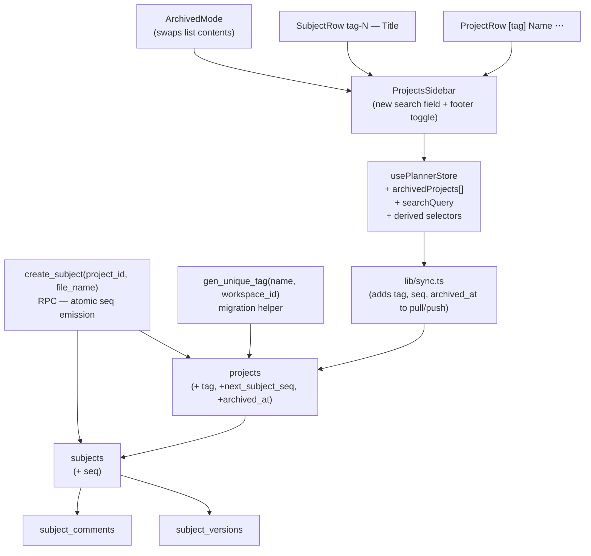

# Tags, Search & Archive — Design Spec

Date: 2026-05-14
Author: Brainstorming session (Claude + user)
Status: Draft pending user review.
Baseline: post-Migration A (`supabase/migrations/2026-05-14-workspace-members.sql`). Builds on the multi-user workspaces model — every constraint scoped to `workspace_id`, all RLS through the existing `is_workspace_member`/`workspace_role` helpers.
Relationship to other work: independent of the Phase 1 plan-review pivot and the MCP expansion spec, but produces stable subject identifiers (`flow-3`) that the MCP surface will benefit from quoting back to the model.

## 1. Goal

Give projects a short, stable **tag** (`flow`, `auth`, `api`) and give every subject inside a project a **monotonic sequence number**. The pair renders everywhere as a single identifier `flow-3` — pasteable, deeplinkable, MCP-friendly, and immune to title edits. Add a workspace-scoped **search field** that filters projects and subjects in one place, including an "exact identifier" jump. Add **archive** as a single project-level state (with cascade to subjects), exposed via a separate "Arquivados" section so the active list stays clean.

## 2. Scope (locked decisions)

| Decision | Choice | Rationale |
|---|---|---|
| Role of the tag | **Identity (Linear-style).** Tag + per-project sequence is the stable identifier. | User wants `flow-3` to be pasteable into comments/MCP and to survive title renames. A purely-visual chip would not deliver that. |
| Identifier storage | **Computed at read time** from `projects.tag` + `subjects.seq`. Never persisted as a denormalized string. | Tag rename = `UPDATE projects.tag = …` on one row. Zero string rewrites. |
| Tag rename behavior | **Cascade visually.** Old `flow-1..3` re-render as `growth-1..3` after rename. | User chose "tudo migra junto"; computed identifiers make this free. Cost: external bookmarks to `flow-3` go stale (mitigation deferred — see §10.1). |
| Subject `seq` reuse on delete | **Never reuse.** Counter is monotonic; deletions leave holes. | Linear convention. Holes are harmless; reusing would let a deleted-comment thread point at an unrelated new subject. |
| Backfill strategy | **Auto-generate tags from project name.** No blocking modal. | User chose "auto-gerar a partir do nome". Editable post-hoc via project settings. |
| Archive granularity | **Project only**, with cascade. Subjects have no own archive flag. | User chose "tudo arquivado junto / reativar projeto reativa tudo". Single source of truth simplifies queries and RLS. |
| Archive UX entry point | **Footer item "📦 Arquivados (n)" in the projects sidebar.** Click swaps the list into archived mode; an `←` returns. | User chose "item no rodapé da lista de projetos". Keeps the gesture lateral, no extra route. |
| Search scope | **Project name, project tag, subject title, identifier match (`flow-3`).** All workspace-scoped. | User selected all four. Cross-workspace search is out of scope (§10.2). |
| Search affordance | **Single field** at the top of the projects sidebar. Results split into "Projetos" and "Assuntos" groups; exact-identifier query surfaces a one-click jump CTA. | One mental model, one keyboard target. |

Explicit non-goals (see §10):
- No tag aliasing / redirects after rename.
- No cross-workspace search.
- No independent subject archive flag.
- No per-tag color theming beyond the auto-derived chip color.
- No URL/router changes — Notter-AI's sidebar-driven UI doesn't expose project routes today, so deeplinks via `flow-3` are an MCP/comments concern, not a browser URL concern.

## 3. Architecture

### 3.1 Component map



### 3.2 Boundaries

- **Migration (SQL):** schema additions, backfill, indexes, RPC. One migration file, one direction. Idempotent guards.
- **Sync layer (`lib/sync.ts`):** include the new columns in pull/push. Subject creation must go through the new RPC (not raw INSERT) to get an atomic `seq`.
- **Planner store:** add `archivedProjects[]`, `searchQuery`, and derived selectors `visibleProjects`, `subjectSearchHits`. UI components subscribe to selectors, not raw slices.
- **UI:** three changes — sidebar search input, project/subject row identifier chip, archived-mode toggle in sidebar footer + a Reativar action.

No new files outside these boundaries. No router changes. No MCP changes (the MCP expansion spec will pick up the new identifier on its own when it reads subjects).

## 4. Data model

### 4.1 `projects` additions

```sql
alter table projects
  add column tag                text,
  add column next_subject_seq   int  not null default 1,
  add column archived_at        timestamptz;

-- Shape and reserved-word constraints.
alter table projects
  add constraint projects_tag_shape
    check (tag ~ '^[a-z0-9]{2,8}$');

-- Workspace-scoped uniqueness. Partial index excludes nulls during backfill;
-- after backfill we set tag NOT NULL and the partial-vs-full distinction is moot.
create unique index projects_workspace_tag_uniq
  on projects (workspace_id, tag)
  where tag is not null;

-- After backfill (see §5):
alter table projects alter column tag set not null;
```

Reserved tag list (rejected by `gen_unique_tag` and by client-side validation): `new`, `archived`, `settings`, `inbox`, `all`. Keeps room for future top-level routes/shortcuts without collision.

### 4.2 `subjects` additions

```sql
alter table subjects
  add column seq int;

-- Backfill (§5) then enforce.
alter table subjects alter column seq set not null;

-- Project-scoped uniqueness. subjects already references projects by
-- (user_id, project_name); we mirror that key here.
create unique index subjects_project_seq_uniq
  on subjects (user_id, project_name, seq);
```

No `archived_at` on `subjects`. Subject "archived-ness" is derived from `projects.archived_at IS NOT NULL` via the existing project relationship. UI selectors filter on this; RLS keeps reads/writes scoped to the workspace either way.

### 4.3 Identifier as a view, not a column

The displayed identifier `tag-seq` is computed at the application layer (TS helper `subjectIdentifier(subject, project)` in `src/lib/identifiers.ts`). No generated column, no view. Reason: the only consumers are TS code (UI, sync, MCP) — pushing the concatenation into the DB buys nothing and complicates rename-cascade reasoning.

### 4.4 RLS

No new policies. Tag and `next_subject_seq` are columns on `projects`, which already has the post-Migration-A workspace-membership policies. `subjects.seq` likewise. The new RPC (§4.5) is `security definer` and validates membership explicitly.

### 4.5 RPC: atomic subject creation

```sql
create or replace function create_subject(
  p_project_id uuid,
  p_file_name  text,
  p_content    text default ''
)
returns subjects
language plpgsql
security definer
set search_path = public
as $$
declare
  v_uid       uuid := auth.uid();
  v_ws        uuid;
  v_role      text;
  v_pname     text;
  v_seq       int;
  v_subject   subjects;
begin
  if v_uid is null then
    raise exception 'not_authenticated' using errcode = '42501';
  end if;

  -- Lock the project row; reads workspace_id + name and bumps the counter
  -- atomically with the INSERT below.
  select workspace_id, name, next_subject_seq
    into v_ws, v_pname, v_seq
  from projects
  where id = p_project_id
  for update;

  if v_ws is null then
    raise exception 'project_not_found' using errcode = 'P0002';
  end if;

  v_role := workspace_role(v_ws);
  if v_role not in ('owner', 'editor') then
    raise exception 'forbidden' using errcode = '42501';
  end if;

  -- Refuse to write into an archived project. Mirrors the store-layer guard
  -- in src/stores/planner-store.ts; both layers enforce so neither can be
  -- bypassed by a misbehaving client OR a stale server check.
  if exists (select 1 from projects where id = p_project_id and archived_at is not null) then
    raise exception 'project_archived' using errcode = 'P0001';
  end if;

  insert into subjects (user_id, project_name, file_name, content, seq, workspace_id)
  values (v_uid, v_pname, p_file_name, p_content, v_seq, v_ws)
  returning * into v_subject;

  update projects
    set next_subject_seq = v_seq + 1,
        updated_at       = now()
  where id = p_project_id;

  return v_subject;
end $$;

grant execute on function create_subject(uuid, text, text) to authenticated;
```

Notes:
- `FOR UPDATE` on the project row serializes concurrent creations on the same project. Different projects do not contend. For Notter-AI's expected load (single user per workspace creating one subject at a time) this is overkill; we keep it because it costs nothing and forecloses a class of bug.
- Why definer and not invoker: the RPC writes to two tables in one transaction; running as definer lets us assert membership once with `workspace_role()` instead of relying on per-table RLS to fail late. Validation is explicit at the top.
- File-name uniqueness within a project is **kept** for now (it's still part of the PK). The spec does not lift that constraint — see §10.3.

### 4.6 Migration helper: `gen_unique_tag`

```sql
create or replace function gen_unique_tag(p_name text, p_workspace_id uuid)
returns text
language plpgsql
as $$
declare
  v_base text;
  v_candidate text;
  v_suffix int := 2;
begin
  -- First token, lowercase, alphanumeric only, truncated to 8 chars.
  v_base := lower(regexp_replace(split_part(coalesce(p_name, ''), ' ', 1), '[^a-z0-9]', '', 'gi'));
  if v_base = '' or length(v_base) < 2 then
    v_base := 'proj';
  end if;
  v_base := substring(v_base, 1, 8);

  -- Skip reserved words.
  if v_base in ('new', 'archived', 'settings', 'inbox', 'all') then
    v_base := substring(v_base || 'p', 1, 8);
  end if;

  v_candidate := v_base;
  while exists (select 1 from projects where workspace_id = p_workspace_id and tag = v_candidate) loop
    -- Truncate base so suffix fits in 8 chars total.
    v_candidate := substring(v_base, 1, 8 - length(v_suffix::text)) || v_suffix::text;
    v_suffix := v_suffix + 1;
    if v_suffix > 999 then
      raise exception 'tag_generation_exhausted for workspace %', p_workspace_id;
    end if;
  end loop;

  return v_candidate;
end $$;
```

Only used at migration time and from a project-creation client-side helper (which calls it via RPC to get a default suggestion in the new-project dialog).

## 5. Backfill / migration

One migration: `supabase/migrations/2026-05-14-tags-search-archive.sql`.

Order of operations:

1. **Schema additions** (§4.1, §4.2). All nullable initially.
2. **`gen_unique_tag` function** (§4.6).
3. **Backfill `projects.tag`:**
   ```sql
   -- Process workspaces independently so collisions are scoped right.
   do $$
   declare r record;
   begin
     for r in
       select id, workspace_id, name
       from projects
       where tag is null
       order by workspace_id, created_at, name
     loop
       update projects
         set tag = gen_unique_tag(r.name, r.workspace_id)
       where id = r.id;
     end loop;
   end $$;
   ```
4. **Backfill `subjects.seq`:**
   ```sql
   with ordered as (
     select id,
            row_number() over (
              partition by user_id, project_name
              order by created_at asc, file_name asc
            ) as rn
     from subjects
   )
   update subjects s
     set seq = ordered.rn
     from ordered
     where s.id = ordered.id;
   ```
5. **Backfill `projects.next_subject_seq`:**
   ```sql
   update projects p
     set next_subject_seq = coalesce(
       (select max(s.seq) + 1 from subjects s
          where s.user_id = p.user_id and s.project_name = p.name),
       1
     );
   ```
6. **Verification block** — fail-fast if any project has null tag or any subject has null seq:
   ```sql
   do $$
   declare null_tags int; null_seqs int;
   begin
     select count(*) into null_tags from projects where tag is null;
     select count(*) into null_seqs from subjects where seq is null;
     if null_tags > 0 then raise exception 'tag backfill missed % rows', null_tags; end if;
     if null_seqs > 0 then raise exception 'seq backfill missed % rows', null_seqs; end if;
   end $$;
   ```
7. **NOT NULL + uniqueness:**
   ```sql
   alter table projects alter column tag set not null;
   alter table subjects alter column seq set not null;
   -- (unique indexes from §4.1/§4.2)
   ```
8. **`create_subject` RPC** (§4.5).

Order matters: schema → backfill → constraints. Reversing constraints-first deadlocks the backfill on rows with `tag is null`.

The migration is one-way. There is no rollback path beyond `drop column`; that's acceptable for a feature addition.

## 6. UX

### 6.1 Sidebar layout

```
┌─ Projects sidebar ─────────────┐
│ 🔍 Buscar...                   │  ← new search input (workspace-scoped)
│                                │
│ Projetos                       │
│  [flow]  Marketing Flow     ⋯ │  ← chip + name + hover-revealed menu
│  [auth]  Auth Platform      ⋯ │
│  [api]   API v2             ⋯ │
│                                │
│ + Novo projeto                 │
│ ────────────────────────────── │
│ 📦 Arquivados (2)              │  ← footer toggle; (n) is the count
└────────────────────────────────┘
```

Chip color is derived deterministically from the tag string (`hash(tag) % palette`). Palette = 8 tonal pastel/dark variants matched to the active theme. No user-configurable color in this phase.

Project row hover menu (`⋯`):
- Renomear projeto
- Editar tag
- Mover para workspace ▸
- Arquivar
- Excluir

Subject row inside an opened project:

```
┌─ Subjects ─────────────────────┐
│ flow-1  Login                  │
│ flow-2  Sign up                │
│ flow-3  Reset password         │
│ + Novo assunto                 │
└────────────────────────────────┘
```

Identifier `flow-3` rendered in small monospace, muted-foreground color, left-aligned. Title fills the rest. No archive UI per subject.

Subject row hover menu:
- Renomear (edits `file_name` / title, not the identifier)
- Excluir

"Mover para projeto" intentionally absent — would require re-issuing the subject's `seq` against the destination project's counter and is non-trivial. Out of scope; revisit if requested.

### 6.2 Archived mode

Clicking "📦 Arquivados (n)" swaps the projects list into archived mode:

```
┌─ Projects sidebar (archived) ──┐
│ 🔍 Buscar...                   │  ← still works, scoped to archived
│ ← Arquivados                   │
│                                │
│  [flow] Marketing Flow     ↩ ⋯ │  ← ↩ = Reativar (one-click)
│  [old]  Legacy 2024        ↩ ⋯ │
│                                │
└────────────────────────────────┘
```

`←` button returns to the active list. The hover `⋯` menu in this mode contains only: Reativar, Excluir permanentemente.

Opening an archived project is allowed in read-only mode. Edits are blocked at the store layer (any mutation through `usePlannerStore` checks `project.archived_at` and throws); the editor renders with a banner "Projeto arquivado — reativar para editar". This avoids accidentally writing to an archived project without removing the "view contents" affordance.

### 6.3 Search behavior

While the query is non-empty:
- Sidebar list is replaced by two grouped sections:
  - **Projetos (n)** — `lower(tag) like q || '%'` OR `lower(name) like '%' || q || '%'`
  - **Assuntos (n)** — `lower(file_name) like '%' || q || '%'` across non-archived projects in the active workspace
- Each subject result row shows: `[flow] flow-3 — Login` (project chip + identifier + title) so the user can locate it.
- Section headers are clickable to collapse/expand.

**Exact identifier mode:** if the query matches `^[a-z0-9]{2,8}-\d+$`, a CTA banner appears at the top:

```
┌────────────────────────────────┐
│ Abrir flow-3 →                 │
└────────────────────────────────┘
```

Press Enter or click → navigate to that subject. If the identifier does not resolve (tag does not exist or seq not found), the CTA shows in muted state with text "flow-3 não encontrado".

Search input is cleared by `Esc`. No keyboard shortcut to focus the field in this phase (a future `/` or `Cmd-K` is an obvious follow-on but out of scope).

### 6.4 Project creation dialog

The existing "Novo projeto" dialog gets a second field:

```
┌─ Novo projeto ─────────────────┐
│ Nome:  Marketing Flow          │
│ Tag:   [ flow ]   (auto)       │  ← suggested via RPC gen_unique_tag
│                                │
│        [Cancelar] [Criar]      │
└────────────────────────────────┘
```

Tag field:
- Pre-fills with `gen_unique_tag(name, workspace_id)` debounced as the user types the name.
- User can override; field shows real-time validation (shape, reserved-word, workspace-unique).
- Invalid → "Criar" disabled.

### 6.5 Tag edit dialog

Triggered from project hover-menu "Editar tag":

```
┌─ Editar tag ───────────────────┐
│ Tag atual: flow                │
│ Nova tag:  [ growth ]          │
│                                │
│ Atenção: links externos a      │
│ flow-N deixarão de resolver.   │
│                                │
│        [Cancelar] [Salvar]     │
└────────────────────────────────┘
```

Server-side path is just `UPDATE projects SET tag = new WHERE id = …`. RLS already restricts to owners/editors. Uniqueness enforced by the partial unique index.

## 7. Sync layer changes

`src/lib/sync.ts`:
- `pullProjects` selects the new columns (`tag`, `next_subject_seq`, `archived_at`).
- `pushProject` upserts the new columns (except `next_subject_seq`, which is RPC-only — clients never write it directly).
- `pullSubjects` selects `seq`.
- Subject creation no longer calls direct INSERT; it calls the `create_subject` RPC. This is the only behavioral change to the local-first flow. Local-first stays correct because:
  - Optimistic local insert assigns a *tentative* seq from `project.next_subject_seq` and increments local state.
  - On sync success, server's authoritative `seq` replaces the tentative value. (In single-user mode they agree; in multi-user the server may have re-ordered.)
  - On sync conflict (unique violation on `(project, seq)`), local re-fetches `project.next_subject_seq` and retries once. After one retry, surface a toast.

This is the existing local-first pattern for board_tasks IDs; we reuse the same retry path.

## 8. Planner store changes

`src/stores/planner-store.ts`:
- Add slices: `archivedProjects: Project[]`, `searchQuery: string`, `searchMode: 'active' | 'archived'`.
- Add selectors:
  - `visibleProjects(state)` — active projects, optionally filtered by `searchQuery`.
  - `archivedProjectsVisible(state)` — archived projects, optionally filtered by `searchQuery`.
  - `subjectSearchHits(state)` — flat list of `{subject, project}` for subjects whose `file_name` matches `searchQuery` in active projects.
  - `exactIdentifierMatch(state)` — `{ subject, project } | null` when `searchQuery` matches the identifier pattern.
- Existing `projects` selector continues to return the active list (no breaking change to existing consumers).
- Mutations (`archiveProject`, `unarchiveProject`, `updateProjectTag`) added; all funnel through `lib/sync.ts`.

## 9. Failure modes & edge cases

| Case | Behavior |
|---|---|
| Two concurrent `create_subject` calls on the same project | `FOR UPDATE` serializes them. Both succeed with distinct `seq`. |
| `create_subject` fires while project is archived | RPC checks role but not archive state — add an explicit check `if project.archived_at is not null then raise 'project_archived'`. Client surfaces "Projeto arquivado". |
| User renames tag while another client is sending a subject create with the old tag in some UI cache | Identifier is computed at render time. No data corruption; the other client sees the new identifier on next pull. |
| User tries to set tag to a reserved word | Client validation blocks. Server CHECK + reserved list in `gen_unique_tag` also block. |
| User deletes subject `flow-2`, then creates a new one | New one gets `flow-N` where N = `next_subject_seq` (≥ 4). Gap at 2 is permanent. |
| Search query produces 10k subject matches | Selector pagination at 100 results with "Show more" link. Above that, prompt user to refine. Trigram + GIN index is the long-term path if this hits in practice. |
| Archive cascade: user archives a project that's the active selection | UI selects the next active project (or empty state); editor closes. |
| Unarchive a project whose tag collides with a tag now in use | Server returns unique-violation error. Client surfaces "Tag `flow` já está em uso. Edite a tag antes de reativar." |
| Subject created on disconnected client gets tentative `seq=N`; on reconnect the server already has `seq=N` for a sibling | Local conflict retry (see §7) re-fetches and assigns `seq=N+1` locally. Editor preserves content; identifier label updates. |
| MCP token holder lists subjects | They see `tag-seq` identifiers and can re-quote them. MCP server spec is unchanged; the identifier just appears in the response shape via a new `identifier: 'flow-3'` field on the subject row (delivered when the MCP expansion lands). |

## 10. Non-goals / deferred

### 10.1 Tag aliasing after rename
External references to `flow-3` break when `flow → growth`. We do **not** implement a `project_tag_aliases` table or redirect lookup in this phase. If/when this bites, the design is: tag-alias table with `(workspace_id, alias, project_id, valid_until)` and a fallback lookup `find_subject_by_identifier` that consults aliases when the primary lookup misses. Out of scope until requested.

### 10.2 Cross-workspace search
Search is strictly within the active workspace. Cross-workspace search needs UI for disambiguation (which workspace did this hit come from?) and RLS reasoning about whether the result is even visible. Out of scope.

### 10.3 Independent subject archive
Subjects do not have their own `archived_at`. To remove a subject from the active list without archiving the project, the user **deletes** it. If the user later asks for non-destructive subject hiding, the path is: add `subjects.archived_at`, surface a per-subject hover action "Arquivar assunto", add a "Arquivados (n)" footer to the subjects list (analogous to the projects one).

### 10.4 Per-tag color theming
Chip color is deterministic from tag hash. No per-tag color picker.

### 10.5 Router/URL changes
Notter-AI's sidebar-driven UI does not expose project routes. The identifier `flow-3` lives in comments, MCP responses, and (eventually) export markdown — not in URLs.

### 10.6 Keyboard shortcut for search
No `/` or `Cmd-K` binding in this phase. Future enhancement.

### 10.7 PK changes
`subjects` keeps its `(user_id, project_name, file_name)` PK. `file_name` uniqueness within project is preserved. We add `seq` as an additional unique key but do not collapse the PK. A future refactor may change this, but it's not required for the tag/identifier model to work.

## 11. Open items to confirm before /make-plan

All three open items raised during brainstorming are resolved by default in this draft (see §10.1–10.3). If any of these should land in Phase 1 instead of deferred, flag during review and the spec is amended.

## 12. Test strategy

- **Migration test** (`supabase/migrations/__tests__/2026-05-14-tags-search-archive.test.sql` or equivalent): seed workspaces + projects + subjects pre-migration; run migration; assert (a) every project has a unique-per-workspace tag, (b) every subject has `seq ≥ 1` and `(project, seq)` is unique, (c) `next_subject_seq = max(seq) + 1` per project.
- **`create_subject` RPC**: concurrent calls on the same project produce distinct seqs (parallel pgTAP or shell harness); call as a non-member returns `forbidden`; call on archived project returns `project_archived`.
- **`gen_unique_tag`**: known-input fixtures cover the empty/symbol-only/collision/reserved-word cases.
- **Sync layer**: subject create offline → reconnect → server seq replaces tentative; second offline create on same project gets next tentative; conflict retry path covered.
- **UI**: snapshot tests for archived-mode swap; search-mode result grouping; exact-identifier CTA visibility; tag chip color determinism.
